# Couchbase Autonomous Operator on AKS

The Couchbase Autonomous Operator enables you to automate the management of common Couchbase tasks such as the configuration, creation, scaling, and recovery of Couchbase clusters. By reducing the complexity of running a Couchbase cluster, it lets you focus on the desired configuration and not worry about the details of manual deployment and lifecycle management.

This guide walks through the recommended procedure for installing and running the Couchbase Autonomous Operator on Microsoft Azure Kubernetes Service (AKS).


## Table of Contents

- [Prerequisites](#prerequisites)
  - [Install kubectl](#install-kubectl)
  - [Install Azure CLI](#install-azure-cli)
- [Setup AKS Cluster](#setup-aks-cluster)
  - [Use the Azure CLI](#use-azure-cli-to-create-the-aks-cluster)
  - [Use the Azure portal](#use-azure-portal-to-create-the-aks-cluster)
- [Deploy Couchbase Autonomous Operator](#deploy-couchbase-autonomous-operator)
- [Deploy the Couchbase Cluster in AKS](#deploy-the-couchbase-cluster-in-aks)
- [Operations](#operations)
  - [Scaling the Couchbase Cluster](#1-scaling-a-couchbase-cluster)
  - [Self Recovery from a Node Failure](#2-self-recovery-from-a-node-failure)
- [Conclusion](#conclusion)

# Prerequisites

In this section, you will perform the necessary steps to install and configure the prerequisite tools required to interact with kubernetes cluster deployed on Azure. Follow the steps below and reach out for help if you get stuck. You can skip any step if you already have the corresponding tool(s) installed on your computer.

> **Note:** It is important to have the right minimum versions of the tools. This guide focuses on installing the right versions, so you get the functionality needed to complete all steps successfully.

For Mac OS, it is recommended you install Homebrew package manager; it will make things much easier. If you don't have homebrew available on your system, [install homebrew](https://docs.brew.sh/Installation.html) before continuing.

There are separate sections for Mac and Windows setup steps where needed. If there are no such separate sections, the steps are similar or identical for both operating systems, however terminal commands shown are based on Mac OS and some may need to be modified before being run on Windows, e.g. change / to \\, remove trailing & character to run commands in the background.

This guide does not cover installation steps on Linux due to a variety of popular Linux distributions. Please ask for help if you are using Linux and get stuck.

## Install kubectl

Kubectl is a command line interface for running commands against Kubernetes clusters. We will use kubectl to deploy and manage applications on Kubernetes. There are multiple options to download and install kubectl for your operating system, you can find them on the following page: [Install and setup kubectl](https://kubernetes.io/docs/tasks/tools/install-kubectl/). Below are the recommended methods for Mac and Windows.

### Mac - Homebrew

Please follow the below steps to install `kubectl` uisng [Homebrew](https://brew.sh/) package manager.

1. Run the installation command:

	```bash
	brew install kubernetes-cli
	```

2. Test to ensure the version you installed is up-to-date:

	```bash
	kubectl version
	```

	If `kubectl` is installed successfully, then you should see the below output.

	```bash
	Client Version: version.Info{Major:"1", Minor:"15", GitVersion:"v1.15.2",
	GitCommit:"f6278300bebbb750328ac16ee6dd3aa7d3549568", GitTreeState:"clean",
	BuildDate:"2019-08-05T16:54:35Z", GoVersion:"go1.12.7", Compiler:"gc", Platform:"darwin/
	amd64"}
	```

### Windows - Download kubectl.exe

1. Download the kubectl.exe binary from here: [kubectl 1.13.0 binary for Windows](https://storage.googleapis.com/kubernetes-release/release/v1.13.0/bin/windows/amd64/kubectl.exe). Put the kubectl.exe file in any directory of your choice on your computer, e.g. ```C:\kubectl```.

2. Modify/edit your PATH environment variable to include the path where you put kubectl.exe, e.g., C:\kubectl. Use the Environment Variables dialog box (Control Panel → System → Advanced system settings → Environment Variables) to change the PATH variable permanently or use the terminal as shown below to change the PATH variable for the duration of the session:

	```bash
	> set PATH=%PATH%;C:\kubectl
	```

## Install Azure CLI

The Azure CLI is a command-line tool providing a great experience for managing Azure resources. Please refer [Install the Azure CLI](https://docs.microsoft.com/en-us/cli/azure/install-azure-cli?view=azure-cli-latest) for more details on installing Azure CLI on various environments.

### Mac - Homebrew

Please follow the below steps to install `Azure CLI` uisng [Homebrew](https://brew.sh/) package manager.

You can install the CLI by updating your brew repository information, and then running the `install` command:

```bash
brew update && brew install azure-cli
```

> **Note:** The Azure CLI has a dependency on the python3 package in Homebrew, and will install it on your system, even if Python 2 is available. The Azure CLI is guaranteed to be compatible with the latest version of python3 published on Homebrew.

You can then run the Azure CLI with the az command. To sign in, use [az login](https://docs.microsoft.com/en-us/cli/azure/reference-index#az-login) command.

1. Run the login command.

	```bash
	az login
	```

	If the CLI can open your default browser, it will do so and load a sign-in page.

	Otherwise, you need to open a browser page and follow the instructions on the command line to enter an authorization code after navigating to [https://aka.ms/devicelogin](https://aka.ms/devicelogin) in your browser.

2. Sign in with your account credentials in the browser.

To learn more about different authentication methods, see [Sign in with Azure CLI](https://docs.microsoft.com/en-us/cli/azure/authenticate-azure-cli?view=azure-cli-latest).

### Windows - MSI Installer

The MSI distributable is used for installing or updating the Azure CLI on Windows. You don't need to uninstall any current versions before using the MSI installer.

You can download the MSI Installer [here](https://aka.ms/installazurecliwindows).

You can now run the Azure CLI with the `az` command from either Windows Command Prompt or PowerShell. PowerShell offers some tab completion features not available from Windows Command Prompt.

1. Run the login command.

	```bash
	az login
	```

2. Sign in with your account credentials in the browser.

---

# Setup AKS Cluster

There are different ways to create an AKS cluster. This AKS cluster will be used to deploy Couchbase Autonomous Operator later in the lab.

Now, lets see how AKS cluster is created using the below options.

- Use the Azure CLI
- Use the Azure portal

## Use Azure CLI to create the AKS Cluster

In this section, you deploy an AKS cluster using the Azure CLI.

### Step 1. Create a resource group

An Azure resource group is a logical group in which Azure resources are deployed and managed. When you create a resource group, you are asked to specify a location. This location is where resource group metadata is stored, it is also where your resources run in Azure if you don't specify another region during resource creation. Create a resource group using the `az group create` command.

The following example creates a resource group named `myResourceGroup` in the eastus location.

```bash
az group create --name myResourceGroup --location centralus
```

The following example output shows the resource group created successfully:

```json
{
  "id": "/subscriptions/<guid>/resourceGroups/myResourceGroup",
  "location": "centralus",
  "managedBy": null,
  "name": "myResourceGroup",
  "properties": {
    "provisioningState": "Succeeded"
  },
  "tags": null,
  "type": null
}
```

### Step 2. Create AKS cluster

Use the `az aks create` command to create an AKS cluster. The following example creates a cluster named _myAKSCluster_ with one node. Azure Monitor for containers is also enabled using the _--enable-addons monitoring_ parameter.

```bash
az aks create \
    --resource-group myResourceGroup \
    --name myAKSCluster \
    --node-count 2 \
    --enable-addons monitoring \
    --generate-ssh-keys
```

After a few minutes, the command completes and returns JSON-formatted information about the cluster.

### Step 3. Connect to the cluster

- To configure kubectl to connect to your Kubernetes cluster, use the `az aks get-credentials` command. This command downloads credentials and configures the Kubernetes CLI to use them.

	```bash
	az aks get-credentials --resource-group myResourceGroup --name myAKSCluster
	```

	You should see the following output if Azure credentials are successfully downloaded and configured to the Kubernetes CLI.

	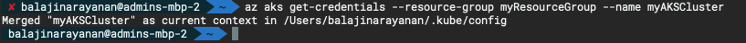

- To verify the connection to your cluster, use the `kubectl get` command to return a list of the cluster nodes.

	```bash
	kubectl get nodes
	```

	The following example output shows the single node created in the previous steps. Make sure that the status of the node is Ready:

	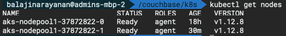

---

## Use Azure portal to create the AKS Cluster

In this section, you deploy an AKS cluster using the Azure portal.

### Step 1. Create AKS cluster

In the top left-hand corner of the Azure portal, select **+ Create a resource > Containers > Kubernetes Service**.

To create an AKS cluster, complete the following steps:

1. On the Basics page, configure the following options:

	- **PROJECT DETAILS:** Select an Azure subscription, then select or create an Azure resource group, such as `myResourceGroup`. Enter a Kubernetes cluster name, such as `myAKSCluster`.

	- **CLUSTER DETAILS:** Select a region, Kubernetes version, and DNS name prefix for the AKS cluster.

	- **PRIMARY NODE POOL:** select a VM size for the AKS nodes. The VM size **cannot** be changed once an AKS cluster has been deployed.
		- Select the number of nodes to deploy into the cluster. For this quickstart, set **Node count** to 1 and **can** be adjusted after the cluster has been deployed.

	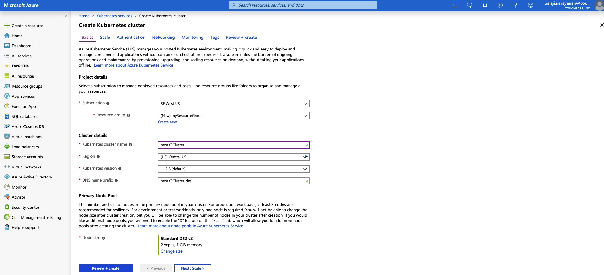

	Select **Next: Scale** when complete.

2. On the **Scale** page, keep the default options. At the bottom of the screen, click **Next:Authentication**.

3. On the **Authentication** page, configure the following options:

	- Create a new service principal by leaving the **Service Principal** field with **(new) default service principal**. Or you can choose _Configure service principal_ to use an existing one. If you use an existing one, you will need to provide the SPN client ID and secret.

	- Enable the option for Kubernetes role-based access controls (RBAC). This will provide more fine-grained control over access to the Kubernetes resources deployed in your AKS cluster.

	By default, _Basic_ networking is used, and Azure Monitor for containers is enabled. Click **Review + create** and then **Create** when validation completes.

It takes a few minutes to create the AKS cluster. When your deployment is complete, click **Go to resource**, or browse to the AKS cluster resource group, such as myResourceGroup, and select the AKS resource, such as _myAKSCluster_. The AKS cluster dashboard is shown, as in this example:

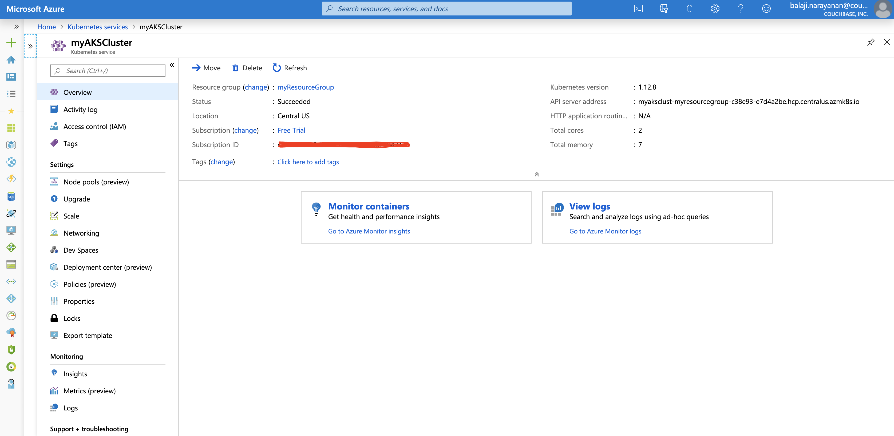

### Step 2. Connect to the cluster

You can either open Cloud Shell using the `>_` button on the top of the Azure portal, or use command line to perform this step. Then follow the same steps as mentioned in `Step 3. Connect to the cluster` under `Use Azure CLI to create the AKS Cluster`.

---

# Deploy Couchbase Autonomous Operator

>**Note:** If you are using Autonomous Operator version 2.0, then follow the steps from [Deploy Operator 2.0](./../cb-operator-guide/guides/cb-op-2.0-setup.md). Once the Operator is deployed, you can then go to the next step to [Deploy the Couchbase cluster](#deploy-the-couchbase-cluster-in-aks).

The Couchbase Autonomous Operator for Kubernetes enables cloud portability and automates operational best practices for deploying and managing Couchbase.

## Download the Operator

You can download the latest [Couchbase Autonomous Operator](https://www.couchbase.com/downloads?family=kubernetes) package and unzip to the local machine. Contained in this package are a set of YAML files that define the admission controller.

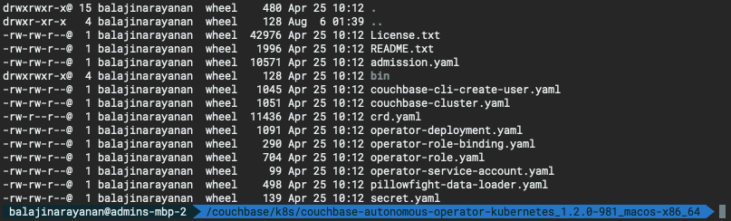

## Install the Custom Resource Definition

The first step in installing the Operator is to install the custom resource definition (CRD) that describes the `CouchbaseCluster` resource type. This can be achieved by running the below command from the Operator package directory:

```bash
kubectl create -f crd.yaml
```

## Deploy the Admission Controller

The admission controller is a required component of the Couchbase Autonomous Operator and needs to be installed separately. The primary purpose of the admission controller is to validate Couchbase cluster configuration changes before the Operator acts on them, thus protecting your Couchbase deployment (and the Operator) from any accidental damage that might arise from an invalid configuration.

- Open a Terminal window and go to the directory where you unpacked the Operator package. Run the following command to create the admission controller.

	```bash
	kubectl create -f admission.yaml
	```

- Confirm the admission controller has deployed successfully.

	```
	kubectl get deployments
	```
	
	

## Create a Namespace

Namespaces are a way to divide cluster resources between multiple users

- Run the following command to create a `Namespace`.

	```bash
	kubectl create namespace workshop
	```

- Confirm the Namespace is created successfully.

	```bash
	kubectl get namespaces
	```

	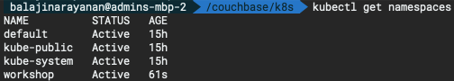

## Create a Couchbase Operator Role

In this step, we will create a [cluster role](https://kubernetes.io/docs/reference/access-authn-authz/rbac/#api-overview) that allows the Operator to access the resources that it needs to run.

> **Note:**
If you plan to run the Operator in more than one [namespace](https://kubernetes.io/docs/concepts/overview/working-with-objects/namespaces/), it may be preferable to create a cluster role because you can assign that role to a [service account](https://kubernetes.io/docs/reference/access-authn-authz/rbac/#service-account-permissions) in any namespace. Note that if you chose to to use a cluster role, making modifications to it will affect all instances of the Operator that use it.

- To create the role for the Operator, run the below command from the Operator package directory:

	```bash
	kubectl create -f operator-role.yaml --namespace workshop
	```

## Create the Service Account

After the cluster role is created, you need to create a service account in the namespace where you are installing the Operator, and then assign the cluster role to that service account using a [cluster role binding](https://kubernetes.io/docs/reference/access-authn-authz/rbac/#api-overview). (In this example, the service account is created in the namespace called `workshop`).

- Run the following command to create the service account.

	```bash
	kubectl create serviceaccount couchbase-operator --namespace workshop
	```

- Now run the following command to assign the operator role to the service account.

	```bash
	kubectl create rolebinding couchbase-operator --role couchbase-operator \
	--serviceaccount workshop:couchbase-operator --namespace workshop
	```

	Now before we proceed further let's make sure all the roles and service accounts are created under the namespace _workshop_. To do that run these three checks and make sure each _get_ returns the output as shown below:
	
	```bash
	kubectl get roles -n workshop
	kubectl get rolebindings -n workshop
	kubectl get sa -n workshop
	```

	**Output :**
	
	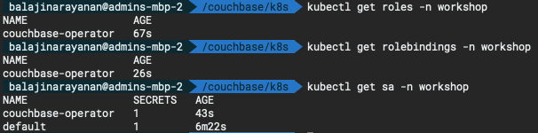

## Create the Couchbase Operator

Now that the service account is set up with the appropriate permissions, you can create and start the Operator by running the following command from the Operator package directory:

```bash
kubectl create -f operator-deployment.yaml --namespace workshop
```

Running the above command downloads the Operator Docker image (specified in the operator-deployment.yaml file) and creates a [deployment](https://kubernetes.io/docs/concepts/workloads/controllers/deployment/), which manages a single instance of the Operator. The Operator uses a deployment so that it can restart if the pod it’s running in dies.

After you run the `kubectl create` command, it generally takes less than a minute for Kubernetes to deploy the Operator and for the Operator to be ready to run.

### Check the status of the Deployment

You can use the following command to check on the status of the deployment:

```bash
kubectl get deployments -n workshop
```

If you run this command immediately after the Operator is deployed, the output will have the `AVAILABLE` column as 0.

However, the **AVAILABLE** field indicates that the pod is not ready yet since its value is 0 and not 1. That means that the Operator is still establishing a connection to the Kubernetes master node to allow it to get updates on CouchbaseCluster objects. Once the Operator has completed this task, it will be able to start managing Couchbase Server clusters and the status will be shown as AVAILABLE.

You should continue to poll the status of the Operator until the output looks similar to the following:

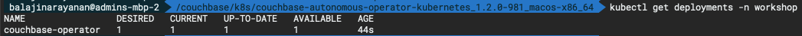

### Check the status of the Operator

Run the following command to verify that the Operator has started successfully:

```bash
kubectl get pods -l app=couchbase-operator -n workshop
```

If the Operator is up and running, the command returns an output where the **READY** field shows **1/1**, such as:

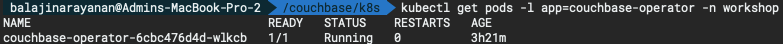

You can also check the logs to confirm that the Operator is up and running.

```bash
kubectl logs -f couchbase-operator-6cbc476d4d-wlkcb -n workshop
```

**Output :**

```bash
✘ balajinarayanan@admins-mbp-2  /couchbase/k8s  kubectl logs -f couchbase-operator-6cbc476d4d-wlkcb -n workshop
time="2019-08-06T19:47:32Z" level=info msg="couchbase-operator v1.2.0 (release)" module=main
time="2019-08-06T19:47:32Z" level=info msg="Obtaining resource lock" module=main
time="2019-08-06T19:47:32Z" level=info msg="Starting event recorder" module=main
time="2019-08-06T19:47:32Z" level=info msg="Attempting to be elected the couchbase-operator leader" module=main
time="2019-08-06T19:47:33Z" level=info msg="I'm the leader, attempt to start the operator" module=main
time="2019-08-06T19:47:33Z" level=info msg="Creating the couchbase-operator controller" module=main
time="2019-08-06T19:47:33Z" level=info msg="Event(v1.ObjectReference{Kind:\"Endpoints\", Namespace:\"workshop\", Name:\"couchbase-operator\", UID:\"083d7749-b883-11e9-ba18-b6c8a2eba861\", APIVersion:\"v1\", ResourceVersion:\"67594\", FieldPath:\"\"}): type: 'Normal' reason: 'LeaderElection' couchbase-operator-6cbc476d4d-wlkcb became leader" module=event_recorder
```

----

## Deploy the Couchbase Cluster in AKS

Now that we have deployed the Couchbase Autonomous Operator in AKS, now lets deploy the Couchbase Cluster.

### Create the Secret for Couchbase Admin Console

Let's create a secret credential which will be used by the administrative web console during login. For convenience, a sample secret is provided in the Operator package. When you push it to your Kubernetes cluster, the secret sets the username to `Administrator` and the password to `password`.

To push the secret into your Kubernetes cluster, run the following command:

```bash
kubectl create -f secret.yaml --namespace workshop
```

**Output :**

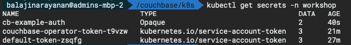

### Deploy Couchbase Cluster

The full spec for deploying Couchbase cluster across 3 different zones using persistent volumes can be seen in the [couchbase-persistent-cluster](./cb-operator-guide/files/couchbase-persistent-cluster.yaml) file. This file along with other sample yaml files used in this article can be downloaded from this git repo.

You can change the configuration to meet your production requirements.

We get `StorageClass` by default with AKS, lets check by running the following command:

```bash
kubectl get sc
```

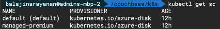

Now use kubectl to deploy the cluster.

```bash
kubectl create -f couchbase-persistent-cluster.yaml --namespace workshop
```

This will start deploying the Couchbase cluster and if all goes fine then we will have five Couchbase cluster pods hosting the services as per the configuration file above. To check the progress run the below command, which will watch (-w argument) the progress of pods creating:

```bash
kubectl get pods --namespace workshop -w
```

**Output :**

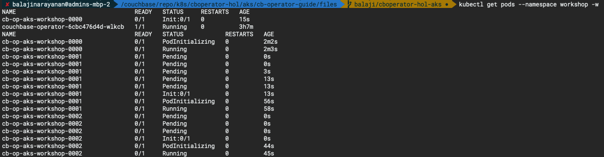

If for any reason there is an exception, then you can find the details of exception from the couchbase-operator log file. To display the last 20 lines of the log, copy the name of your operator pod and run the below command by replacing the operator pod name with the name in your environment.

```bash
kubectl logs couchbase-operator-6cbc476d4d-wlkcb --namespace workshop --tail 20
```

**Output :**

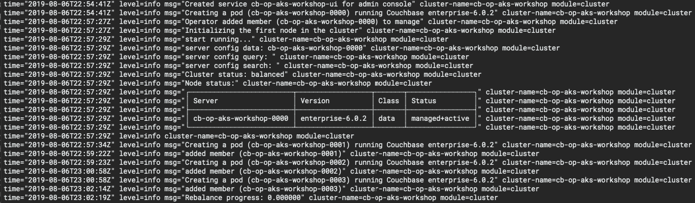

When all the pods are ready then you can port forward one of Couchbase cluster pod so that we can view the cluster status from the web-console. Run this command to port forward it.

```bash
kubectl port-forward cb-op-aks-workshop-0000 8091:8091 --namespace workshop
```

At this point you can open up a browser and type http://locahost:8091 which will bring Couchbase web-console from where you can monitor server stats, create buckets, run queries all from one single place.

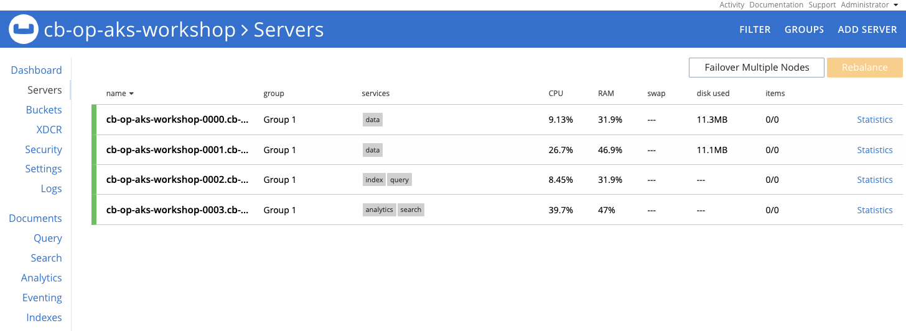

----

## Operations

### 1. Scaling a Couchbase Cluster

Using the Couchbase Operator, you can easily scale clusters and services up and down. The handling of individual nodes is defined in the servers section of the Couchbase cluster specification in [couchbase-persistent-cluster](./cb-operator-guide/files/couchbase-persistent-cluster.yaml)

This configuration specifies that the cluster should contain 4 nodes running the data, index, query, search and analytics services and that the data and index path are each set to /opt/couchbase/var/lib/couchbase/data.

To scale these servers, you only need to change the size parameter and then push the new configuration into Kubernetes to increase or decrease the number of nodes in the cluster. Let's say we want to increase data nodes capacity from 2 to 3, so change servers:size to 3.

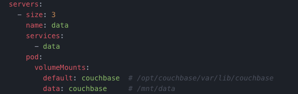

To update the configuration in Kubernetes, run the following command:

```bash
kubectl replace -f couchbase-persistent-cluster.yaml -n workshop
```

We will see the new pods are getting created and pods aks couchbase nodes are getting added to cluster, rebalance is performed, simply amazing!

```bash
kubectl logs couchbase-operator-6cbc476d4d-wlkcb --namespace workshop --tail 20
```

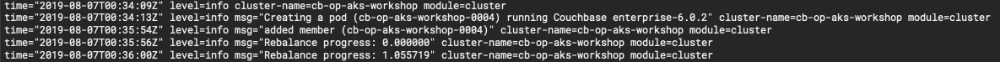

You can check the Couchbase web console to see how the new data service pod is added to the cluster and rebalance is performed.

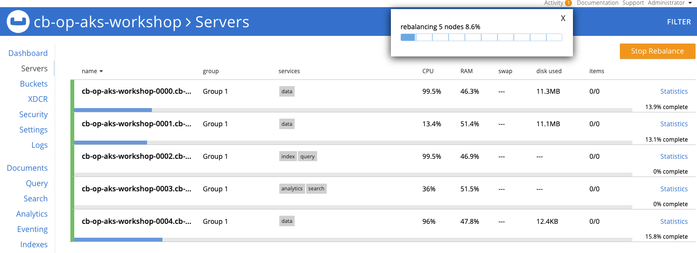

### 2. Self Recovery from a Node Failure

The Couchbase Operator can detect node failures, rebalance out bad nodes, and bring the cluster back up to the desired capacity.

Lets delete a pod simulating a node failure by following the below steps.

**Step 1:** Run the below command to get the list pods running in the `workshop` namespace.

```bash
kubectl get pods -n workshop
```

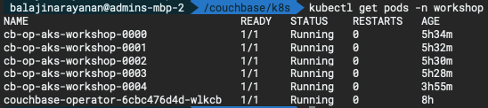

**Step 2:** Delete one of the pod from the list above by running the below command.

```bash
kubectl delete pod cb-op-aks-workshop-0004 -n workshop
```


Couchbase Server waits for the node to be down for a specified amount of time before failing over the node, and this failover timeout can be set using the `autoFailoverTimeout` in the cluster configuration file. You can check this in the logs.

```bash
kubectl logs -f couchbase-operator-6cbc476d4d-wlkcb -n workshop
```

**Output :**

```bash
time="2019-08-07T07:35:50Z" level=warning msg="unable to poll external addresses for pod cb-op-aks-workshop-0004" cluster-name=cb-op-aks-workshop module=cluster
time="2019-08-07T07:35:50Z" level=info msg="Cluster status: unbalanced" cluster-name=cb-op-aks-workshop module=cluster
time="2019-08-07T07:35:50Z" level=info msg="Node status:" cluster-name=cb-op-aks-workshop module=cluster
time="2019-08-07T07:35:50Z" level=info msg="┌─────────────────────────┬──────────────────┬────────┬────────────────┐" cluster-name=cb-op-aks-workshop module=cluster
time="2019-08-07T07:35:50Z" level=info msg="│ Server                  │ Version          │ Class  │ Status         │" cluster-name=cb-op-aks-workshop module=cluster
time="2019-08-07T07:35:50Z" level=info msg="├─────────────────────────┼──────────────────┼────────┼────────────────┤" cluster-name=cb-op-aks-workshop module=cluster
time="2019-08-07T07:35:50Z" level=info msg="│ cb-op-aks-workshop-0000 │ enterprise-6.0.2 │ data   │ managed+active │" cluster-name=cb-op-aks-workshop module=cluster
time="2019-08-07T07:35:50Z" level=info msg="│ cb-op-aks-workshop-0001 │ enterprise-6.0.2 │ data   │ managed+active │" cluster-name=cb-op-aks-workshop module=cluster
time="2019-08-07T07:35:50Z" level=info msg="│ cb-op-aks-workshop-0002 │ enterprise-6.0.2 │ query  │ managed+active │" cluster-name=cb-op-aks-workshop module=cluster
time="2019-08-07T07:35:50Z" level=info msg="│ cb-op-aks-workshop-0003 │ enterprise-6.0.2 │ search │ managed+active │" cluster-name=cb-op-aks-workshop module=cluster
time="2019-08-07T07:35:50Z" level=info msg="│ cb-op-aks-workshop-0004 │ enterprise-6.0.2 │ data   │ managed+failed │" cluster-name=cb-op-aks-workshop module=cluster
time="2019-08-07T07:35:50Z" level=info msg="└─────────────────────────┴──────────────────┴────────┴────────────────┘" cluster-name=cb-op-aks-workshop module=cluster
time="2019-08-07T07:35:50Z" level=info cluster-name=cb-op-aks-workshop module=cluster
time="2019-08-07T07:35:51Z" level=info msg="An auto-failover has taken place" cluster-name=cb-op-aks-workshop module=cluster
time="2019-08-07T07:35:51Z" level=info msg="Creating a pod (cb-op-aks-workshop-0004) running Couchbase enterprise-6.0.2" cluster-name=cb-op-aks-workshop module=cluster
time="2019-08-07T07:37:25Z" level=error msg="failed to reconcile: recovering node http://cb-op-aks-workshop-0004.cb-op-aks-workshop.workshop.svc:8091" cluster-name=cb-op-aks-workshop module=cluster
time="2019-08-07T07:37:33Z" level=info msg="server config data: cb-op-aks-workshop-0001,cb-op-aks-workshop-0000" cluster-name=cb-op-aks-workshop module=cluster
time="2019-08-07T07:37:33Z" level=info msg="Cluster status: unbalanced" cluster-name=cb-op-aks-workshop module=cluster
time="2019-08-07T07:37:33Z" level=info msg="Node status:" cluster-name=cb-op-aks-workshop module=cluster
time="2019-08-07T07:37:33Z" level=info msg="┌─────────────────────────┬──────────────────┬────────┬──────────────────┐" cluster-name=cb-op-aks-workshop module=cluster
time="2019-08-07T07:37:33Z" level=info msg="│ Server                  │ Version          │ Class  │ Status           │" cluster-name=cb-op-aks-workshop module=cluster
time="2019-08-07T07:37:33Z" level=info msg="├─────────────────────────┼──────────────────┼────────┼──────────────────┤" cluster-name=cb-op-aks-workshop module=cluster
time="2019-08-07T07:37:33Z" level=info msg="│ cb-op-aks-workshop-0000 │ enterprise-6.0.2 │ data   │ managed+active   │" cluster-name=cb-op-aks-workshop module=cluster
time="2019-08-07T07:37:33Z" level=info msg="│ cb-op-aks-workshop-0001 │ enterprise-6.0.2 │ data   │ managed+active   │" cluster-name=cb-op-aks-workshop module=cluster
time="2019-08-07T07:37:33Z" level=info msg="│ cb-op-aks-workshop-0002 │ enterprise-6.0.2 │ query  │ managed+active   │" cluster-name=cb-op-aks-workshop module=cluster
time="2019-08-07T07:37:33Z" level=info msg="│ cb-op-aks-workshop-0003 │ enterprise-6.0.2 │ search │ managed+active   │" cluster-name=cb-op-aks-workshop module=cluster
time="2019-08-07T07:37:33Z" level=info msg="│ cb-op-aks-workshop-0004 │ enterprise-6.0.2 │ data   │ managed+add_back │" cluster-name=cb-op-aks-workshop module=cluster
time="2019-08-07T07:37:33Z" level=info msg="└─────────────────────────┴──────────────────┴────────┴──────────────────┘" cluster-name=cb-op-aks-workshop module=cluster
time="2019-08-07T07:37:33Z" level=info cluster-name=cb-op-aks-workshop module=cluster
time="2019-08-07T07:37:35Z" level=info msg="Add back node `cb-op-aks-workshop-0004` is being marked for delta recovery" cluster-name=cb-op-aks-workshop module=cluster
time="2019-08-07T07:37:39Z" level=info msg="Rebalance progress: 0.000000" cluster-name=cb-op-aks-workshop module=cluster
time="2019-08-07T07:37:43Z" level=info msg="Rebalance progress: 0.000000" cluster-name=cb-op-aks-workshop module=cluster
time="2019-08-07T07:37:47Z" level=info msg="Rebalance progress: 0.000000" cluster-name=cb-op-aks-workshop module=cluster
time="2019-08-07T07:37:51Z" level=info msg="Rebalance progress: 0.000000" cluster-name=cb-op-aks-workshop module=cluster
time="2019-08-07T07:37:55Z" level=info msg="Rebalance progress: 1.407633" cluster-name=cb-op-aks-workshop module=cluster
```

After the node gets auto-failed over, the Couchbase Operator removes the faulty pod from the cluster, adds a new pod to the cluster and peforms rebalance, ensuring that the cluster is back up to the desired configuration without any loss of data.

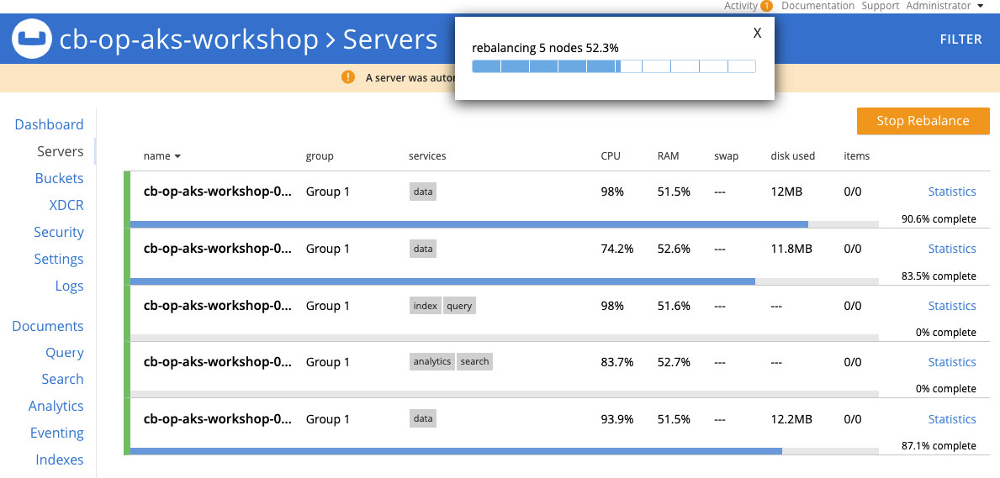

## Conclusion

Couchbase Autonomous Operator makes management and orchestration of Couchbase Cluster seamlessly on the Kubernetes platform. What makes this operator unique is its ability to easily use storage classes offered by different cloud vendors (AWS, Azure, GCP, RedHat OpenShift etc) to create persistent volumes, which is then used by the Couchbase database cluster to persistently store the data. In the event of pod or container failure, Kubernetes re-instantiate a new pod/container automatically and simply remounts the persistent volumes back, making the recovery fast. It also helps maintain the SLA of the system during infrastructure failure recovery because only delta recovery is needed as opposed to full-recovery, if persistent volumes are not being used.

We walked through step-by-step on how you will setup persistent volumes on Azure AKS in this article but the same steps would also be applicable if you are using any other open-source Kubernetes environment (EKS, GKE etc). We hope you will give Couchbase Autonomous Operator a spin and let us know of your experience.
