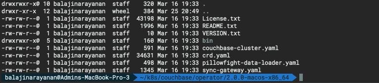
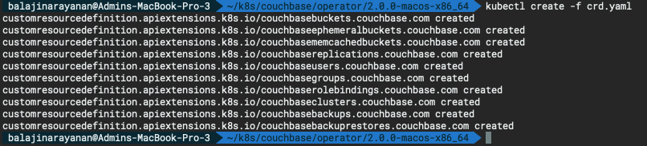
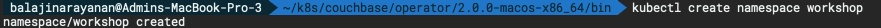
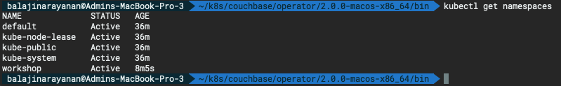
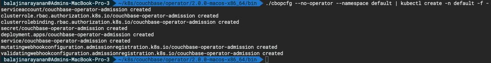
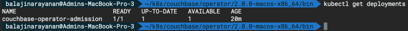
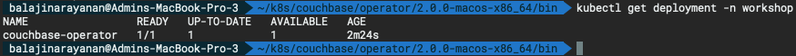
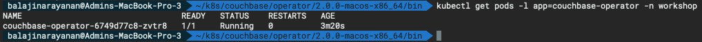

# Deploy Couchbase Autonomous Operator 2.0

The Couchbase Autonomous Operator for Kubernetes enables cloud portability and automates operational best practices for deploying and managing Couchbase.

## Prerequisites: Download the Operator

You can download the latest [Couchbase Autonomous Operator](https://www.couchbase.com/downloads?family=kubernetes) package and unzip to the local machine. The Operator package contains YAML configuration files and command-line tools that you will use to install the Operator.



## Step 1: Install the Custom Resource Definition

The first step in installing the Operator is to install the custom resource definition (CRD) that describes the `Couchbase` resource types. This can be achieved by running the below command from the Operator package directory:

```bash
kubectl create -f crd.yaml
```



## Step 2: Create a Namespace

Namespaces are a way to divide cluster resources between multiple users.

- Run the following command to create a `Namespace`.

	```bash
	kubectl create namespace workshop
	```

	

- Confirm the Namespace is created successfully.

	```
	kubectl get namespaces
	```
	
	

## Step 3: Install the Operator

The operator is composed of two components: a per-cluster dynamic admission controller (DAC) and a per-namespace Operator. Refer to the [operator architecture](https://docs.couchbase.com/operator/2.0/concept-operator.html) for additional information on what is required and security considerations.

### 1. Install the Dynamic Admission Controller (DAC)

The DAC allows custom resources to be modified and interrogated before a resource is accepted and committed to etcd. Running the DAC allows us to add sensible defaults to Couchbase cluster configurations thus minimizing the size of specifications. It also allows us to maintain backwards compatibility when new attributes are added and must be populated. This makes the experience of using Couchbase resources similar to that of native resource types.

Now, lets install the Dynamic Admission Controller.

- Open a Terminal window and go to the directory where you unpacked the Operator package and `cd` to bin. Run the following command to install the DAC into the `default` namespace.

```bash
./cbopcfg --no-operator --namespace default | kubectl create -n default -f -
```



- Confirm the admission controller has deployed successfully.

```bash
kubectl get deployments
```



### 2. Install the Couchbase Operator

Now lets deploy the Operator in the `workshop` namespace by running the following command.

```bash
./cbopcfg --no-admission --namespace workshop | kubectl create -n workshop -f -
```


Running the above command downloads the Operator Docker image and creates a [deployment](https://kubernetes.io/docs/concepts/workloads/controllers/deployment/), which manages a single instance of the Operator. The Operator uses a deployment so that it can restart if the pod it’s running in dies.

After you run the `kubectl create` command, it generally takes less than a minute for Kubernetes to deploy the Operator and for the Operator to be ready to run.

### Check the status of the Deployment

You can use the following command to check on the status of the deployment:

```bash
kubectl get deployments -n workshop
```

If you run this command immediately after the Operator is deployed, the output will have the `AVAILABLE` column as 0.

However, the **AVAILABLE** field indicates that the pod is not ready yet since its value is `0` and not `1`. That means the Operator is still establishing a connection to the Kubernetes master node to allow it to get updates on CouchbaseCluster objects. Once the Operator has completed this task, it will be able to start managing Couchbase Server clusters and the status will be shown as AVAILABLE.

You should continue to poll the status of the Operator until the output looks similar to the following:



### Check the status of the Operator

Run the following command to verify that the Operator has started successfully:

```
kubectl get pods -l app=couchbase-operator -n workshop
```

If the Operator is up and running, the command returns an output where the **READY** field shows **1/1**, such as:



You can also check the logs to confirm that the Operator is up and running.

```bash
kubectl logs -f couchbase-operator-6749d77c8-zvtr8 -n workshop
```

**Output :**

```bash
balajinarayanan@Admins-MacBook-Pro-3  ~/k8s/couchbase/operator/2.0.0-macos-x86_64/bin  kubectl logs -f couchbase-operator-6749d77c8-zvtr8 \
-n workshop
{"level":"info","ts":1585196337.0459344,"logger":"main","msg":"couchbase-operator","version":"2.0.0","revision":"release"}
{"level":"info","ts":1585196337.0461888,"logger":"leader","msg":"Trying to become the leader."}
{"level":"info","ts":1585196337.1988726,"logger":"leader","msg":"No pre-existing lock was found."}
{"level":"info","ts":1585196337.204028,"logger":"leader","msg":"Became the leader."}
{"level":"info","ts":1585196337.2575383,"logger":"kubebuilder.controller","msg":"Starting EventSource","controller":"couchbase-controller","source":"kind source: /, Kind="}
{"level":"info","ts":1585196337.3590217,"logger":"kubebuilder.controller","msg":"Starting Controller","controller":"couchbase-controller"}
{"level":"info","ts":1585196337.459182,"logger":"kubebuilder.controller","msg":"Starting workers","controller":"couchbase-controller","worker count":4}
```
