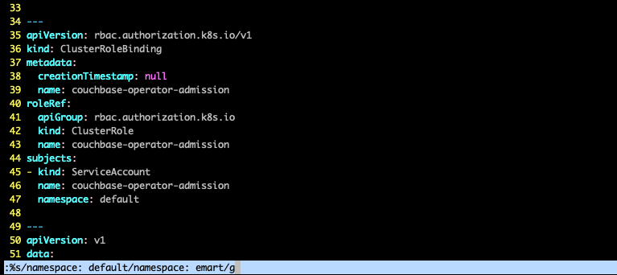
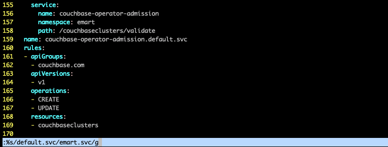
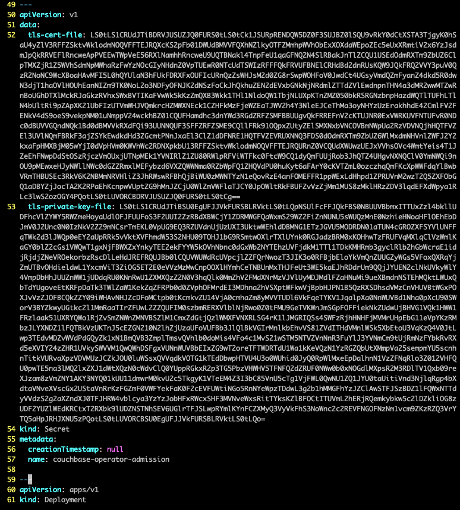
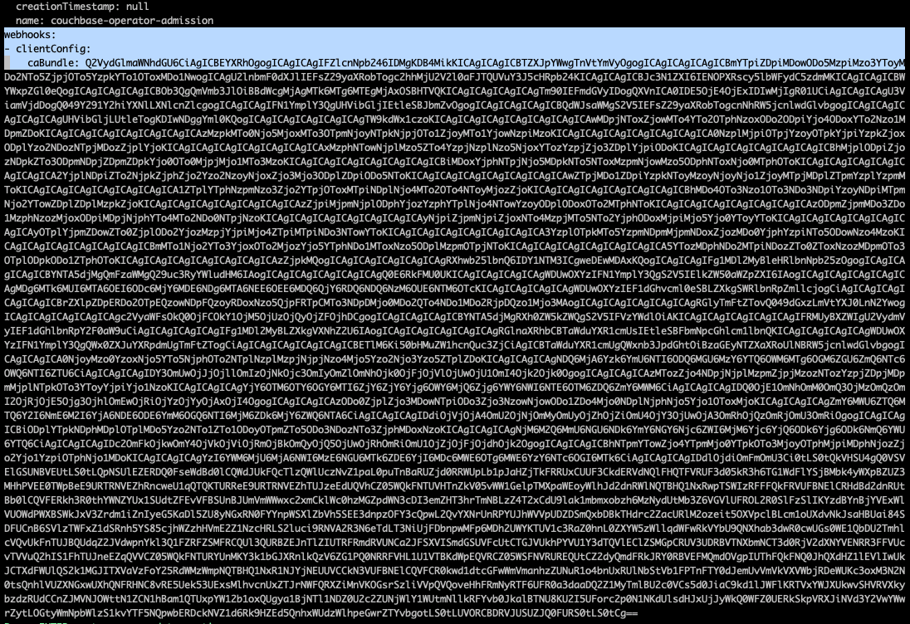
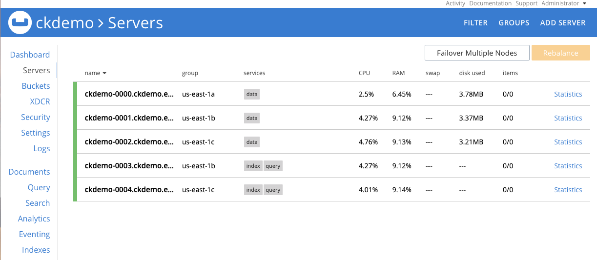
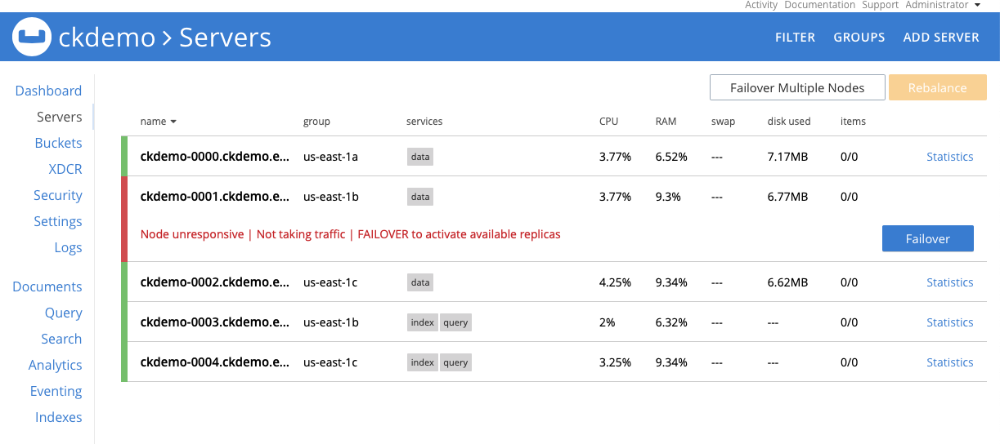
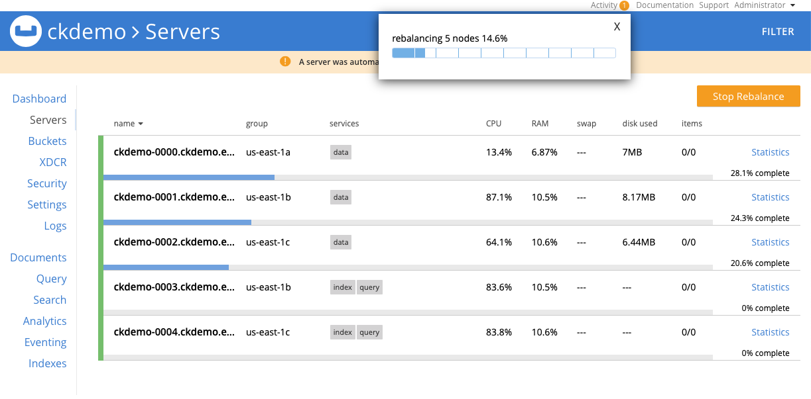
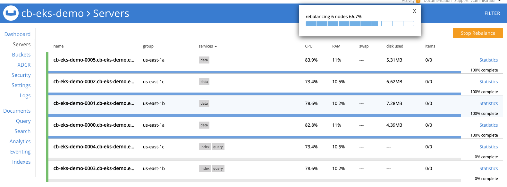

# Content

1. **Prerequisites**

2. **Deploy Couchbase Autonomous Operator**

	2.1. **Download Operator package**

	2.2. **Create a namespace**

	2.3. **Add TLS Certificate**

	2.4. **Install Admission Control**

	2.5. **Install CRD**

	2.6. **Create a Operator Role**

	2.7. **Create a Service Account**

	2.8. **Deploy Couchbase Operator**

3. **Deploy Couchbase cluster using persistent volumes**

	3.1. **Create Secret for Couchbase Admin Console**

	3.2. **Create Google storage class for the GKS cluster**

	3.3. **Server Group Awareness**

	3.4. **Add Storage Class to Persistent Volume Claim Template**

	3.5. **Deploy Couchbase Cluster**

4. **Test Client-Application**

5. **Operations**

	5.1. **Self-Recovery from Failure**

	5.2. **On-Demand Scaling - Up & Down**

	5.3. **Couchbase Automated Upgrade**

6. **Conclusion**


# 1. Prerequisites

There are two important prerequisites before we begin the deployment of Couchbase Autonomous Operator on EKS:

1. You have installed _kubectl_ & _AWS CLI_ on your local machine as described in the [guide](./cb-operator-guide/guides/prerequisite-tools.md).

2. You have AWS account and have setup Amazon EKS cluster as per the [EKS Instruction Guide](./cb-operator-guide/guides/eks-setup.md).

In the labs below we will be using us-east-1 as the region and us-east-1a/1b/1c as three availability-zones but you can deploy to any region/zones by making minor changes to YAML files in the examples below.


# 2. Deploy Couchbase Autonomous Operator

Before we begin with the setup of Couchbase Operator, run ‘kubectl get nodes’ command from the local machine to confirm EKS cluster is up and running.


```
$ kubectl get nodes

NAME                              STATUS    ROLES     AGE       VERSION
ip-192-168-106-132.ec2.internal   Ready     <none>    110m      v1.11.9
ip-192-168-153-241.ec2.internal   Ready     <none>    110m      v1.11.9
ip-192-168-218-112.ec2.internal   Ready     <none>    110m      v1.11.9
```

After we have tested that we can connect to Kubernetes control plane running on Amazon EKS cluster from our local machine, we can now begin with the steps required to deploy Couchbase Autonomous Operator, which is the glue technology enabling Couchbase Server cluster to be managed by Kubernetes.

### 2.1. Download Operator package

Let’s first begin by downloading the latest [Couchbase Autonomous Operator](https://www.couchbase.com/downloads?family=kubernetes) and unzip onto the local machine. Change directory to the operator folder so we can find YAML files we need to deploy Couchbase operator:


```
$ cd couchbase-autonomous-operator-kubernetes_1.2.0-981_linux-x86_64

$ ls

License.txt			couchbase-cli-create-user.yaml	operator-role-binding.yaml	secret.yaml
README.txt			couchbase-cluster.yaml		operator-role.yaml
admission.yaml			crd.yaml			operator-service-account.yaml
bin				operator-deployment.yaml	pillowfight-data-loader.yaml
```
Note: This workshop is tested with Couchbase Autonomous Operator 1.2.

### 2.2. Create a namespace

Create a namespace that will allow cluster resources to be nicely separated between multiple users. To do that we will use a unique namespace called emart for our deployment and later will use this namespace to deploy Couchbase Cluster.

In your working directory create a [namespace.yaml](./cb-operator-guide/files/namespace.yaml) file with this content and save it in the Couchbase operator directory itself:

```
apiVersion: v1
kind: Namespace
metadata:
  name: emart
```
After saving the namespace configuration in a file, run kubectl cmd to create it:

```
$ kubectl create -f namespace.yaml
```
Run get namespace command to confirm it is created successfully:

```
$ kubectl get namespaces

output:

NAME          STATUS    AGE
default       Active    1h
emart         Active    12s
```

From now onwards we will use emart as the namespace for all resource provisioning.

### 2.3. Create TLS Certificate

We need to generate self-signed certificated which we will use later on to deploy:
- Admission Control
- Couchbase Autonomous Operator
- Couchbase Cluster

Follow steps as described in the guide to [generate self-signed certificate](../guides/configure-tls.md). After you are done generating the certs then proceed further.

```
$ cd easy-rsa/easyrsa3
```
Create these two TLS secrets to be used later on in the [couchbase-cluster.yaml](./cb-operator-guide/files/couchbase-cluster-with-pv-1.2.yaml) file during Couchbase Cluster Deployment section.
```

$ kubectl create secret generic couchbase-server-tls --from-file chain.pem \
--from-file pkey.key --namespace emart

secret/couchbase-server-tls created
```

```
$ kubectl create secret generic couchbase-operator-tls --from-file pki/ca.crt \
--namespace emart

secret/couchbase-operator-tls created
```
One more TLS secret to create which will be used during Admission-Control deployment.
```

$ kubectl create secret generic couchbase-operator-admission --from-file tls-cert-file \
--from-file tls-private-key-file --namespace emart

secret/couchbase-operator-admission created
```
Make sure all the secrets exist under the namespace.
```
$ kubectl get secret --namespace emart

NAME                           TYPE                                  DATA      AGE
couchbase-operator-admission   Opaque                                2         24s
couchbase-operator-tls         Opaque                                1         41s
couchbase-server-tls           Opaque                                2         56s
default-token-7w7vx            kubernetes.io/service-account-token   3         94s

```
### 2.4. Install Admission Controller

The admission controller is a required component of the Couchbase Autonomous Operator and needs to be installed separately. The primary purpose of the admission controller is to validate Couchbase cluster configuration changes before the Operator acts on them, thus protecting your Couchbase deployment (and the Operator) from any accidental damage that might arise from an invalid configuration. For architecture details please visit documentation page on the [Admission Controller](https://docs.couchbase.com/operator/current/install-admission-controller.html#architecture)

#### Prepare the file

Use the following steps to edit the admission-controller file:

- From Couchbase Operator directory open ```admission.yaml``` file in the editor.
- Change all occurrences of ```namespace: default``` to ```namespace: emart``` which is the namespace we will be using in our deployment.



Note: There will be three occurrences  where the replacement will happen (in v1.2 it is at line 47,132, 157).

- Similarly we will change occurrences of ```default.svc``` to ```emart.svc``` as **emart** is the namespace we will be using not default.



Note: There will be two occurrences of replacement (in v1.2 it is at line 134, 159).

- Delete lines 49-58 as we have already created ```couchbase-operator-admission``` secret and don't need to mention ```tls-cert-file``` and ```tls-priavate-key-file```.



- Next we will convert the cert file we generated in the TLS section, into base64 encoded file format so we can copy/paste into the YAML file.


```
$ cd easy-rsa/easyrsa3

$ base64 -i tls-cert-file -o ./tls-cert-file-base64
```
- Replace all instances of ```caBundle``` with the content of ```tls-cert-file-base64```.  There are total of two occurrences in the yaml file.



#### Ready to deploy

Deploy the admission controller using the command:

```
$ kubectl create -f admission.yaml --namespace emart
```
- Confirm the admission controller has deployed successfully:

```
$ kubectl get deployments --namespace emart

NAME                           DESIRED   CURRENT   UP-TO-DATE   AVAILABLE   AGE
couchbase-operator-admission   1         1         1            1           1m
```


### 2.5. Install CRD

The first step in installing the Operator is to install the custom resource definition (CRD) that describes the CouchbaseCluster resource type. This can be achieved with the following command:

```
kubectl create -f crd.yaml --namespace emart
```

### 2.6. Create a Operator Role

Next, we will create a [cluster role](https://kubernetes.io/docs/reference/access-authn-authz/rbac/#api-overview) that allows the Operator to access the resources that it needs to run. Since the Operator will manage many different [namespaces](https://kubernetes.io/docs/concepts/overview/working-with-objects/namespaces/), it is best to create a cluster role first because you can assign that role to a [service account](https://kubernetes.io/docs/reference/access-authn-authz/rbac/#service-account-permissions) in any namespace.

To create the cluster role for the Operator, run the following command:

```
$ kubectl create -f operator-role.yaml --namespace emart
```

This cluster role only needs to be created once.

### 2.7. Create a Service Account

After the cluster role is created, you need to create a service account in the namespace where you are installing the Operator. To create the service account:

```
$ kubectl create serviceaccount couchbase-operator --namespace emart
```

Now assign the operator role to the service account:

```
$ kubectl create rolebinding couchbase-operator --role couchbase-operator \
--serviceaccount emart:couchbase-operator --namespace emart

output:

clusterrolebinding.rbac.authorization.k8s.io/couchbase-operator created
```

Now before we proceed further let's make sure all the roles and service accounts are created under the namespace _emart_. To do that run these three checks and make sure each get returns something:

```
Kubectl get roles -n emart
Kubectl get rolebindings -n emart
Kubectl get sa -n emart
```

### 2.8. Deploy Couchbase Operator

We now have all the roles and privileges for our operator to be deployed. Deploying the operator is as simple as running the operator.yaml file from the Couchbase Autonomous Operator directory.

```
$ kubectl create -f operator-deployment.yaml --namespace emart

output:

deployment.apps/couchbase-operator created
```

Above command will download the Operator Docker image (specified in the operator.yaml file) and creates a deployment, which manages a single instance of the Operator. The Operator uses a deployment so that it can restart if the pod it’s running in dies.

It would take less than a minute for Kubernetes to deploy the Operator and for the Operator to be ready to run.

#### a) Verify the Status of the Deployment

You can use the following command to check on the status of the deployment:

```
  $ kubectl get deployments --namespace emart
```

If you run the this command immediately after the Operator is deployed, the output will look something like the following:

```
NAME           	    DESIRED    CURRENT     UP-TO-DATE      AVAILABLE        AGE
couchbase-operator   1          1          1               0               10s
```
Note: Above output means your Couchbase operator is deployed and you can go ahead with deploying Couchbase cluster next.

#### b) Verify the Status of the Operator

You can use the following command to verify that the Operator has started successfully:

```
$ kubectl get pods -l app=couchbase-operator --namespace emart
```

If the Operator is up and running, the command returns an output where the READY field shows 1/1, such as:
```
NAME                                    READY   STATUS   RESTARTS   AGE
couchbase-operator-8c554cbc7-6vqgf      1/1         Running  0          57s
```
You can also check the logs to confirm that the Operator is up and running. Look for the message: CRD initialized, listening for events…​ module=controller.

```
$ kubectl logs couchbase-operator-8c554cbc7-6vqgf --namespace emart --tail 20

output:

time="2019-05-30T23:00:58Z" level=info msg="couchbase-operator v1.2.0 (release)" module=main
time="2019-05-30T23:00:58Z" level=info msg="Obtaining resource lock" module=main
time="2019-05-30T23:00:58Z" level=info msg="Starting event recorder" module=main
time="2019-05-30T23:00:58Z" level=info msg="Attempting to be elected the couchbase-operator leader" module=main
time="2019-05-30T23:00:58Z" level=info msg="I'm the leader, attempt to start the operator" module=main
time="2019-05-30T23:00:58Z" level=info msg="Creating the couchbase-operator controller" module=main
time="2019-05-30T23:00:58Z" level=info msg="Event(v1.ObjectReference{Kind:\"Endpoints\", Namespace:\"emart\", Name:\"couchbase-operator\", UID:\"c96ae600-832e-11e9-9cec-0e104d8254ae\", APIVersion:\"v1\", ResourceVersion:\"950158\", FieldPath:\"\"}): type: 'Normal' reason: 'LeaderElection' couchbase-operator-6cbc476d4d-2kps4 became leader" module=event_recorder
```

# 3. Deploy Couchbase cluster using persistent volumes

In a production environment where performance and SLA of the system matters most, we should always plan on deploying Couchbase cluster using persistent volumes because it helps in:

* **Data Recoverability**: Persistent Volumes allow the data associated within Pods to be recovered in the case that a Pod is terminated. This helps prevent data-loss and avoid time-consuming index building when using the data or index services.

* **Pod Relocation**: Kubernetes may decide to evict pods that reach resource thresholds such as CPU and Memory Limits. Pods that are backed with Persistent Volumes can be terminated and restarted on different nodes without incurring any downtime or data-loss.
* **Dynamic Provisioning**: The Operator will create Persistent Volumes on-demand as your cluster scales, alleviating the need to pre-provision your cluster storage prior to deployment.

* **Cloud Integration**: Kubernetes integrates with native storage provisioners available on major cloud vendors such as AWS and GCE.

In this next section we will see how you can define storage classes in different availability zone and build persistent volume claim template, which will be used in [couchbase-cluster-with-pv-1.2.yaml](./cb-operator-guide/files/couchbase-cluster-with-pv-1.2.yaml) file.

### 3.1. Create Secret for Couchbase Admin Console

First thing we need to do is create a secret credential which will be used by the administrative web console during login. For convenience, a sample secret is provided in the Operator package. When you push it to your Kubernetes cluster, the secret sets the username to Administrator and the password to password.

To push the secret into your Kubernetes cluster, run the following command:

```
$ kubectl create -f secret.yaml --namespace emart

Output:

Secret/cb-example-auth created
```

### 3.2 Create AWS storage class for the EKS cluster

Now in order to use PersistentVolume for Couchbase services (data, index, search, etc.), we need to create Storage Classes (SC) first in each of the Availability Zones (AZ). Let’s begin by checking what storage classes exist in our environment.

Let’s use kubectl command to find that out:
```
$ kubectl get storageclass

Output:

gp2 (default)   kubernetes.io/aws-ebs   12m
```

Above output means we just have default gp2 storage class and we need to create separate storage-classes in all of the AZs where we are planning to deploy our Couchbase cluster.

1) Create a AWS storage class manifest file. Below example defines the structure of the storage class ([sc-gp2.yaml](./cb-operator-guide/files/sc-gp2.yaml)), which uses the Amazon EBS gp2 volume type (aka general purpose SSD drive). This storage we will later use in our _VolumeClaimTemplate_.

	For more information about the options available for AWS storage classes, see [AWS](https://kubernetes.io/docs/concepts/storage/storage-classes/#aws) in the Kubernetes documentation.

	```
	apiVersion: storage.k8s.io/v1
	kind: StorageClass
	metadata:
		 labels:
		   k8s-addon: storage-aws.addons.k8s.io
		 name: gp2-multi-zone
	parameters:
		 type: gp2
	provisioner: kubernetes.io/aws-ebs
	reclaimPolicy: Delete
	volumeBindingMode: WaitForFirstConsumer
	```
	Above we used ```reclaimPolicy``` to _Delete_ which tells K8 to delete the volumes of deleted Pods but you can change it to _Retain_ depending on your needs or if for troubleshooting purpose you would like to keep the volumes of deleted pods.

2) We will now use kubectl command to physically create storage class from the manifest files we defined above.

	```
	$ kubectl create -f sc-gp2.yaml

	Output:

	storageclass.storage.k8s.io/gp2-multi-zone created
	```

3) Verify New Storage Class
Once you’ve created all the storage classes, you can verify them through kubectl command:

	```
	$ kubectl get sc  --namespace emart

	output:

	NAME            PROVISIONER             AGE
	gp2 (default)   kubernetes.io/aws-ebs   16h
	gp2-multi-zone  kubernetes.io/aws-ebs   96s
	```

### 3.3. Server Groups Awareness

Server Group Awareness provides enhanced availability as it protects a cluster from large-scale infrastructure failure, through the definition of groups.

Groups should be defined in accordance with the physical distribution of cluster-nodes. For example, a group should only include the nodes that are in a single server rack, or in the case of cloud deployments, a single availability zone. Thus, if the server rack or availability zone becomes unavailable due to a power or network failure, Group Failover, if enabled, allows continued access to the affected data.

We  therefore going to place Couchbase servers onto separate ```spec.servers.serverGroups```, which are going to be mapped to physically separated EKS node running in three different AZs (us-east-1a/b/c):

```
spec:
  servers:
    - name: data-east-1a
      size: 1
      services:
        - data
      serverGroups:
       - us-east-1a
```

### 3.4. Add Storage Class to Persistent Volume Claim Template

With Server groups defined, and Storage Classes available in all three AZs, we are now going to create dynamic storage volumes and mount them of each of the Couchbase server that requires persistent data. In order to do that we will first define Persistent Volume Claim Template in our [couchbase-cluster.yaml](./cb-operator-guide/files/couchbase-cluster-with-pv-1.2.yaml) file (which can be found from the operator folder).

```
Spec:
  volumeClaimTemplates:
    - metadata:
        name: pvc-default
      spec:
        storageClassName: gp2-multi-zone
        resources:
          requests:
            storage: 1Gi
    - metadata:
        name: pvc-data
      spec:
        storageClassName: gp2-multi-zone
        resources:
          requests:
            storage: 5Gi
    - metadata:
        name: pvc-index
      spec:
        storageClassName: gp2-multi-zone
        resources:
          requests:
            storage: 3Gi
```
After claim template being added the final step is to pair the volume claim template with server groups accordingly in each of the zones. For instance, Pods within Server-Group named data-east-1a should use volumeClaimTemplate named _pvc-data_ to store data and _pvc-default_ for Couchbase binaries and log files.

For example, the following shows the pairing of a Server Group and its associated VolumeClaimTemplate:

```
spec:
  servers:
    - name: data-east-1a
      size: 1
      services:
        - data
      serverGroups:
       - us-east-1a
      pod:
        volumeMounts:
          default: pvc-default
          data: pvc-data
    - name: data-east-1b
      size: 1
      services:
        - data
      serverGroups:
       - us-east-1b
      pod:
        volumeMounts:
          default: pvc-default
          data: pvc-data
    - name: data-east-1c
      size: 1
      services:
        - data
      serverGroups:
       - us-east-1c
      pod:
        volumeMounts:
          default: pvc-default
          data: pvc-data
```

Notice that we have created three separate data server groups (data-east-1a/-1b/-1c), each located in its own AZ, using persistent volume claim templates from that AZ. Now using the same concept we will add index, and query services and allocate them in separate server groups so they can scale independently of data nodes.

### 3.5. Deploy Couchbase Cluster

The full spec for deploying Couchbase cluster across 3 different zones using persistent volumes can be seen in the [couchbase-cluster-with-pv-1.2.yaml](./cb-operator-guide/files/couchbase-cluster-with-pv-1.2.yaml) file. This file along with other sample yaml files used in this article can be downloaded from this git repo.

Please open the yaml file and note that we are deploying data service in three AZs but deploying index & query service in two AZs only. You can change the configuration to meet your production requirements.

Now use kubectl to deploy the cluster.

```
$ kubectl create -f couchbase-cluster-with-pv-1.2.yaml --save-config --namespace emart
```

This will start deploying the Couchbase cluster and if all goes fine then we will have five Couchbase cluster pods hosting the services as per the configuration file above. To check the progress run this command, which will watch (-w argument) the progress of pods creating:

```
$ kubectl get pods --namespace emart -w

output:

NAME                                            READY     STATUS    RESTARTS   AGE
ckdemo-0000                                     1/1       Running   0          6m3s
ckdemo-0001                                     1/1       Running   0          5m17s
ckdemo-0002                                     1/1       Running   0          4m7s
ckdemo-0003                                     1/1       Running   0          2m57s
ckdemo-0004                                     1/1       Running   0          2m2s
couchbase-operator-admission-6bf9bf8848-zdc7x   1/1       Running   0          9m1s
couchbase-operator-f6f7b6f75-pzb9m              1/1       Running   0          8m17s
```

If for any reason there is an exception, then you can find the details of exception from the couchbase-operator log file. To display the last 20 lines of the log, copy the name of your operator pod and run below command by replacing the operator name with the name in your environment.

```

$ kubectl logs couchbase-operator-f6f7b6f75-pzb9m --namespace emart --tail 25

time="2019-08-27T18:08:22Z" level=info msg="server config query-east-1c: " cluster-name=ckdemo module=cluster
time="2019-08-27T18:08:22Z" level=info msg="Cluster status: balanced" cluster-name=ckdemo module=cluster
time="2019-08-27T18:08:22Z" level=info msg="Node status:" cluster-name=ckdemo module=cluster
time="2019-08-27T18:08:22Z" level=info msg="┌─────────────┬──────────────────┬──────────────┬────────────────┐" cluster-name=ckdemo module=cluster
time="2019-08-27T18:08:22Z" level=info msg="│ Server      │ Version          │ Class        │ Status         │" cluster-name=ckdemo module=cluster
time="2019-08-27T18:08:22Z" level=info msg="├─────────────┼──────────────────┼──────────────┼────────────────┤" cluster-name=ckdemo module=cluster
time="2019-08-27T18:08:22Z" level=info msg="│ ckdemo-0000 │ enterprise-5.5.4 │ data-east-1a │ managed+active │" cluster-name=ckdemo module=cluster
time="2019-08-27T18:08:22Z" level=info msg="└─────────────┴──────────────────┴──────────────┴────────────────┘" cluster-name=ckdemo module=cluster
time="2019-08-27T18:08:22Z" level=info msg="Scheduler status:" cluster-name=ckdemo module=cluster
time="2019-08-27T18:08:22Z" level=info msg="┌──────────────┬────────────┬─────────────┐" cluster-name=ckdemo module=cluster
time="2019-08-27T18:08:22Z" level=info msg="│ Class        │ Zone       │ Server      │" cluster-name=ckdemo module=cluster
time="2019-08-27T18:08:22Z" level=info msg="├──────────────┼────────────┼─────────────┤" cluster-name=ckdemo module=cluster
time="2019-08-27T18:08:22Z" level=info msg="│ data-east-1a │ us-east-1a │ ckdemo-0000 │" cluster-name=ckdemo module=cluster
time="2019-08-27T18:08:22Z" level=info msg="└──────────────┴────────────┴─────────────┘" cluster-name=ckdemo module=cluster
time="2019-08-27T18:08:22Z" level=info cluster-name=ckdemo module=cluster
time="2019-08-27T18:08:27Z" level=info msg="Creating a pod (ckdemo-0001) running Couchbase enterprise-5.5.4" cluster-name=ckdemo module=cluster
time="2019-08-27T18:09:37Z" level=info msg="added member (ckdemo-0001)" cluster-name=ckdemo module=cluster
time="2019-08-27T18:09:37Z" level=info msg="Creating a pod (ckdemo-0002) running Couchbase enterprise-5.5.4" cluster-name=ckdemo module=cluster
time="2019-08-27T18:10:47Z" level=info msg="added member (ckdemo-0002)" cluster-name=ckdemo module=cluster
time="2019-08-27T18:10:47Z" level=info msg="Creating a pod (ckdemo-0003) running Couchbase enterprise-5.5.4" cluster-name=ckdemo module=cluster
time="2019-08-27T18:11:42Z" level=info msg="added member (ckdemo-0003)" cluster-name=ckdemo module=cluster
time="2019-08-27T18:11:42Z" level=info msg="Creating a pod (ckdemo-0004) running Couchbase enterprise-5.5.4" cluster-name=ckdemo module=cluster
time="2019-08-27T18:12:33Z" level=info msg="added member (ckdemo-0004)" cluster-name=ckdemo module=cluster
time="2019-08-27T18:12:38Z" level=info msg="Rebalance progress: 0.000000" cluster-name=ckdemo module=cluster
time="2019-08-27T18:12:42Z" level=info msg="reconcile finished" cluster-name=ckdemo module=cluster
time="2019-08-27T18:12:52Z" level=info msg="Created bucketName default" cluster-name=ckdemo module=cluster
```

When all the pods are ready you can view what External-IP are assigned to each pod. Please note that in the [couchbase-cluster-with-pv-1.2.yaml](./cb-operator-guide/files/couchbase-cluster-with-pv-1.2.yaml) file, we used ```exposedFeatureServiceType: LoadBalancer``` therefore our pods get assigned with public facing IP.

```
$  kubectl get svc --namespace emart -w

NAME                           TYPE           CLUSTER-IP       EXTERNAL-IP                                                               PORT(S)                           AGE
ckdemo-0000-exposed-ports      LoadBalancer   10.100.218.99    <pending>     18091:31325/TCP,11207:31716/TCP   2m
ckdemo-0001-exposed-ports      LoadBalancer   10.100.67.128    <pending>     18091:31463/TCP,11207:30847/TCP   2m
ckdemo-0002-exposed-ports      LoadBalancer   10.100.107.146   <pending>     18091:32242/TCP,11207:30585/TCP   2m
ckdemo-0003-exposed-ports      LoadBalancer   10.100.202.204   <pending>     18091:32766/TCP,18092:32672/TCP   2m
ckdemo-0004-exposed-ports      LoadBalancer   10.100.162.33    <pending>     18091:30420/TCP,18092:30063/TCP   2m
ckdemo-srv                     ClusterIP      None             <none>        11210/TCP,11207/TCP               6m
ckdemo-ui                      NodePort       10.100.111.34    <none>        8091:31106/TCP,18091:30156/TCP    6m
couchbase-operator-admission   ClusterIP      10.100.70.83     <none>        443/TCP                           23h
ckdemo-0000-exposed-ports      LoadBalancer   10.100.218.99    a3e1e07e1c9bb11e988541276313ac26-929659888.us-east-1.elb.amazonaws.com    18091:31325/TCP,11207:31716/TCP   5m6s
ckdemo-0001-exposed-ports      LoadBalancer   10.100.67.128    a3e302ed5c9bb11e988541276313ac26-1624506791.us-east-1.elb.amazonaws.com   18091:31463/TCP,11207:30847/TCP   5m5s
ckdemo-0002-exposed-ports      LoadBalancer   10.100.107.146   a3e0f0732c9bb11e988541276313ac26-1179001987.us-east-1.elb.amazonaws.com   18091:32242/TCP,11207:30585/TCP   5m6s
ckdemo-0003-exposed-ports      LoadBalancer   10.100.202.204   a3e14de9cc9bb11e988541276313ac26-1849814018.us-east-1.elb.amazonaws.com   18091:32766/TCP,18092:32672/TCP   5m6s
ckdemo-0004-exposed-ports      LoadBalancer   10.100.162.33    a3e198391c9bb11e988541276313ac26-11092324.us-east-1.elb.amazonaws.com     18091:30420/TCP,18092:30063/TCP   5m6s
```


At this point you can open up a browser and type https://a3e1e07e1c9bb11e988541276313ac26-929659888.us-east-1.elb.amazonaws.com:18091 (external-ip of ckdemo-0000 pod) which will bring Couchbase web-console from where you can monitor server stats, create buckets, run queries all from one single place.



Figure 1: Five node Couchbase cluster using persistent volumes.

If for any reason you don't get external-ip assigned to your pods you can always do the port forwarding like this:


```
$ kubectl port-forward ckdemo-0000 18091:18091 --namespace emart
```

And access web-console by typing https://localhost:18091 on the browser.

# 4. Test Client-Application

After deploying a secured Couchbase Cluster, we would like to perform some load test so that we can confirm that a client application running locally on our laptop can write JSON documents into the Couchbase bucket.

To connect to an SSL enabled Couchbase Cluster we need to setup Keystore locally on our laptop machine so we can securely persist the certificates we used to setup the cluster in the first place. The steps are simple and covered in [How to setup Keystore](../guides/setting_keystore.md) document.

Once you have setup the Keystore then we are going to download a Java jar file from here:

```
$ wget https://raw.githubusercontent.com/sahnianuj/cb-loadgen/master/bin/cbloadgen.jar

--2019-08-31 21:40:22--  https://raw.githubusercontent.com/sahnianuj/cb-loadgen/master/bin/cbloadgen.jar
Resolving raw.githubusercontent.com (raw.githubusercontent.com)... 151.101.188.133
Connecting to raw.githubusercontent.com (raw.githubusercontent.com)|151.101.188.133|:443... connected.
HTTP request sent, awaiting response... 200 OK
Length: 15646628 (15M) [application/octet-stream]
Saving to: ‘cbloadgen.jar’

cbloadgen.jar     100%[====================================================================>]  14.92M  32.7MB/s    in 0.5s

```
Also, make sure that you have java installed on your machine before we run the workload test. Please run this command to make sure you have Java 1.8 or higher installed.

```
$ java -version

java version "1.8.0_144"
Java(TM) SE Runtime Environment (build 1.8.0_144-b01)
Java HotSpot(TM) 64-Bit Server VM (build 25.144-b01, mixed mode)
```

We are ready to write a few thousand documents into our _default_ bucket by using the jar file we downloaded before. Here is the command to use:

```
$ java -jar cbloadgen.jar -t 10 -d 1000 -h localhost -u Administrator \
-p password -b default -e true -ks ~/.keystore -kp password

Connection created.
...............
*****************************************************************
Time elapsed: 1785 ms
Average Throughput: 560 ops/sec
Average Latency: 1.78 ms
*****************************************************************
```
In order to learn more about the arguments used, please follow the [README](https://github.com/sahnianuj/cb-loadgen) file.

**Note**: There could be a significant network latency between your laptop and Amazon EKS cluster so please take performance numbers with a grain of salt.

# 5. Operations

In this section we are going to perform some operational tasks like cluster expansion, cluster upgrade and test self-recovery feature of the Couchbase Autonomous operator. Let's start with the last topic first.

### 5.1. Self-Recovery from Failure

One of the best feature of Kubernetes in general is that it provides Auto-Healing capability to the services that are managed by it. With Couchbase Autonomous Operator we leverage the same Auto-Healing capability of K8 for Couchbase Cluster.

We are going to test this capability by manually deleting the pod, which would be detected by K8 as an exception, which will inform the operator to bring back the current state of the cluster to the desired state as specified in the [couchbase-cluster-with-pv-1.2.yaml](./cb-operator-guide/files/couchbase-cluster-with-pv-1.2.yaml) file.

Let's induce the fault now using kubectl delete command:

```
$ kubectl get pod --namespace emart
NAME                                            READY     STATUS    RESTARTS   AGE
ckdemo-0000                                     1/1       Running   0          15m
ckdemo-0001                                     1/1       Running   0          15m
ckdemo-0002                                     1/1       Running   0          13m
ckdemo-0003                                     1/1       Running   0          12m
ckdemo-0004                                     1/1       Running   0          11m
couchbase-operator-admission-6bf9bf8848-zdc7x   1/1       Running   0          18m
couchbase-operator-f6f7b6f75-pzb9m              1/1       Running   0          18m
```
```

$ kubectl delete pod ckdemo-0001 --namespace emart
pod "ckdemo-0001" deleted

```

Figure 2: One of the Data pod is dropped.

After Couchbase Autonomous Operator detects the failure it triggers the healing process.


Figure 3: Data node with same name and persistent volume will be restored automatically.

### 5.2. On-Demand Scaling - Up & Down

If you have ever scaled-out or scaled-in a database cluster you would know that it is a non-trivial process as it entails lot of manually triggered steps which are not only time consuming but also error prone.

With Couchbase Autonomous Operator scaling-out or scaling-in is as simple as changing the desired number servers for a specific service in the [couchbase-cluster-with-pv-1.2.yaml](./cb-operator-guide/files/couchbase-cluster-with-pv-1.2.yaml) file. Let's open this YAML file again and add one server node in us-east-1a server-group running Index and Query service.

Notice we don't have any Index and Query service in the **us-east-1a** serverGroups:

  ```
  - name: query-east-1b
    size: 1
    services:
      - query
      - index
    serverGroups:
     - us-east-1b
    pod:
      volumeMounts:
        default: pvc-default
        index: pvc-index
  - name: query-east-1c
    size: 1
    services:
      - index
      - query
    serverGroups:
     - us-east-1c
    pod:
      volumeMounts:
        default: pvc-default
        index: pvc-index
  ```  
So we are going to add one more server in **us-east-1a** server group hosting both index and query service like this:

  ```
  - name: query-east-1a
    size: 1
    services:
      - query
      - index
    serverGroups:
     - us-east-1a
    pod:
      volumeMounts:
        default: pvc-default
        index: pvc-index
  - name: query-east-1b
    ....
  - name: query-east-1c
    ....
  ```
A separate [couchbase-cluster-sout-with-pv-1.2.yaml](./cb-operator-guide/files/couchbase-cluster-sout-with-pv-1.2.yaml) file is provided just for convenience but if you want you can also make changes yourself in the [couchbase-cluster-with-pv-1.2.yaml](./cb-operator-guide/files/couchbase-cluster-with-pv-1.2.yaml)

```
  $ kubectl apply -f couchbase-cluster-sout-with-pv-1.2.yaml  --namespace emart
```

Notice a new pod will be getting ready to be added to the cluster:
```
  $ kubectl get pods --namespace emart
NAME                                            READY     STATUS     RESTARTS   AGE
ckdemo-0000                                     1/1       Running    0          27m
ckdemo-0001                                     1/1       Running    0          10m
ckdemo-0002                                     1/1       Running    0          25m
ckdemo-0003                                     1/1       Running    0          24m
ckdemo-0004                                     1/1       Running    0          23m
ckdemo-0005                                     0/1       Init:0/1   0          6s
couchbase-operator-admission-6bf9bf8848-zdc7x   1/1       Running    0          30m
couchbase-operator-f6f7b6f75-pzb9m              1/1       Running    0          30m
```

  After pod is ready you can view it from the Web Console as well.

  
  Figure 4: Cluster now has three Couchbase server pods hosting Index and Query services spread across three server-groups.

```

$ kubectl logs couchbase-operator-f6f7b6f75-pzb9m --namespace emart --tail 20

time="2019-08-27T18:47:06Z" level=info msg="┌─────────────┬──────────────────┬───────────────┬────────────────┐" cluster-name=ckdemo module=cluster
time="2019-08-27T18:47:06Z" level=info msg="│ Server      │ Version          │ Class         │ Status         │" cluster-name=ckdemo module=cluster
time="2019-08-27T18:47:06Z" level=info msg="├─────────────┼──────────────────┼───────────────┼────────────────┤" cluster-name=ckdemo module=cluster
time="2019-08-27T18:47:06Z" level=info msg="│ ckdemo-0000 │ enterprise-5.5.4 │ data-east-1a  │ managed+active │" cluster-name=ckdemo module=cluster
time="2019-08-27T18:47:06Z" level=info msg="│ ckdemo-0001 │ enterprise-5.5.4 │ data-east-1b  │ managed+active │" cluster-name=ckdemo module=cluster
time="2019-08-27T18:47:06Z" level=info msg="│ ckdemo-0002 │ enterprise-5.5.4 │ data-east-1c  │ managed+active │" cluster-name=ckdemo module=cluster
time="2019-08-27T18:47:06Z" level=info msg="│ ckdemo-0003 │ enterprise-5.5.4 │ query-east-1b │ managed+active │" cluster-name=ckdemo module=cluster
time="2019-08-27T18:47:06Z" level=info msg="│ ckdemo-0004 │ enterprise-5.5.4 │ query-east-1c │ managed+active │" cluster-name=ckdemo module=cluster
time="2019-08-27T18:47:06Z" level=info msg="│ ckdemo-0005 │ enterprise-5.5.4 │ query-east-1a │ managed+active │" cluster-name=ckdemo module=cluster
time="2019-08-27T18:47:06Z" level=info msg="└─────────────┴──────────────────┴───────────────┴────────────────┘" cluster-name=ckdemo module=cluster
time="2019-08-27T18:47:06Z" level=info msg="Scheduler status:" cluster-name=ckdemo module=cluster
time="2019-08-27T18:47:06Z" level=info msg="┌───────────────┬────────────┬─────────────┐" cluster-name=ckdemo module=cluster
time="2019-08-27T18:47:06Z" level=info msg="│ Class         │ Zone       │ Server      │" cluster-name=ckdemo module=cluster
time="2019-08-27T18:47:06Z" level=info msg="├───────────────┼────────────┼─────────────┤" cluster-name=ckdemo module=cluster
time="2019-08-27T18:47:06Z" level=info msg="│ data-east-1a  │ us-east-1a │ ckdemo-0000 │" cluster-name=ckdemo module=cluster
time="2019-08-27T18:47:06Z" level=info msg="│ data-east-1b  │ us-east-1b │ ckdemo-0001 │" cluster-name=ckdemo module=cluster
time="2019-08-27T18:47:06Z" level=info msg="│ data-east-1c  │ us-east-1c │ ckdemo-0002 │" cluster-name=ckdemo module=cluster
time="2019-08-27T18:47:06Z" level=info msg="│ query-east-1a │ us-east-1a │ ckdemo-0005 │" cluster-name=ckdemo module=cluster
time="2019-08-27T18:47:06Z" level=info msg="│ query-east-1b │ us-east-1b │ ckdemo-0003 │" cluster-name=ckdemo module=cluster
time="2019-08-27T18:47:06Z" level=info msg="│ query-east-1c │ us-east-1c │ ckdemo-0004 │" cluster-name=ckdemo module=cluster
time="2019-08-27T18:47:06Z" level=info msg="└───────────────┴────────────┴─────────────┘" cluster-name=ckdemo module=cluster
time="2019-08-27T18:47:06Z" level=info cluster-name=ckdemo module=cluster
```


### 5.3.  Couchbase Automated Upgrade

Any software in service goes through continuous improvement and there is definitely going to be the moments when you would like to upgrade Couchbase Autonomous Operator too because of some new feature or the patch which is critical for your business.

Upgrading a distributed cluster like Couchbase requires careful orchestration of steps if you manually run the online upgrade operation. With Couchbase Autonomous Operator the whole symphony of these operations are completely automated, so the management becomes very easy.

Let's take a look at how you can upgrade the system in an online fashion.

#### 5.3.1. Preparing for Upgrade
Before beginning an upgrade to your Kubernetes cluster, review the following considerations and prerequisites:

- As an eviction deletes a pod, ensure that the Couchbase cluster is scaled correctly so that it can handle the increased load of having a pod down while a new pod is balanced into the cluster.

- To minimize disruption, ensure that a short failover period is configured with the autoFailoverTimeout parameter to reduce down time before another node takes over the load.

- Ensure that there is capacity in your Kubernetes cluster to handle the scheduling of replacement Couchbase pods. For example, if a Couchbase cluster were running on Kubernetes nodes marked exclusively for use by Couchbase, and anti-affinity were enabled as per the deployment [best practices](https://docs.couchbase.com/operator/current/best-practices.html), the Kubernetes cluster would require at least one other node capable of scheduling and running your Couchbase workload.

#### 5.3.2. Perform Automatic Upgrade
To prevent downtime or a data loss scenario, the Operator provides controls for how automated Kubernetes upgrades proceed.

A PodDisruptionBudget is created for each CouchbaseCluster resource created. The PodDisruptionBudget specifies that at least the cluster size minus one node (N-1) be ready at any time. This constraint allows, at most, one node to be evicted at a time. As a result, it’s recommended that to support an automatic Kubernetes upgrade, the cluster be deployed with anti-affinity enabled to guarantee only a single eviction at a time.

Now let's open [couchbase-cluster-with-pv-1.2.yaml](./cb-operator-guide/files/couchbase-cluster-with-pv-1.2.yaml) file and change:

```
spec:
  baseImage: couchbase/server
  version: enterprise-5.5.4
```
  to
```
  spec:
    baseImage: couchbase/server
    version: enterprise-6.0.2
```
  Now using kubectl to deploy the cluster.

```
  $ kubectl apply -f couchbase-cluster-with-pv-1.2.yaml  --namespace emart
```
At this point you would notice the pods will be evicted one by one and new pod will be joined to the existing cluster but with an upgraded Couchbase version (6.0.2).


Figure 6: Couchbase Cluster getting upgraded one pod at a time in and online fashion.

Just wait for some time and cluster will upgraded one pod at a time in a rolling fashion.

```
$ kubectl logs couchbase-operator-f6f7b6f75-pzb9m --namespacemart --tail 20

time="2019-08-27T18:55:40Z" level=info msg="│ Class         │ Zone       │ Server      │" cluster-name=ckdemo module=cluster
time="2019-08-27T18:55:40Z" level=info msg="├───────────────┼────────────┼─────────────┤" cluster-name=ckdemo module=cluster
time="2019-08-27T18:55:40Z" level=info msg="│ data-east-1a  │ us-east-1a │ ckdemo-0006 │" cluster-name=ckdemo module=cluster
time="2019-08-27T18:55:40Z" level=info msg="│ data-east-1b  │ us-east-1b │ ckdemo-0007 │" cluster-name=ckdemo module=cluster
time="2019-08-27T18:55:40Z" level=info msg="│ data-east-1c  │ us-east-1c │ ckdemo-0008 │" cluster-name=ckdemo module=cluster
time="2019-08-27T18:55:40Z" level=info msg="│ query-east-1a │ us-east-1a │ ckdemo-0005 │" cluster-name=ckdemo module=cluster
time="2019-08-27T18:55:40Z" level=info msg="│ query-east-1b │ us-east-1b │ ckdemo-0009 │" cluster-name=ckdemo module=cluster
time="2019-08-27T18:55:40Z" level=info msg="│ query-east-1c │ us-east-1c │ ckdemo-0004 │" cluster-name=ckdemo module=cluster
time="2019-08-27T18:55:40Z" level=info msg="└───────────────┴────────────┴─────────────┘" cluster-name=ckdemo module=cluster
time="2019-08-27T18:55:40Z" level=info cluster-name=ckdemo module=cluster
time="2019-08-27T18:55:43Z" level=info msg="Planning upgrade of candidate ckdemo-0004 from enterprise-5.5.4 to enterprise-6.0.2" cluster-name=ckdemo module=cluster
time="2019-08-27T18:55:44Z" level=info msg="Creating a pod (ckdemo-0010) running Couchbase enterprise-6.0.2" cluster-name=ckdemo module=cluster

```
**Note**: At some point during upgrade all the pods are going to be  recycled and external-ip addresses are also going to be reset. So you would need to check the services again to find the latest external-ip by running below command so you can reconnect to the web-console:

```
$  kubectl get svc -n emart
NAME                           TYPE           CLUSTER-IP       EXTERNAL-IP                                                               PORT(S)                           AGE

ckdemo-0005-exposed-ports      LoadBalancer   10.100.184.222   ad15bb757c9cc11e988541276313ac26-1745975236.us-east-1.elb.amazonaws.com   18091:30716/TCP,11207:31845/TCP   89m
ckdemo-0006-exposed-ports      LoadBalancer   10.100.24.45     a1546a98ec9cd11e988541276313ac26-1471357696.us-east-1.elb.amazonaws.com   11207:30645/TCP,18091:31792/TCP   87m
ckdemo-0007-exposed-ports      LoadBalancer   10.100.225.136   a58c87ecbc9cd11e988541276313ac26-105279754.us-east-1.elb.amazonaws.com    11207:32754/TCP,18091:30044/TCP   85m
ckdemo-0008-exposed-ports      LoadBalancer   10.100.105.23    a9bb9db5bc9cd11e988541276313ac26-425926447.us-east-1.elb.amazonaws.com    18091:31156/TCP,18092:31766/TCP   83m
ckdemo-0009-exposed-ports      LoadBalancer   10.100.156.109   ad2fcf7c1c9cd11e988541276313ac26-549415956.us-east-1.elb.amazonaws.com    18091:31214/TCP,18092:31299/TCP   82m

  $ kubectl port-forward ckdemo-0006 18091:18091 --namespace emart
```

Refreshing external-ip is not a desired behavior from Couchbase client perspective and in later section we will describe how you can add ```externalDNS``` in front of your EKS cluster so that there is no impact of IP being changed as client code will use Fully Qualified Domain Names (FQDN) instead.

# 6. Conclusion

Couchbase Autonomous Operator makes management and orchestration of Couchbase Cluster seamless on the Kubernetes platform. What makes this operator unique is its ability to easily use storage classes offered by different cloud vendors (AWS, Azure, GCP, RedHat OpenShift, etc) to create persistent volumes, which is then used by the Couchbase database cluster to persistently store the data. In the event of pod or container failure, Kubernetes re-instantiate a new pod/container automatically and simply remounts the persistent volumes back, making the recovery fast. It also helps maintain the SLA of the system during infrastructure failure recovery because only delta recovery is needed as opposed to full-recovery, if persistent volumes are not being used.

We walked through step-by-step on how you will setup persistent volumes on Amazon EKS in this article but the same steps would also be applicable if you are using any other open-source Kubernetes environment (AKS, GKE, etc). We hope you will give Couchbase Autonomous Operator a spin and let us know of your experience.
