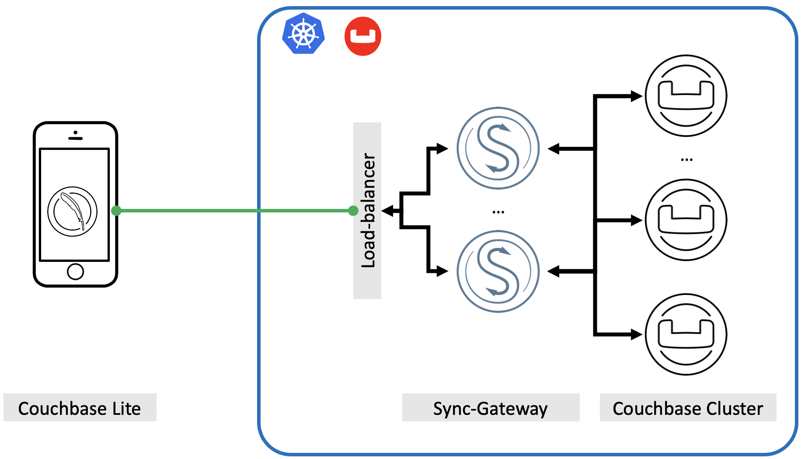
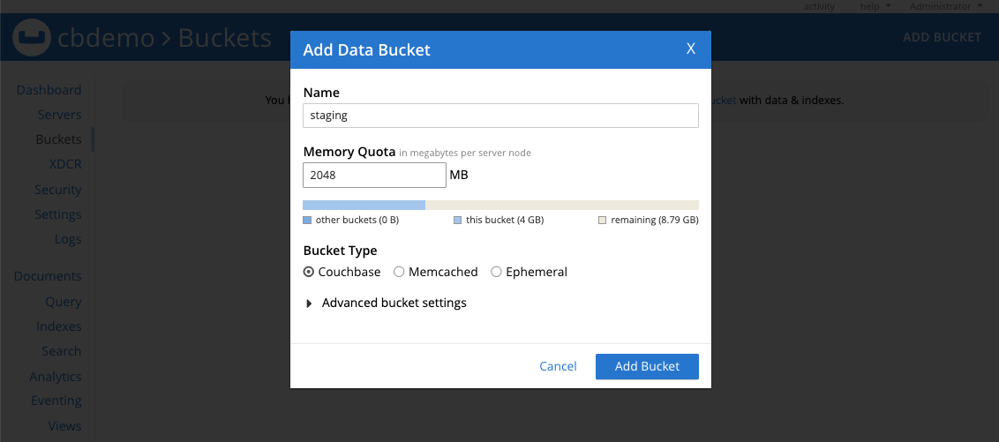
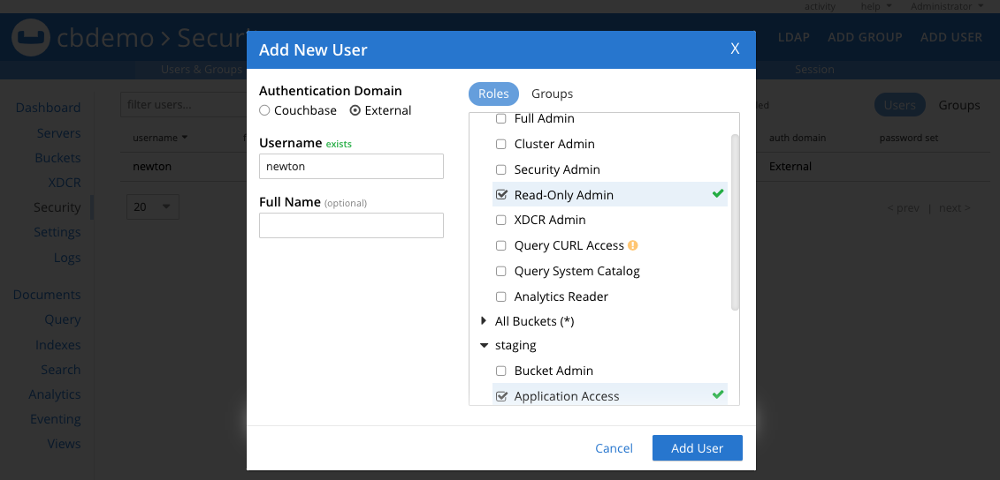

# Get set to the edge (devices) with Sync Gateway


## Introduction

Imagine you are going to meet an important client in downtown San Francisco, CA and you have an email with details on who to call to when you get to the office lobby. You are in the lobby but the Mobile network reception is completely down. You try to open your email client but it needs network connection every time you start the application. I am sure the inability to read the email without connectivity will lead to frustrating user experience.

To prevent these situations applications are now built with the offline first paradigm. This simply means application functionality is unaffected by intermittent lack of network connectivity. Also offline first usually implies the ability to sync data between edge-devices to the backend database.

Many relational or even non-relation database solutions treat mobile and backend as two separate problems therefore building offline-first applications with these point-solutions is next to impossible.



Figure 0: Couchbase edge-to-cloud data platform Architecture

Couchbase on the other hand is the leading provider of a fully integrated edge to the cloud solution. [Couchbase Lite](https://docs.couchbase.com/couchbase-lite/2.7/introduction.html) product is the embedded database for the edge devices (where you can run declarative queries locally on the device), [Sync Gateway](https://docs.couchbase.com/sync-gateway/2.7/introduction.html) is the gel technology which enables data synchronization from the edge devices to the [Couchbase Cluster](https://docs.couchbase.com/home/server.html).

In this article, we will focus on deploying Couchabse Cluster and Sync Gateway on the Kubernetes platform. The goal is that you get first-hand experience working with these technologies and you understand mechanics behind each one.

One more take away I would like you to take from this article is some of the best practices while deploying this solution in your own private or public cloud.

## Best practices

As I hear these questions from many of my enterprise customers,  I decided to address these first by talking about some of the best practices when it comes to deploying Couchbase on the Kubernetes platform.

1. Always perform [sizing analysis](https://docs.couchbase.com/server/6.5/install/sizing-general.html#sizing-data-service-nodes) of the Couchbase cluster first, to plan what EC2 instance, storage device types, and space would be needed for the cluster. Sizing estimates remain the same for the Kubernetes cluster as one would do it for the on-premises cluster.
However, do remember that in K8s we are doing the sizing for Kubernetes Nodes, where Couchbase pods are going to run. That is where the second best-practice comes into the picture.

2. Always use `spec.antiAffinity=true` in [couchbase-cluster.yaml](../files/2.0.1/yaml/couchbase-cluster.yaml) file during cluster deployment in production. This field specifies whether or not two pods in this cluster can be deployed on the same Kubernetes node. From the high-availability perspective, we don't want to place more than one pod on each of the K8s nodes, so that single node failure brings down a single pod only.

3. In the Kubernetes environment, it is advisable to manage pod placement on predefined node types (large, xlarge, 4xlarge, etc.) so that desired resources can be guaranteed at the cluster deployment or auto-recovery time. You can use   `spec.servers[].pod.spec.nodeSelector` field (as mentioned in [couchbase-cluster.yaml](../files/2.0.1/yaml/couchbase-cluster.yaml)), which specifies a key-value map of the constraints on node placement for pods. For a pod to be eligible to run on a node, the node must have each of the indicated key-value pairs as labels.

4. One last one before we begin the fun if your K8s cluster have homogeneous nodes and you don't want to use `node selector` method to determine the pod placement, then use [spec.servers[].resources](https://docs.couchbase.com/operator/2.0/reference-couchbasecluster.html#spec-servers-resources) to define `requests` and `limits`. Again this will help to place pods with a predefined pool of resources.

> **_NOTE:_** In the example below we will use `nodeSelector` technique to place respective pod types on the `nodegroups` to guarantee the desired resources.


## Prerequisites

Make sure you have an AWS account setup (instructions out of scope from this blog) and all the tools you would need to successfully try these instructions are ready. Here is the list of things you would need:

1. Download the latest [Couchbase Autonomous Operator](https://www.couchbase.com/downloads?family=kubernetes) package and unzip to the local machine. The Operator package contains command-line tools that you will use to install the Operator.

2. Install and setup [kubectl](https://kubernetes.io/docs/tasks/tools/install-kubectl/) on your local machine – kubectl is a command-line interface for running commands against Kubernetes clusters.

3. Install the latest [AWS CLI](https://docs.aws.amazon.com/cli/latest/userguide/cli-chap-install.html) – The AWS CLI is a unified tool that enables you to interact with AWS services using commands in your command-line shell. In this case, we will be using AWS CLI to communicate securely with the Kubernetes cluster running on AWS.

Once you have `aws cli` setup with your account credentials you can move on to creating a Kubernetes cluster section.

## Step 1: Create Multi-Nodegroup K8s Cluster

Kubernetes (K8s) provides us the flexibility to provision different sizes (vCPU, RAM, Disk size) compute machines into one single Kubernetes cluster so resource requirements of various managed services can be satisfied from a single K8s cluster.

We are going to leverage the same flexibility and provision three `NodeGroups`, which we will later use to host a specific set of Couchbase services.

### 1.1. Create an EKS cluster in the region of your choice

First, let's deploy a K8s cluster in `us-west-2` region and across two availability zones `us-west-2a/b`. You can mention a different `vpc-cidr` block as per your needs but in this example we will be using `172.16.0.0/20`, providing us a range of over 4K (2<sup>12</sup>) IP addresses, which should be more than enough for us.

```
$ eksctl create cluster --name k8sEKS \
 --version 1.14 \
 --region us-west-2 \
 --zones us-west-2a,us-west-2b \
 --vpc-cidr 172.16.0.0/20 \
 --without-nodegroup

```
### 1.2. Create separate Node Groups
Lets' create `nodegroup` within the EKS cluster so we can host  Couchbase `Data` service instances. In this example, we will be using `m5.large (2 vCPU & 8GB RAM)` EC2 machines as `node-type`, but the actual size of the EC2 node will depend on the capacity and performance planning based on your workload. So make sure you pick the right kind of nodes in your production deployment.

```bash
$ eksctl create nodegroup --cluster=k8sEKS \
 --name=m5l-pool \
 --node-type m5.large \
 --region us-west-2 \
 --nodes 2 \
 --nodes-min 2 \
 --nodes-max 4 \
 --node-ami auto
```

To host `Index/Query` services we will create a separate nodegroup with more compute and RAM. In this example we will be using `r5.large (2 vCPU & 16GB RAM)` machines.

```bash
$ eksctl create nodegroup --cluster=k8sEKS \
 --name=r5l-pool \
 --node-type r5.large \
 --region us-west-2 \
 --nodes 2 \
 --nodes-min 2 \
 --nodes-max 4 \
 --node-ami auto
```

Last but not least we will use `t2.xlarge (4 vCP & 16GB RAM)` to host `Sync-Gateway` instance.

```bash
$ eksctl create nodegroup --cluster=k8sEKS \
 --name=t2xl-pool \
 --node-type t2.xlarge \
 --region us-west-2 \
 --nodes 1 \
 --nodes-min 1 \
 --nodes-max 2 \
 --node-ami auto
```

Once all three `nodegroups` are ready we can start labeling each node in the nodegroup or use pre-existing label but first confirm all `nodegroups` are ready:

```bash
$ eksctl get nodegroups --cluster=k8sEKS --region=us-west-2

LUSTER	NODEGROUP	CREATED			MIN SIZE	MAX SIZE	DESIRED CAPACITY	INSTANCE TYPE	IMAGE ID
k8sEKS	m5l-pool	2020-07-24T18:58:02Z	2		4		2			m5.largeami-04387c277e83865b2
k8sEKS	r5l-pool	2020-07-24T18:58:09Z	2		4		2			r5.largeami-04387c277e83865b2
k8sEKS	t2xl-pool	2020-07-24T19:09:09Z	1		2		1			t2.xlargeami-04387c277e83865b2
```

### 1.3. Label EKS nodes

We have picked three different types of EC2 machines to host `data`, `Index/Query`, and `sync-gateway` machines just to dedicate Couchbase services to a specific `nodegroup` type. We are going to use an existing label called `beta.kubernetes.io/instance-type` for node selection. This label is going to be available by default so we don't have to create a new label. You can simply see node labels by running this cmd:


```bash

$ kubectl get nodes --show-labels

NAME                                         STATUS    ROLES     AGE       VERSION              LABELS
ip-172-16-0-12.us-west-2.compute.internal    Ready     <none>    21m       v1.14.9-eks-a0a484   ...,beta.kubernetes.io/instance-type=t2.xlarge,...
ip-172-16-0-127.us-west-2.compute.internal   Ready     <none>    32m       v1.14.9-eks-a0a484   ...,beta.kubernetes.io/instance-type=m5.large,...
ip-172-16-3-234.us-west-2.compute.internal   Ready     <none>    32m       v1.14.9-eks-a0a484   ...,beta.kubernetes.io/instance-type=m5.large,...
ip-172-16-1-29.us-west-2.compute.internal    Ready     <none>    32m       v1.14.9-eks-a0a484   ...,beta.kubernetes.io/instance-type=r5.large,...
ip-172-16-3-119.us-west-2.compute.internal   Ready     <none>    32m       v1.14.9-eks-a0a484   ...,beta.kubernetes.io/instance-type=r5.large,...


```

In this example we will be hosting `data` service on `m5.large` machines, `index/query` on `r5.large` machines and `sync-gateway` on `t2.xlarge` machine.

In a real production environment, we understand you may have a different type of machine but not essentially one type dedicated to one specific type of Couchbase service. In that case, you can create mutually exclusive labels for each node type.

You would use `kubectl label` cmd to label all the nodes that you want to use for data nodes only like this:

```
$ kubectl label nodes <ec2-node-ip>  instanceType=data

```
 Same way to label all the index (query or another) nodes:

 ```
$ kubectl label nodes <ec2-node-ip>  instanceType=index
 ```

Once you label all the nodes, you are ready to move to the next section.

> **_NOTE:_**   
We are using  `beta.kubernetes.io/instance-type` as the label, therefore we don't have to create any new label for the nodes.


## Step 2: Install the Custom Resource Definition

The first step in installing the Operator is to install the custom resource definition (CRD) that describes the `Couchbase` resource types. This can be achieved by running the below command from the Operator package directory:

```bash
kubectl create -f crd.yaml
```


## Step 3: Create a Namespace

Namespaces are a way to divide cluster resources between multiple users.

- Run the following command to create a namespace.

  ```
  $ kubectl create namespace cbdb

  namespace/cbdb created
  ```

- Confirm the Namespace is created successfully.

  ```
  $ kubectl get namespaces

  NAME              STATUS    AGE
  cbdb              Active    34s
  default           Active    5h20m
  ```

## Step 4: Install the Operator

The operator is composed of two components: a `per-cluster dynamic admission controller` (DAC) and a `per-namespace Operator`. Refer to the [operator architecture](https://docs.couchbase.com/operator/2.0/concept-operator.html) for additional information on what is required and security considerations.

### 4.1. Install the Dynamic Admission Controller (DAC)

The DAC allows custom resources to be modified and interrogated before a resource is accepted and committed to etcd. Running the DAC allows us to add sensible defaults to Couchbase cluster configurations thus minimizing the size of specifications. It also allows us to maintain backward compatibility when new attributes are added and must be populated. This makes the experience of using Couchbase resources similar to that of native resource types.

Lets now install the Dynamic Admission Controller.

- Open a Terminal window and go to the directory where you unpacked the Operator package. Run the following command to install the DAC into the `default` namespace.

```bash
$ bin/cbopcfg --no-operator --namespace default | kubectl create --namespace default -f -


serviceaccount/couchbase-operator-admission created
clusterrole.rbac.authorization.k8s.io/couchbase-operator-admission created
clusterrolebinding.rbac.authorization.k8s.io/couchbase-operator-admission created
secret/couchbase-operator-admission created
deployment.apps/couchbase-operator-admission created
service/couchbase-operator-admission created
mutatingwebhookconfiguration.admissionregistration.k8s.io/couchbase-operator-admission created
validatingwebhookconfiguration.admissionregistration.k8s.io/couchbase-operator-admission created
```

- Confirm the admission controller has deployed successfully.

```bash
$ kubectl get deployments

NAME                           READY     UP-TO-DATE   AVAILABLE   AGE
couchbase-operator-admission   1/1       1            1           48s
```

### 4.2. Install the Couchbase Operator

Now lets deploy the Operator in the `workshop` namespace by running the following command.

```bash
$ bin/cbopcfg --no-admission --namespace cbdb | kubectl create --namespace cbdb -f -

serviceaccount/couchbase-operator created
role.rbac.authorization.k8s.io/couchbase-operator created
rolebinding.rbac.authorization.k8s.io/couchbase-operator created
deployment.apps/couchbase-operator created
service/couchbase-operator created
```

Running the above command downloads the Operator Docker image and creates a [deployment](https://kubernetes.io/docs/concepts/workloads/controllers/deployment/), which manages a single instance of the Operator. The Operator uses a deployment so that it can restart the pod if it dies.

After you run the `kubectl create` command, it generally takes less than a minute for Kubernetes to deploy the Operator and for the Operator to be ready to run.

### 4.3. Check the status of the Deployment

You can use the following command to check on the status of the deployment:

```bash
$ kubectl get deployments -n cbdb

NAME                 READY     UP-TO-DATE   AVAILABLE   AGE
couchbase-operator   1/1       1            1           73s
```

### 4.4. Check the status of the Operator

Run the following command to verify that the Operator has started successfully:

```bash
$ kubectl get pods -l app=couchbase-operator -n cbdb

NAME                                  READY     STATUS    RESTARTS   AGE
couchbase-operator-558fd8486c-788jr   1/1       Running   0          2m9s
```

If the Operator is up and running, the command returns an output where the **READY** field shows **1/1**, such as:


## Step 5. Deploy Couchbase Cluster

In a production environment where performance and SLA of the system matter most, we should always plan on deploying Couchbase cluster using persistent volumes because it helps in:

* **Data Recoverability**: Persistent Volumes allow the data associated with Pods to be recovered in the case that a Pod is terminated. This helps prevent data loss and avoid time-consuming index building when using data or index services.

* **Pod Relocation**: Kubernetes may decide to evict pods that reach resource thresholds such as CPU and Memory Limits. Pods that are backed with Persistent Volumes can be terminated and restarted on different nodes without incurring any downtime or data loss.
* **Dynamic Provisioning**: The Operator will create Persistent Volumes on-demand as your cluster scales, alleviating the need to pre-provision your cluster storage before deployment.

* **Cloud Integration**: Kubernetes integrates with native storage provisioners available on major cloud vendors such as AWS and GCE.


### 5.1. Create Secret for Couchbase Admin Console

The first thing we need to do is create a secret credential that will be used by the administrative web console during login. For convenience, a sample secret is provided in the Operator package. When you push it to your Kubernetes cluster, the secret sets the username to the Administrator and the password to password.

To push the [secret.yaml](../files/2.0.1/yaml/secret.yaml) into your Kubernetes cluster, run the following command:

```bash
$ kubectl create -f secret.yaml -n cbdb

Secret/cb-admin-auth created
```

### 5.2 Create storage class for the k8s cluster

In order to use PersistentVolume for Couchbase services (data, index, search, etc.), we need to create Storage Classes ([sc-nas.yaml](../files/2.0.1/yaml/sc-nas.yaml)). Run kubectl to create a new SSD based storage class:

```bash
$ kubectl create -f sc-nas.yaml -n cbdb


storageclass.storage.k8s.io/nas created
```


### 5.3. Deploy Couchbase Cluster

The full spec for deploying the Couchbase cluster across 3 different zones using persistent volumes can be seen in the [couchbase-cluster.yaml](../files/2.0.1/yaml/couchbase-cluster.yaml) file. This file along with other sample YAML files used in this article can be downloaded from this git repo.

Open the YAML file you just downloaded and notice how we are using `nodeSelector` for placing the pods on the nodes that have the specific value of `beta.kubernetes.io/instance-type` label.
```
servers:
  - name: data-service-2a
    size: 1
    services:
      - data
    volumeMounts:
      default: pvc-default 	   # /opt/couchbase/var/lib/couchbase
      data: pvc-data	           # /mnt/data
    pod:
      spec:
        nodeSelector:
          beta.kubernetes.io/instance-type: m5.large
  - name: index-quer-service-2a
    size: 1
    services:
      - index
      - query
    volumeMounts:
      default: pvc-default
      index: pvc-index
    pod:
      spec:
        nodeSelector:
          beta.kubernetes.io/instance-type: r5.large
```

Now use `kubectl` to deploy the cluster but make sure you are using [couchbase-cluster.yaml](../files/2.0.1/yaml/couchbase-cluster.yaml) file from the git, not the same name file present in the current working directory.

```bash
$ kubectl create -f couchbase-cluster.yaml -n cbdb --save-config

couchbasecluster.couchbase.com/cbdemo created
```

This will start deploying the Couchbase cluster and if all goes fine then we will have four Couchbase cluster pods hosting the services as per the configuration file above. To check the progress run this command, which will watch (-w argument) the progress of pods creating:

```bash
$ kubectl get pods  -n cbdb -w

NAME                                  READY     STATUS    RESTARTS   AGE
cbdemo-0000                           0/1       Running   0          1m
cbdemo-0001                           0/1       Running   0          53s
cbdemo-0002                           0/1       Running   0          20s
couchbase-operator-558fd8486c-788jr   1/1       Running   0          21m
cbdemo-0003   0/1       Pending   0         3s
cbdemo-0003   0/1       Pending   0         3s
cbdemo-0003   0/1       ContainerCreating   0         3s
cbdemo-0003   0/1       Running   0         18s
cbdemo-0001   1/1       Running   0         2m
cbdemo-0000   1/1       Running   0         2m
cbdemo-0002   1/1       Running   0         1m
cbdemo-0003   1/1       Running   0         1m
```

To view which pod is running on which node you can run:

```bash
$ kubectl get pods -owide -n cbdb

NAME                                  READY     STATUS    RESTARTS   AGE       IP             NODE                                         NOMINATED NODE   READINESS GATES
cbdemo-0000                           1/1       Running   0          10m       172.16.2.134   ip-172-16-3-234.us-west-2.compute.internal   <none>           <none>
cbdemo-0001                           1/1       Running   0          10m       172.16.1.116   ip-172-16-0-127.us-west-2.compute.internal   <none>           <none>
cbdemo-0002                           1/1       Running   0          9m51s     172.16.1.5     ip-172-16-1-29.us-west-2.compute.internal    <none>           <none>
cbdemo-0003                           1/1       Running   0          9m3s      172.16.2.98    ip-172-16-3-119.us-west-2.compute.internal   <none>           <none>
couchbase-operator-558fd8486c-r2tcc   1/1       Running   0          31m       172.16.1.230   ip-172-16-0-12.us-west-2.compute.internal    <none>           <none>
```

You would notice that `Index/Query` service is running on pod `cbdemo-0002` and `cbdemo-0003` which is hosted on the EKS nodes with label `beta.kubernetes.io/instance-type: r5.large` and `data` service pods (`cbdemo-0000`, `cbdemo-0001`) are placed on EKS nodes with label `beta.kubernetes.io/instance-type: m5.large`. This means `nodeSelector` defined in [couchbase-cluster.yaml](../files/2.0.1/yaml/couchbase-cluster.yaml) has successfully enforced the placement of pods on the nodes with desired resources.

At this point you can do the port forwarding like this:


```bash
$ kubectl port-forward cbdemo-0000 18091:18091 -n cbdb

Forwarding from 127.0.0.1:18091 -> 18091
Forwarding from [::1]:18091 -> 18091
```

And access web-console by typing https://localhost:18091 on the browser.

## Step 6. Deploying a Sync Gateway Cluster

Great progress so far deploying multi-zone, highly-available Couchbase cluster using persistent storage volumes. Now before we begin deploying Sync Gateway, we need to make sure of two more things:

### 6.1 Sync Gateway Prerequisites

1. We have a bucket available where client application as well as Sync Gateway is going to write the data. We don't have any bucket available to write just yet, so we are going to create a `staging` bucket from the `Web Console`.


Figure 2: `Staging` bucket created with 2GB space.

We are assigning 2GB of RAM to this bucket but in the production environment you would be assigning RAM based on the sizing estimates that you or Couchbase Solutions Architect have done for your business use case.

2. We have n RBAC user in place with the `Application Access` role at the bucket level.

We can simply create a `Couchbase` User as we generally do, but to make this little more interesting we are going to use an `external` (aka LDAP) user. In the [couchbase-cluster.yaml](../files/2.0.1/yaml/couchbase-cluster.yaml) you can find details of a third party [LDAP test server](https://www.forumsys.com/tutorials/integration-how-to/ldap/online-ldap-test-server/) that we have used in this example.


```
security:
  adminSecret: cb-admin-auth
  rbac:
    managed: false
  ldap:
    hosts:
    - ldap.forumsys.com
    port: 389
    bindDN: "cn=read-only-admin,dc=example,dc=com"
    bindSecret: cb-admin-auth
    authenticationEnabled: true
    userDNMapping:
      template: "uid=%u,dc=example,dc=com"
    authorizationEnabled: false

```

If you like to connect to a different LDAP server you can simply update [ldap](https://docs.couchbase.com/server/current/manage/manage-security/configure-ldap.html#configure-ldap-with-the-ui) server details in the [couchbase-cluster.yaml](../files/2.0.1/yaml/couchbase-cluster.yaml) and apply the changes. Alright back to creating a user and assigning the bucket level `Application Access` role.


Figure 3: Using `newton` as the external user which will automatically be confirmed as `exists`.


Figure 4: User details after hitting the `Add User` button.

So far so good. Bucket and RBAC user is ready so we can go ahead with configuring the `Sync Gateway`.

### 6.2 Sync Gateway Configuration

In order for `Sync Gateway` to communicate with Couchbase Cluster, we need to provide database, bucket, and credential details. We will use `database` connection string as `couchbase://cbdemo-srv.cbdb.svc.cluster.local` as can be seen in the snippet below:

```bash
...
      },
      "databases": {
        "cbdemo": {
          "server": "couchbase://cbdemo-srv.cbdb.svc.cluster.local",
          "bucket": "staging",
          "username": "newton",
          "password": "password",
          "allow_conflicts": false,
          "revs_limit": 20,
          "enable_shared_bucket_access": true,
          "import_docs": true,
          "sync": `function(doc, oldDoc) {
                      channel(doc.channels);
                  }`,
        }
    ...
```

One thing I would highlight that with `Sync Gateway 2.7` (or above) enterprise customers can now designate multiple Sync Gateway nodes as Import nodes (to handle Couchbase Server writes), which provides added resiliency. Therefore we are using `import_docs: true` in the configuration file.


You can find all other configuration attributes from [sgw-config.yaml](../files/2.0.1/yaml/sgw-config.yaml) file. We will use this file to create the secret and save the configurations there as well.

```bash
$ kubectl create -f sgw-config.yaml -n cbdb --save-config

secret/sync-gateway created
```

To view `sgw-config` secret run below cmd:

```bash
$ kubectl get secret -n cbdb

NAME                             TYPE                                  DATA      AGE
cb-admin-auth                    Opaque                                2         4h
couchbase-operator-token-p4qzb   kubernetes.io/service-account-token   3         4h
default-token-x7cvw              kubernetes.io/service-account-token   3         4h
sgw-config                       Opaque                                1         30s

```

### 6.3 Deployment controller

After setting up the secret and configuration, we are almost ready to deploy `Sync Gateway` processes on our Kubernetes cluster. Adjust the `replicas` and `GOMAXPROCS` based on your production requirement but in this example, we are going to deploy two replicas with a maximum of single vCPU per replica.

```bash
apiVersion: apps/v1
kind: Deployment
metadata:
  name: sync-gateway
spec:
  replicas: 2
  selector:
    matchLabels:
      app: sync-gateway
  template:
    metadata:
      labels:
        app: sync-gateway
    spec:
      containers:
      - name: sync-gateway
        image: couchbase/sync-gateway:2.7.3-enterprise
        volumeMounts:
        - name: config
          mountPath: /etc/sync_gateway
          readOnly: true
        env:
        - name: GOMAXPROCS
          value: "1"
      volumes:
      - name: config
        secret:
          secretName: sync-gateway
```
Deploy [sgw-deployment.yaml](../files/2.0.1/yaml/sgw-deployment.yaml) file via `kubectl` cmd:


```bash
$ kubectl create -f sgw-deployment.yaml -n cbdb --save-config

deployment.extensions/sync-gateway created
```

You can view the progress of the deployment by running:

```
$ kubectl get deployments sync-gateway -n cbdb

$ kubectl get deployments sync-gateway -n cbdb
NAME           READY     UP-TO-DATE   AVAILABLE   AGE
sync-gateway   2/2       2            2           98s
```

As can be seen above, both the replica instances are up and running and we now have to just put a loadbalancer in the front.

### 6.4 Deploy a Load Balancer

In a production deployment, you will likely have one or more Sync Gateway nodes fronted by a [load balancer](https://docs.couchbase.com/sync-gateway/current/load-balancer.html).

You will deploy the load balancer using the [Kubernetes Load Balancer](https://kubernetes.io/docs/tasks/access-application-cluster/create-external-load-balancer/) service. The load balancer service provides an externally accessible IP address and routes traffic to the right ports in the cluster.

1. Create a new file called [sgw-lb.yaml](../files/2.0.1/yaml/sgw-lb.yaml) with the following attributes. Note that we are forwarding both 4984 (public access port) and 4985 (admin port)
```
kind: Service
apiVersion: v1
metadata:
  name: sgw-lb
spec:
  type: LoadBalancer
  selector:
    app: sync-gateway
  ports:
  - name: http
    protocol: TCP
    port: 4984
    targetPort: 4984
  - name: http2
    protocol: TCP
    port: 4985
    targetPort: 4985
```
**Note** we are forwarding both 4984 (public access port) and 4985 (admin port) via load balancer.

2. Deploy the load balancer using [sgw-lb.yaml](../files/2.0.1/yaml/sgw-lb.yaml) file.

```bash
$ kubectl create -f sgw-lb.yaml -n cbdb

service/sgw-load-balancer created
```

3. Verify the pods that the load balancer is targeting.

If all is deployed properly then you should see something similar to the following:

```
$ kubectl describe service sgw-load-balancer -n cbdb

Name:                     sgw-load-balancer
Namespace:                cbdb
Labels:                   <none>
Annotations:              <none>
Selector:                 app=sync-gateway
Type:                     LoadBalancer
IP:                       10.100.106.138
LoadBalancer Ingress:     a8ce.us-west-2.elb.amazonaws.com
Port:                     <unset>  4984/TCP
TargetPort:               4984/TCP
NodePort:                 <unset>  31066/TCP
Endpoints:                172.16.11.2:4984, 172.16.11.3:4984
Session Affinity:         None
External Traffic Policy:  Cluster
Events:
  Type    Reason                Age   From                Message
  ----    ------                ----  ----                -------
  Normal  EnsuringLoadBalancer  3m    service-controller  Ensuring load balancer
  Normal  EnsuredLoadBalancer   3m    service-controller  Ensured load balancer

```
Note down the `LoadBalancer Ingress` value.

### 6.5 Test the installation

Once Load Balancer is online we can confirm Sync Gateway cluster accessibility via `LoadBalancer Ingress` endpoint (as mentioned in the above output). Just use `curl` cmd:

```
curl  http://a8ce.us-west-2.elb.amazonaws.com:4984
```
It should return the following.

```h7bC4BA19zPHsHsChj
{"couchdb":"Welcome","vendor":{"name":"Couchbase Sync \
 Gateway","version":"2.7"},"version":"Couchbase Sync Gateway/2.7.3(3;33d352f) EE"}
```

Voila! Sync Gateway is fully functional and ready to take the workload from the client (via Couchbase Lite) application.


#### 6.5.1 Test Reading/Writing documents

In a separate blog I will discuss how one can develop applications for the edge devices using [Couchbase Lite](https://docs.couchbase.com/couchbase-lite/2.7/compatibility.html#couchbase-litesync-gateway-matrix) but to test the sanity of our end-to-end setup we can quickly perform simple POST and GET operations using `Sync Gateway` REST endpoints.

Let's use curl command to insert couple of documents:
```
$ curl -u admin:password -X POST "http://a8ce.us-west-2.elb.amazonaws.com:4984/cbdemo/" -H "accept: application/json" -H "Content-Type: application/json" -d "{\"id\":\"doc3\",\"channels\":\"newton\"}"

output

{"id":"c4988cff19c632a724e13d4390b23b82","ok":true,"rev":"1-f99195111681fe7361b74eb5ebca23d4"}
```

First document was inserted and document key was automatically generated as `c4988cff19c632a724e13d4390b23b82`.

```
$ curl -u admin:password -X POST "http://a8ce.us-west-2.elb.amazonaws.com:4984/cbdemo/" -H "accept: application/json" -H "Content-Type: application/json" -d "{\"id\":\"doc4\",\"channels\":\"newton\"}"

output

{"id":"8f02cab34faa17d61ca89aa05ade372e","ok":true,"rev":"1-68b03bf8df34c5854d852e3b549d0572"}
```

Second document was inserted successfully too using admin credentials and auto generated document key is `8f02cab34faa17d61ca89aa05ade372e`.

We can now get the document by performing GET operation using Sync Gateway [public REST API](https://docs.couchbase.com/sync-gateway/current/rest-api.html#api-explorer):

```
$ curl -u admin:password -X GET "http://a8ce.us-west-2.elb.amazonaws.com:4984/cbdemo/c4988cff19c632a724e13d4390b23b82" -H "accept: application/json" -H "Content-Type: application/json"

output

{"_id":"c4988cff19c632a724e13d4390b23b82","_rev":"1-f99195111681fe7361b74eb5ebca23d4","channels":"foo","id":"doc3"}

```

## Conclusion

Couchbase Sync Gateway is the critical data synchronization technology that enables application developers to build edge to the cloud solutions. In this article, we have used the latest version of Couchbase Autonomous Operator to install Couchbase cluster and Sync Gateway on the public cloud Kubernetes platform. In future articles, I will be building upon this article and show you how you can do many more enterprise-class things (like encryption, LDAP, Couchbase Lite development, and many more).  Till then happy learning.
