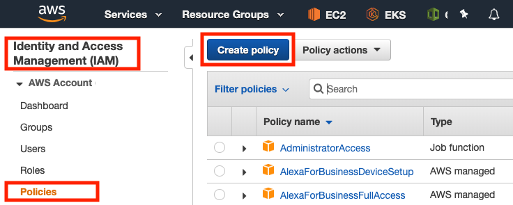
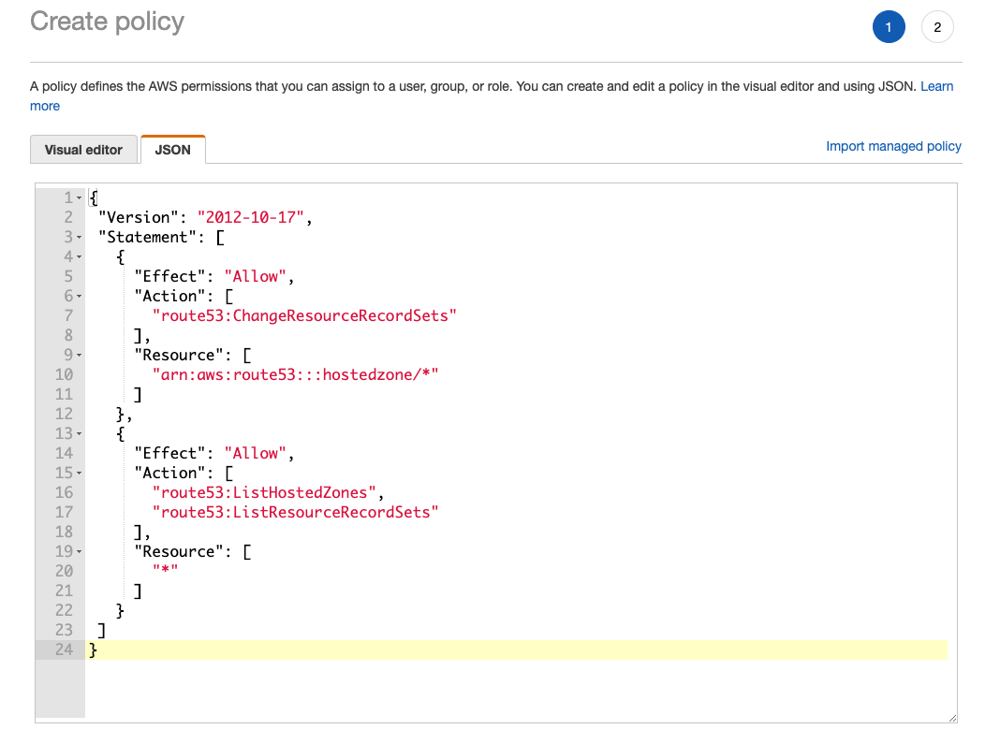
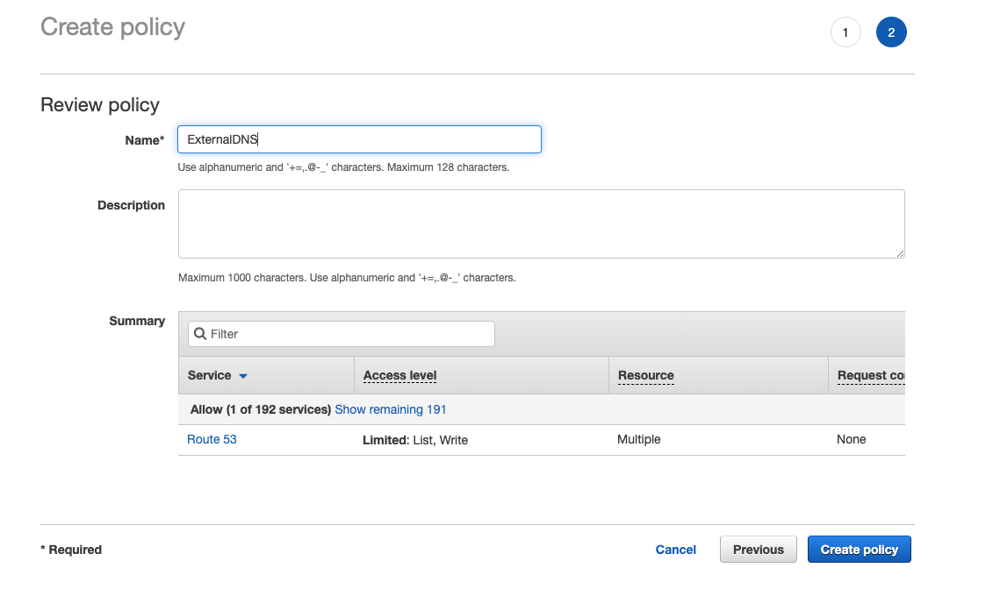
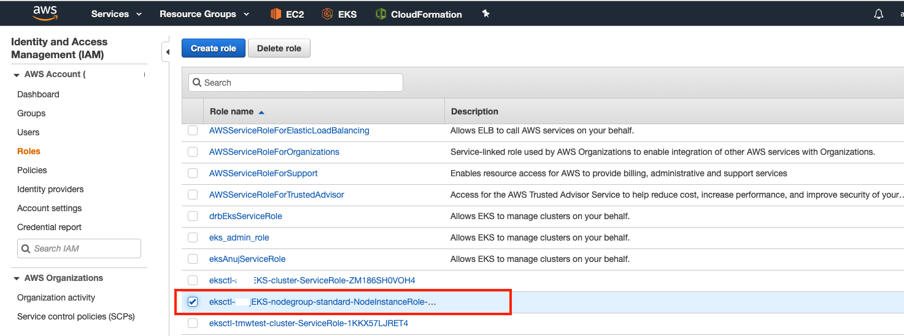
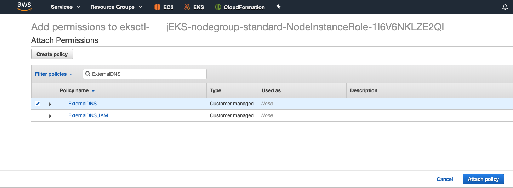
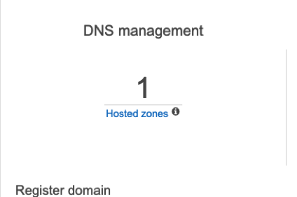
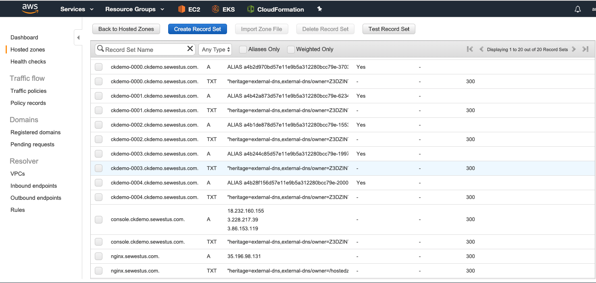
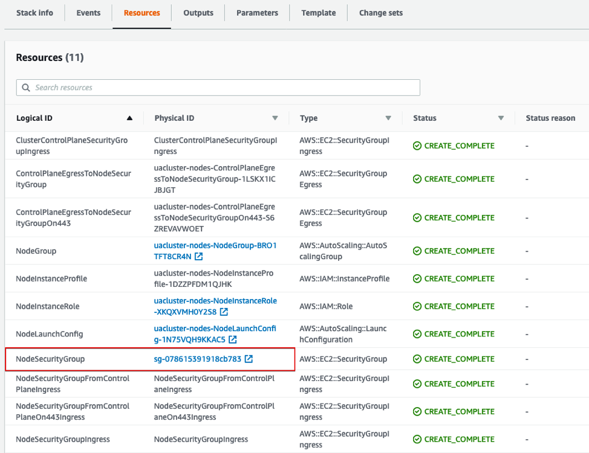

### Create IAM Policies

#### 1. Create ExternalDNS Policy

In order to create a new policies we need to login to AWS console with our credential:


Once logged-in find ```Services.IAM``` option. On the left hand side there is an option to create new policies. We will click that next and follow steps described



Figure 1: Bring create new policy form by visiting ```IAM > Policies``` option


```
{
 "Version": "2012-10-17",
 "Statement": [
   {
     "Effect": "Allow",
     "Action": [
       "route53:ChangeResourceRecordSets"
     ],
     "Resource": [
       "arn:aws:route53:::hostedzone/*"
     ]
   },
   {
     "Effect": "Allow",
     "Action": [
       "route53:ListHostedZones",
       "route53:ListResourceRecordSets"
     ],
     "Resource": [
       "*"
     ]
   }
 ]
}
```
Once we get the form, we will press JSON tab to copy/paste above json text from [ExternalDNS.json](../files/json/ExternalDNS.json) file into the textbox:



Figure 2: Copy/Paste ExternalDNS policy text into the form


Click Preview button to give a name to your policy:


Figure 3: Policy preview page

Give the name ```ExternalDNS``` as the policy name and hit 'Create policy' button.

#### 2. Create ExternalDNS_IAM Policy

Just following the same steps as above we will create second policy called [ExternalDNS_IAM](../files/json/ExternalDNS_IAM.json) policy:

```
{
    "Version": "2012-10-17",
    "Statement": [
        {
            "Sid": "VisualEditor0",
            "Effect": "Allow",
            "Action": [
                "iam:ListRoleTags",
                "iam:ListServerCertificates",
                "iam:ListPoliciesGrantingServiceAccess",
                "iam:ListServiceSpecificCredentials",
                "iam:ListMFADevices",
                "iam:ListSigningCertificates",
                "iam:ListVirtualMFADevices",
                "iam:ListInstanceProfilesForRole",
                "iam:ListSSHPublicKeys",
                "iam:ListAttachedRolePolicies",
                "iam:ListAttachedUserPolicies",
                "iam:ListAttachedGroupPolicies",
                "iam:ListRolePolicies",
                "iam:ListAccessKeys",
                "iam:ListPolicies",
                "iam:ListSAMLProviders",
                "iam:ListGroupPolicies",
                "iam:ListEntitiesForPolicy",
                "iam:ListRoles",
                "iam:ListUserPolicies",
                "iam:ListInstanceProfiles",
                "iam:ListPolicyVersions",
                "iam:ListOpenIDConnectProviders",
                "iam:ListGroupsForUser",
                "iam:ListAccountAliases",
                "iam:ListUsers",
                "iam:ListGroups",
                "iam:GetLoginProfile",
                "iam:ListUserTags",
                "iam:GetAccountSummary"
            ],
            "Resource": "*"
        }
    ]
}
```
Give policy name as ```ExternalDNS_IAM```.


#### 3. Create Couchbase Route53 Policy

Last but not the least, we will create [CBDRoute53](../files/json/CBDRoute53.json) policy that grants permission to access route53:
```
{
    "Version": "2012-10-17",
    "Statement": [
        {
            "Sid": "VisualEditor0",
            "Effect": "Allow",
            "Action": [
                "route53:ListTrafficPolicyInstances",
                "route53:GetTrafficPolicyInstanceCount",
                "route53:GetChange",
                "route53:ListTrafficPolicyVersions",
                "route53:TestDNSAnswer",
                "route53:GetHostedZone",
                "route53:GetHealthCheck",
                "route53:ListHostedZonesByName",
                "route53:ListQueryLoggingConfigs",
                "route53:GetCheckerIpRanges",
                "route53:ListTrafficPolicies",
                "route53:ListResourceRecordSets",
                "route53:ListGeoLocations",
                "route53:GetTrafficPolicyInstance",
                "route53:GetHostedZoneCount",
                "route53:GetHealthCheckCount",
                "route53:GetQueryLoggingConfig",
                "route53:ListReusableDelegationSets",
                "route53:GetHealthCheckLastFailureReason",
                "route53:GetHealthCheckStatus",
                "route53:ListTrafficPolicyInstancesByHostedZone",
                "route53:ListHostedZones",
                "route53:ListVPCAssociationAuthorizations",
                "route53:GetReusableDelegationSetLimit",
                "route53:ChangeResourceRecordSets",
                "route53:GetReusableDelegationSet",
                "route53:ListTagsForResource",
                "route53:ListTagsForResources",
                "route53:GetAccountLimit",
                "route53:ListTrafficPolicyInstancesByPolicy",
                "route53:ListHealthChecks",
                "route53:GetGeoLocation",
                "route53:GetHostedZoneLimit",
                "route53:GetTrafficPolicy"
            ],
            "Resource": "*"
        }
    ]
}
```
## Attach ExternalDNS Policy

Open the IAM service and select ```Roles```


Figure 4: Identify the role names <CLUSTER_NAME>-nodes-NodeInstanceRole-<UUID>

Click the role and then click 'Attach policies' button.


Figure 5: Attach policy form

Search for ExternalDNS string from the ```Filter Policy``` textbox.


Figure 6: Attach ExternalDNS policy to the selected role

## Deploy ExternalDNS Service

### Get Domain's Hosted Zone ID

We will need the ```hostedzone``` id of the domain (registered in Route53) that we are going to use in our Kubernetes deployment. For demonstration purpose I am using ```sewestus.com``` but you would use the domain that you have used earlier in your [couchbase-cluster-with-pv-1.2.yaml](../files/couchbase-cluster-with-pv-1.2.yaml) file.

```
$ aws route53 list-hosted-zones-by-name --output json --dns-name "sewestus.com" | jq -r '.HostedZones[0].Id'

/hostedzone/XYZIN7IGV3XYZ
```
So the ``hostedzone`` id that we are going to use is  ```XYZIN7IGV3XYZ```.


### Deploy Service

The [ExternalDNS](https://github.com/kubernetes-incubator/external-dns/blob/master/docs/tutorials/aws.md) provides a YAML file to deploy ExternalDNS however, make sure you replace three parameters in the sample [external-dns.yaml](../files/external-dns.yaml) file with the values applicable to your environment:

1. ```subjects.namespace``` = emart
2. ```spec.containers.args.domain-filter``` = mydomain.com
3. ```spec.containers.args.txt-owner-id ``` = XYZIN7IGV3XYZ

After updating the [external-dns.yaml](../files/external-dns.yaml) file,  we deploy it as follows:

```
$ kubectl create -f external-dns.yaml --namespace emart

serviceaccount/external-dns created
clusterrole.rbac.authorization.k8s.io/external-dns created
clusterrolebinding.rbac.authorization.k8s.io/external-dns-viewer created
deployment.extensions/external-dns created
```

Let's take a look at the logs of the external-dns pod to make sure everything deployed fine:

```
$ kubectl get pods -n emart

NAME                                            READY     STATUS    RESTARTS   AGE
ckdemo-0000                                     1/1       Running   0          30m
ckdemo-0001                                     1/1       Running   0          30m
ckdemo-0002                                     1/1       Running   0          30m
ckdemo-0003                                     1/1       Running   0          30m
ckdemo-0004                                     1/1       Running   0          30m
couchbase-operator-7654d844cb-d98w7             1/1       Running   0          30m
couchbase-operator-admission-7ff868f54c-jh66q   1/1       Running   0          30m
external-dns-6fb674fcf6-f7d7k                   1/1       Running   0          22s
```
Give it few minutes and you would get the DNS entry updated:
```
$ kubectl logs external-dns-6fb674fcf6-f7d7k -n emart -f

time="2019-09-16T21:04:56Z" level=error msg="AccessDenied: User: arn:aws:sts::306776353488:assumed-role/eksctl-xyzEKS-nodegroup-standard-NodeInstanceRole-1I6V6NKLZE2QI/i-041d3d5e9b9e5f31a is not authorized to perform: route53:ListHostedZones\n\tstatus code: 403, request id: 1a4fa8be-faef-4493-b889-75f02e67c4fe"
time="2019-09-16T21:05:56Z" level=error msg="AccessDenied: User: arn:aws:sts::306776353488:assumed-role/eksctl-XYZIN7IGV3XYZ-nodegroup-standard-NodeInstanceRole-1I6V6NKLZE2QI/i-041d3d5e9b9e5f31a is not authorized to perform: route53:ListHostedZones\n\tstatus code: 403, request id: 3e92460d-8b8c-4db3-a65f-a6f8392a5acd"
time="2019-09-16T21:06:56Z" level=error msg="AccessDenied: User: arn:aws:sts::306776353488:assumed-role/eksctl-xyzEKS-nodegroup-standard-NodeInstanceRole-1I6V6NKLZE2QI/i-041d3d5e9b9e5f31a is not authorized to perform: route53:ListHostedZones\n\tstatus code: 403, request id: b62ad09a-a45b-4fa2-8e85-d8c341613ecf"

time="2019-09-16T21:07:56Z" level=error msg="AccessDenied: User: arn:aws:sts::306776353488:assumed-role/eksctl-xyzEKS-nodegroup-standard-NodeInstanceRole-1I6V6NKLZE2QI/i-041d3d5e9b9e5f31a is not authorized to perform: route53:ListHostedZones\n\tstatus code: 403, request id: ad60129e-c304-41c9-85d5-185a7658364b"
time="2019-09-16T21:08:56Z" level=info msg="Desired change: CREATE ckdemo-0002.ckdemo.sewestus.com A [Id: /hostedzone/XYZIN7IGV3XYZ]"
time="2019-09-16T21:08:56Z" level=info msg="Desired change: CREATE ckdemo-0004.ckdemo.sewestus.com A [Id: /hostedzone/XYZIN7IGV3XYZ]"
time="2019-09-16T21:08:56Z" level=info msg="Desired change: CREATE ckdemo-0003.ckdemo.sewestus.com A [Id: /hostedzone/XYZIN7IGV3XYZ]"
time="2019-09-16T21:08:56Z" level=info msg="Desired change: CREATE console.ckdemo.sewestus.com A [Id: /hostedzone/XYZIN7IGV3XYZ]"
time="2019-09-16T21:08:56Z" level=info msg="Desired change: CREATE ckdemo-0001.ckdemo.sewestus.com A [Id: /hostedzone/XYZIN7IGV3XYZ]"
time="2019-09-16T21:08:56Z" level=info msg="Desired change: CREATE ckdemo-0000.ckdemo.sewestus.com A [Id: /hostedzone/]"
time="2019-09-16T21:08:56Z" level=info msg="Desired change: CREATE ckdemo-0002.ckdemo.sewestus.com TXT [Id: /hostedzone/XYZIN7IGV3XYZ]"
time="2019-09-16T21:08:56Z" level=info msg="Desired change: CREATE ckdemo-0004.ckdemo.sewestus.com TXT [Id: /hostedzone/XYZIN7IGV3XYZ]"
time="2019-09-16T21:08:56Z" level=info msg="Desired change: CREATE ckdemo-0003.ckdemo.sewestus.com TXT [Id: /hostedzone/XYZIN7IGV3XYZ]"
time="2019-09-16T21:08:56Z" level=info msg="Desired change: CREATE console.ckdemo.sewestus.com TXT [Id: /hostedzone/XYZIN7IGV3XYZ]"
time="2019-09-16T21:08:56Z" level=info msg="Desired change: CREATE ckdemo-0001.ckdemo.sewestus.com TXT [Id: /hostedzone/XYZIN7IGV3XYZ]"
time="2019-09-16T21:08:56Z" level=info msg="Desired change: CREATE ckdemo-0000.ckdemo.sewestus.com TXT [Id: /hostedzone/XYZIN7IGV3XYZ]"
time="2019-09-16T21:08:56Z" level=info msg="12 record(s) in zone sewestus.com. [Id: /hostedzone/XYZIN7IGV3XYZ] were successfully updated"
time="2019-09-16T21:09:56Z" level=info msg="All records are already up to date"
time="2019-09-16T21:10:56Z" level=info msg="All records are already up to date"
```

## Verify ExternalDNS

After we have deployed the ExternalDNS,  it will replicate the DNS entries as A entries in our hosted zone.  We can verify this as follows:

1.	Log into AWS Console
2.	Select Route53 Service
3.	Click on Hosted Zones



4.  Click on your domain
5.  You should see entries for each pods




## Update Network Security Group
Even though we have set up the ExternalDNS, the EKS cluster has a network security group that blocks external traffic to our worker nodes. We will open ports to allow external traffic to our worker nodes.

1.	Log into the AWS Console
2.	Click on ```CloudFormation```
3.	Select the stack for your cluster nodes and select ```Resources```


4.	Find the NodeSecurityGroup and click the Physical ID link



5.	Select the security group with group name like <CLUSTER_NAME>-nodes-NodeSecurity.  Down in the lower pane,  select the Inbound tab


6.	Click on the Edit button under the inbound tab
7.	Click Add Rule


For this example we will open ports 1025-65535 and to cider 0.0.0.0/0 however, this can be much more tuned for security consideration.
