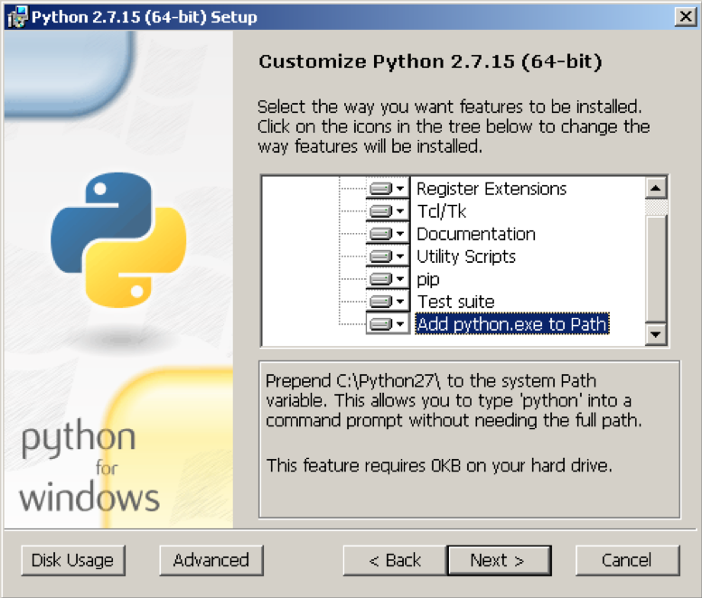

# Prerequisite Tools

In this section, you will perform the necessary steps to install and configure the prerequisite tools required to interact with kubernetes cluster deployed on AWS. Follow the steps below and reach out for help if you get stuck. You can skip any step if you already have the corresponding tool(s) installed on your computer.

**Remember**: it is important to have the right minimum versions of the tools. This guide focuses on installing the right versions, so you get the functionality needed to complete all steps successfully.


For Mac OS, it is recommended you install Homebrew package manager; it will make things much easier.

There are separate sections for Mac and Windows setup steps where needed. If there are no such separate sections, the steps are similar or identical for both operating systems, however terminal commands shown are based on Mac OS and some may need to be modified before being run on Windows, e.g. change / to \\, remove trailing & character to run commands in the background.

This guide does not cover installation steps on Linux due to a variety of popular Linux distributions. Please ask for help if you are using Linux and get stuck.


## Step 1: Install Python 2.7.15 and pip Package Manager

We will use the Python programming language for automating some tasks in the labs. The installers are available from the following page: [Python 2.7.15 Downloads](https://www.python.org/downloads/release/python-2715/). Python 3.x will also work if you already have that installed.

### Mac - Option 1 - Homebrew
Use Homebrew to install Python 2.7.15 and pip by issuing the following command in a terminal:
```
$ brew install python2
```

### Mac - Option 2 - Installer
You can download and run the following installer: [Python 2.7.15 MacOS installer](https://www.python.org/ftp/python/2.7.15/python-2.7.15-macosx10.9.pkg). If you run the installer and accept all the defaults, it will install pip (Python package manager) too.

Check Python and pip versions in a terminal to make sure they successfully installed:
```
$ python -V
Python 2.7.15
$ pip -V
pip 18.1 from /usr/local/lib/python2.7/site-packages/pip (python 2.7)
```
 
### Windows - Installer
Download and run the following installer: [Python 2.7.15 Windows 64-bit](https://www.python.org/ftp/python/2.7.15/python-2.7.15.amd64.msi) installer. If you run the installer and accept all the defaults, it will install pip (Python package manager) too. You can also choose to add python.exe to your PATH environment variable as part of the installation (recommended):



Check Python and pip versions in a terminal to make sure they successfully installed:

```
> python -V
Python 2.7.15
> pip -V
pip 9.0.3 from c:\python27\lib\site-packages (python 2.7)
```

 
## Step 2: Install kubectl

We will use kubectl (the Kubernetes command-line tool) to deploy and manage applications on Kubernetes.  
There are multiple options to download and install kubectl for your operating system, you can find them on the following page: [Install and setup kubectl](https://kubernetes.io/docs/tasks/tools/install-kubectl/). Below are the recommended methods for Mac and Windows (please do only one of the 3 options provided for Windows).

### Mac - Homebrew
Use Homebrew package manager to install kubectl by issuing the following command in a terminal:
```
$ brew install kubernetes-cli
```
Check kubectl version in a terminal to make sure it successfully installed:
```
$ kubectl version

Client Version: version.Info{Major:"1", Minor:"13", GitVersion:"v1.13.3", GitCommit:"721bfa751924da8d1680787490c54b9179b1fed0", GitTreeState:"clean", BuildDate:"2019-02-04T04:48:03Z", GoVersion:"go1.11.5", Compiler:"gc", Platform:"darwin/amd64"}
The connection to the server localhost:8080 was refused - did you specify the right host or port?
```

### Windows - Option 1 - Download kubectl.exe
1. Download the kubectl.exe binary from here: [kubectl 1.13.0 binary for Windows](https://storage.googleapis.com/kubernetes-release/release/v1.13.0/bin/windows/amd64/kubectl.exe). Put the kubectl.exe file in any directory of your choice on your computer, e.g. ```C:\kubectl```.

2. Modify/edit your PATH environment variable to include the path where you put kubectl.exe, e.g., C:\kubectl. Use the Environment Variables dialog box (Control Panel → System → Advanced system settings → Environment Variables) to change the PATH variable permanently or use the terminal as shown below to change the PATH variable for the duration of the session:
```
> set PATH=%PATH%;C:\kubectl
```
 
### Windows - Option 2 - PowerShell Gallery
Use [PowerShell Gallery](https://www.powershellgallery.com/) package manager. This works best on Windows 10, since Install-PackageProvider cmdlet has not been part of the OS prior to Windows 10.

Run Windows PowerShell as Administrator and execute the following commands:
```
> Set-ExecutionPolicy -ExecutionPolicy Unrestricted -Scope CurrentUser -Force
> Install-PackageProvider -Name NuGet -MinimumVersion 2.8.5.201 -Force
Name                           Version          Source           Summary
----                           -------          ------           -------
nuget                          2.8.5.208        https://onege... NuGet provider for the OneGet meta-package manager
> Install-Script -Name install-kubectl -Scope CurrentUser -Force
> install-kubectl.ps1 -DownloadLocation C:\YOUR_PATH
==>Getting download link from  https://kubernetes.io/docs/tasks/tools/install-kubectl/
==>analyzing Downloadlink
==>starting Download from https://storage.googleapis.com/kubernetes-release/release/v1.13.0/bin/windows/amd64/kubectl.exe using Bitstransfer
==>starting 'C:\kubectl\kubectl.exe version'
Client Version: version.Info{Major:"1", Minor:"13", GitVersion:"v1.13.0", GitCommit:"ddf47ac13c1a9483ea035a79cd7c10005ff21a6d", GitTreeState:"clean", BuildDate:"2018-12-03T21:04:45Z", GoVersion:"go1.11.2", Compiler:"gc", Platform:"windows/amd64"}
Unable to connect to the server: dial tcp [::1]:8080: connectex: No connection could be made because the target machine actively refused it.

You can now start kubectl from C:\kubectl\kubectl.exe
```
**Note**:  If you do not specify -DownloadLocation parameter, kubectl.exe will be installed in your temp directory.

### Windows - Option 3 - Chocolatey
Using [Chocolatey](https://chocolatey.org/) package manager. This works well on Windows 7 and later versions.

Once you install Chocolatey, run Windows PowerShell as Administrator and execute the following commands:
```
> choco install kubernetes-cli
Chocolatey v0.10.11
Installing the following packages:
kubernetes-cli
By installing you accept licenses for the packages.
Progress: Downloading kubernetes-cli 1.13.3... 100%

kubernetes-cli v1.13.3 [Approved]
kubernetes-cli package files install completed. Performing other installation steps.
The package kubernetes-cli wants to run 'chocolateyInstall.ps1'.
Note: If you don't run this script, the installation will fail.
Note: To confirm automatically next time, use '-y' or consider:
choco feature enable -n allowGlobalConfirmation
Do you want to run the script?([Y]es/[N]o/[P]rint): Y

.....
 ShimGen has successfully created a shim for kubectl.exe
 The install of kubernetes-cli was successful.
  Software installed to 'C:\ProgramData\chocolatey\lib\kubernetes-cli\tools'

Chocolatey installed 1/1 packages.
 See the log for details (C:\ProgramData\chocolatey\logs\chocolatey.log).

> cd $HOME
> mkdir .kube
Mode                LastWriteTime     Length Name
----                -------------     ------ ----
d----        02/04/2019   4:42 PM            .kube
> cd .kube
> New-Item config -type file
Mode                LastWriteTime     Length Name
----                -------------     ------ ----
-a---        02/04/2019   4:43 PM          0 config
```
Check kubectl version in a terminal to make sure it successfully installed:
```
> kubectl version

Client Version: version.Info{Major:"1", Minor:"13", GitVersion:"v1.13.0", GitCommit:"ddf47ac13c1a9483ea035a79cd7c10005ff21a6d", GitTreeState:"clean", BuildDate:"2018-12-03T21:04:45Z", GoVersion:"go1.11.2", Compiler:"gc", Platform:"windows/amd64"}
Unable to connect to the server: dial tcp [::1]:8080: connectex: No connection could be made because the target machine actively refused it.
```


## Step 3: Install aws-iam-authenticator tool

The aws-iam-authenticator tool uses AWS Identity and Access Management (IAM) credentials to authenticate to a Kubernetes cluster.

### Mac - Homebrew
Use Homebrew package manager to install aws-iam-authenticator by issuing the following command in a terminal:
```
$ brew install aws-iam-authenticator
```
Check aws-iam-authenticator help page in a terminal to make sure it successfully installed:
```
$ aws-iam-authenticator help

A tool to authenticate to Kubernetes using AWS IAM credentials

Usage:
  aws-iam-authenticator [command]

Available Commands:
  help        Help about any command
  init        Pre-generate certificate, private key, and kubeconfig files for the server.
  server      Run a webhook validation server suitable that validates tokens using AWS IAM
  token       Authenticate using AWS IAM and get token for Kubernetes
  verify      Verify a token for debugging purpose
  version     Version will output the current build information

Flags:
  -i, --cluster-id ID       Specify the cluster ID, a unique-per-cluster identifier for your aws-iam-authenticator installation.
  -c, --config filename     Load configuration from filename
  -h, --help                help for aws-iam-authenticator
  -l, --log-format string   Specify log format to use when logging to stderr [text or json] (default "text")

Use "aws-iam-authenticator [command] --help" for more information about a command.
```

### Windows - Download aws-iam-authenticator.exe
1.	Download the aws-iam-authenticator.exe binary from here: [aws-iam-authenticator 1.11.5 binary for Windows](https://amazon-eks.s3-us-west-2.amazonaws.com/1.11.5/2018-12-06/bin/windows/amd64/aws-iam-authenticator.exe). Put the aws-iam-authenticator.exe file in any directory on your computer, e.g., C:\\aws .

2.	Modify/edit your PATH environment variable to include the path where you put aws-iam-authenticator.exe, e.g., C:\aws. Use the Environment Variables dialog box (Control Panel → System → Advanced system settings → Environment Variables) to change the PATH variable permanently or use the terminal as shown below to change the PATH variable for the duration of the session:
```
> set PATH=%PATH%;C:\aws
```
Check aws-iam-authentication help page in a terminal to make sure it successfully installed:
```
$ aws-iam-authenticator help

A tool to authenticate to Kubernetes using AWS IAM credentials

Usage:
  aws-iam-authenticator [command]

Available Commands:
  help        Help about any command
  init        Pre-generate certificate, private key, and kubeconfig files for the server.
  server      Run a webhook validation server suitable that validates tokens using AWS IAM
  token       Authenticate using AWS IAM and get token for Kubernetes
  verify      Verify a token for debugging purpose
  version     Version will output the current build information

Flags:
  -i, --cluster-id ID       Specify the cluster ID, a unique-per-cluster identifier for your aws-iam-authenticator installation.
  -c, --config filename     Load configuration from filename
  -h, --help                help for aws-iam-authenticator
  -l, --log-format string   Specify log format to use when logging to stderr [text or json] (default "text")

Use "aws-iam-authenticator [command] --help" for more information about a command.
```


## Step 4: Install AWS CLI (version 1.16.73 or greater)

AWS Command Line Interface (CLI) is a unified tool to manage all AWS services.

### Mac - Homebrew
Use Homebrew package manager to install awscli by issuing the following command in a terminal:
```
$ brew install awscli
```
If aws is already installed, but the version is older than 1.16.73, you need to upgrade to the latest version:
```
$ brew upgrade awscli
```
Check aws version in a terminal to make sure it successfully installed:
```
$ aws --version

aws-cli/1.16.78 Python/2.7.10 Darwin/18.0.0 botocore/1.12.68
```

### Windows Installer
Download and run the following installer: [AWS CLI Windows 64-bit installer](https://s3.amazonaws.com/aws-cli/AWSCLI64PY3.msi).

Check aws version in a terminal to make sure it successfully installed:
```
> aws --version

aws-cli/1.16.159 Python/2.7.16 Windows/10 botocore/1.12.149
```

## Step 5: Configure AWS CLI

We will configure AWS CLI credentials and options by running aws configure command. Use the following values for AWS Access Key ID, AWS Secret Access Key, Default region name, and Default output format:

| NAME              | VALUE |
| --------------------- | ----------- |
|AWS Access Key ID	|A*****************|
|AWS Secret Access Key|	L******************************/8*******|
|Default region name	|us-east-2|
|Default output format	|json|

Run the aws configure command and enter each of the values provided above, as shown below:
```
$ aws configure

AWS Access Key ID [none]: A*****************
AWS Secret Access Key [none]: L******************************/8*******
Default region name [none]: us-east-2
Default output format [none]: json
```


## Step 6: Install git CLI

git CLI is a tool to work with GitHub repositories.

### Mac - git via Homebrew
git CLI is usually pre-installed on Mac. You can also install it by using Homebrew package manager:
```
$ brew install git
```
### Windows - git via Installer
git CLI for Windows can be downloaded from the following location: [Git for Windows](https://gitforwindows.org/).  Here is the direct link for the current 64-bit installer: [Git Windows 64-bit installer](https://github.com/git-for-windows/git/releases/download/v2.20.1.windows.1/Git-2.20.1-64-bit.exe).
