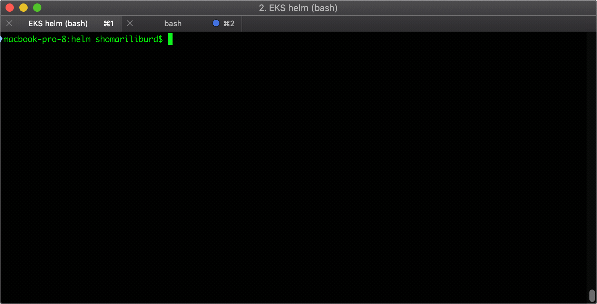
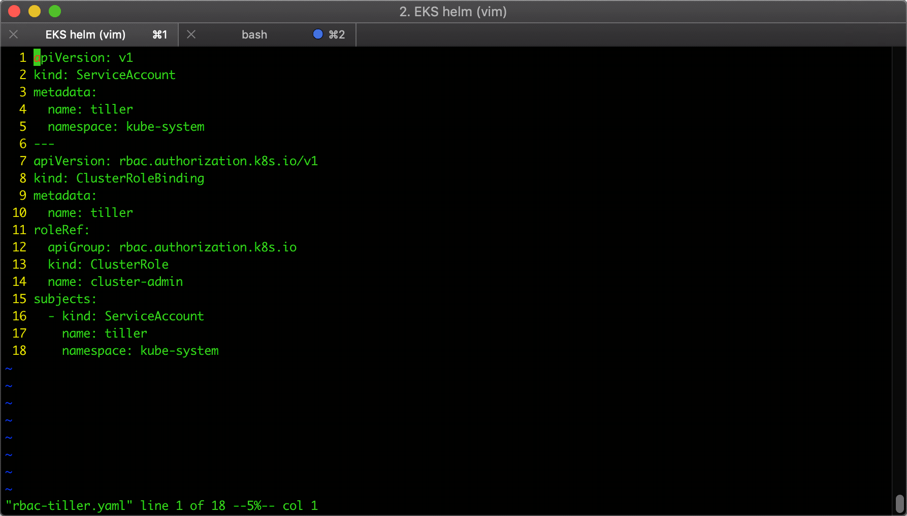
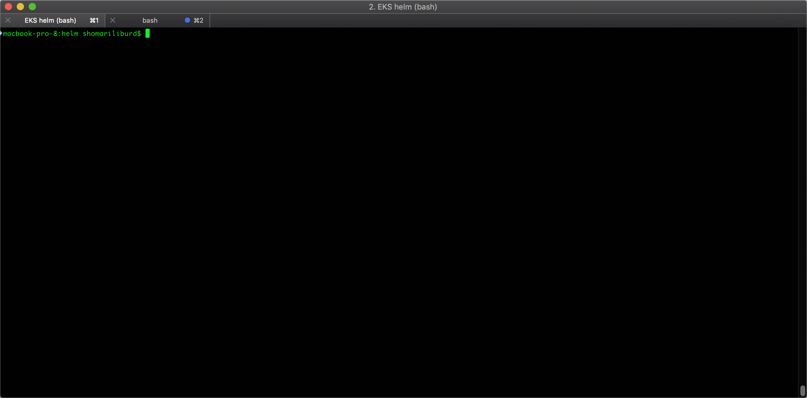
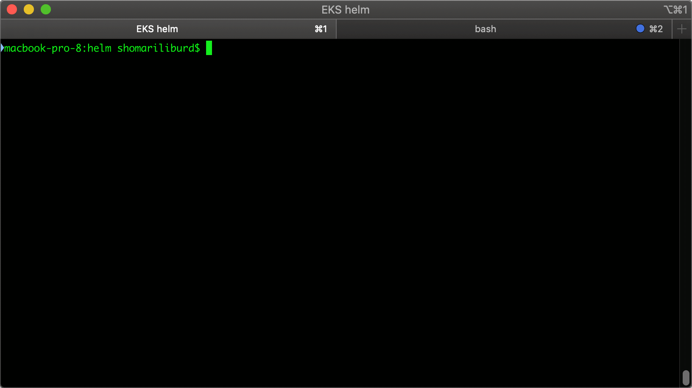
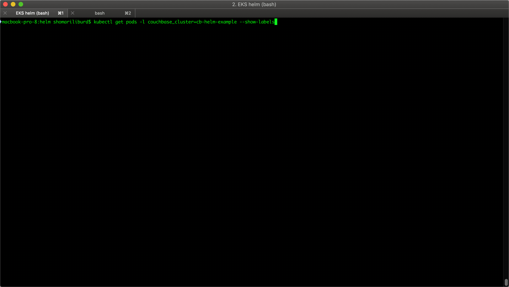
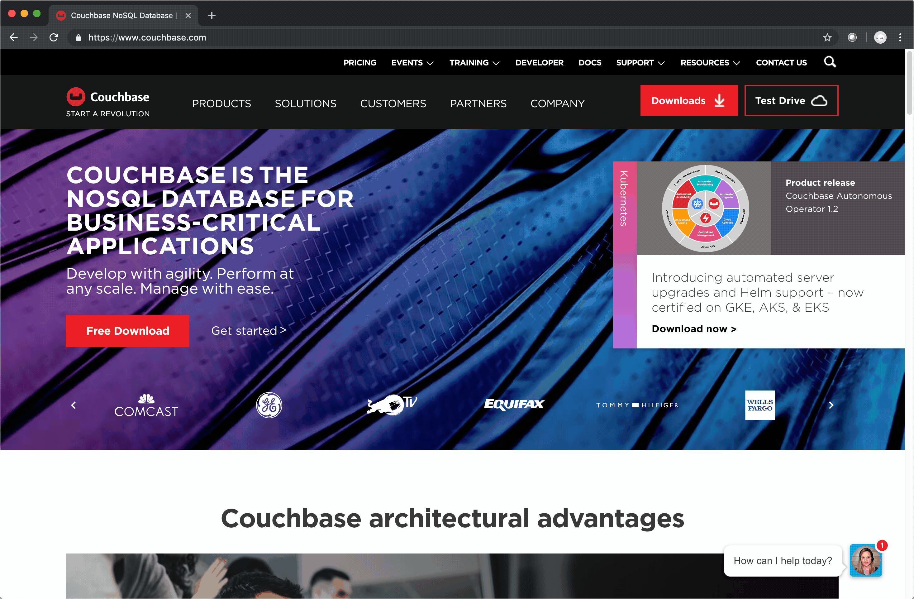
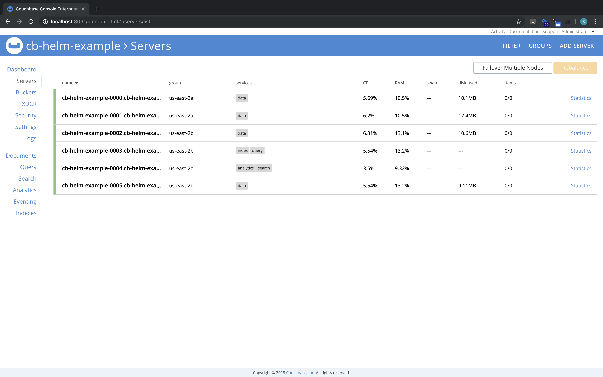

# Deploying Couchbase Clusters with the Couchbase Autonomous Operator using Helm

## Table of Contents

- [Deploying Couchbase Clusters with the Couchbase Autonomous Operator using Helm](#deploying-couchbase-clusters-with-the-couchbase-autonomous-operator-using-helm)
    - [Table of Contents](#table-of-contents)
    - [Introduction](#introduction)
    - [Terms](#terms)
    - [Key Concepts](#key-concepts)
    - [Prerequisites](#prerequisites)
    - [Create an Amazon EKS Cluster](#create-an-amazon-eks-cluster)
    - [Installing and Configuring Helm and Tiller](#installing-and-configuring-helm-and-tiller)
    - [Deploy the Couchbase Autonomous Operator](#deploy-the-couchbase-autonomous-operator)
    - [Storage Classes](#storage-classes)
    - [Deploy the Couchbase Cluster](#deploy-the-couchbase-cluster)
        - [Using TLS](#using-tls)
        - [View the Couchbase Web Console](#view-the-couchbase-web-console)
        - [Upgrade Couchbase Server](#upgrade-couchbase-server)
        - [Scaling a Cluster](#scaling-a-cluster)
    - [Conclusion](#conclusion)
## Introduction

This document is a walk-through of how to deploy the Couchbase Autonomous Operator to manage Couchbase clusters using helm, on Amazon Elastic Kubernetes Service (Amazon EKS).  The document focuses on simplicity and is for demonstration purposes.  This document should not be used for production deployments as-is.  The details on how a user should manage their Kubernetes environment is beyond the scope of this document.

## Terms

*k8s*: A short hand version of Kubernetes.

*Amazon EKS/EKS*: Amazon Elastic Kubernetes Service.

*RBAC*: Role-based acces control.

## Key Concepts

The Couchbase Autonomous Operator simplifies the management and configuration of [Couchbase](www.couchbase.com) clusters in a Kubernetes (k8s) environment. The Couchbase Autonomous Operator [consists of] the Operator itself and the Admission Controller.

Helm is a package manager for k8s applications that streamlines deploying k8s applications.

Amazon Elastic Kubernetes Service ([Amazon EKS](https://aws.amazon.com/eks/)) makes it easy to deploy, manage, and scale containerized applications using Kubernetes on AWS.

Kubernetes supports namespaces, which are groupings that logically isolates resources.  A K8s cluster generates three namespaces, kube-system, kube-public and default. The default namespace is designed for convenienc, and this guide uses the default namespace for that reason.  The commands in this guide can be used in a namespace, by creating one and (typically adding) `--namespace=<NAMESPACE>` to relevant commands.

## Prerequisites

The following tools are required in order to complete this walkthrough:

1. An [AWS](http://aws.amazon.com) account
2. The [AWS CLI](https://docs.aws.amazon.com/cli/latest/userguide/cli-chap-install.html) installed
3. [kubectl](https://docs.aws.amazon.com/eks/latest/userguide/install-kubectl.html) installed

## Create an Amazon EKS Cluster

The first step is to create an [Amazon EKS cluster](https://docs.aws.amazon.com/eks/latest/userguide/getting-started.html#eks-prereqs). 

For simplicity this guide will use [eksctl](https://docs.aws.amazon.com/eks/latest/userguide/getting-started-eksctl.html) to create the EKS cluster, but feel free to use [the AWS Management Console](https://docs.aws.amazon.com/eks/latest/userguide/getting-started-console.html) if you prefer.

The specifications of the cluster are:
* Named cb-helm-eks (optional)
* Using an instance type of m5.xlarge (or better)
* 5 nodes with a max of >= 7
* Using a [supported version of k8s](https://docs.couchbase.com/operator/current/prerequisite-and-setup.html) (in this case 1.13)

Create the cluster using eksctl run:

```
eksctl create cluster --name cb-helm-eks \
--version 1.13 --nodegroup-name standard-workers \
--node-type m5.xlarge --nodes 5 \
--nodes-min 1 --nodes-max 7 --node-ami auto
```

Verify that the cluster has deployed successfully by running:

```
kubectl get nodes
```


If problems are encountered then [troubleshoot the configuration](https://docs.couchbase.com/operator/current/install-eks.html), before continuing.

## Installing and Configuring Helm and Tiller

As mentioned earlier helm is a package manager for k8s applications. There are two tools needed when working with Helm: The Helm client (helm) and the Helm server (Tiller) that speaks to the k8s cluster via the API.  Helm simplifies k8s application installation and management using [three big concepts](https://helm.sh/docs/using_helm/#three-big-concepts) of charts, repositories and releases.

Prepare to use helm by [installing the helm client](https://helm.sh/docs/using_helm/#installing-helm).  

With the helm client installed setup [RBAC](https://helm.sh/docs/using_helm/#role-based-access-control) for tiller to the Kubernetes cluster, by running the below command using the provided file [rbac-tiller.yaml](rbac-tiller.yaml):



```
kubectl create -f rbac-tiller.yaml
```

The RBAC for the tiller Service Account is now configured, so install tiller into the environment by running:

```
helm init --service-account tiller
```

> Note: For simplicity tiller is granted cluster-wide access.  This is appropriate for development and test environments only. For a production environment refer to [the Couchbase documentation](http://labs.couchbase.com/docs-preview/operator/1.2/helm-setup-guide.html#installing-tiller-for-production).

Add the Couchbase chart repository that contains the needed Couchbase charts **Couchbase/Couchbase-operator and Couchbase/Couchbase-cluster**:

```
helm repo add Couchbase https://couchbase-partners.github.io/helm-charts/
```

## Deploy the Couchbase Autonomous Operator



With the necessary tools installed and configured, the core component of this guide, the Couchbase Autonomous Operator can be deployed using the  **Couchbase/Couchbase-operator** chart, with a single command:

```
helm install Couchbase/Couchbase-operator
```

Wait for the operator to become ready by running the command (use Ctrl-c to break out of the wait):

```
kubectl get deployments -w
```
## Storage Classes

A storage class is the key to dynamically provisioning volumes in k8s.  AWS provides a default storage class of type gp2, however the recommended storage type for Couchbase workloads is [io1](https://docs.aws.amazon.com/AWSEC2/latest/UserGuide/EBSVolumeTypes.html).  In order to use the desired storage type, of io1, for the Couchbase cluster, a new Storage Class must be created.

Create a new storage class named io2 (of type io2) with the provided file [createEKSSC.yaml](createEKSSC.yaml) by running the command:

```
kubectl create -f createEKSSC.yaml
```



## Deploy the Couchbase Cluster

The **Couchbase/Couchbase-cluster** chart defines a simple cluster configuration.  This guide uses a more complete configuration that:

* Uses automatically generated TLS certificates
* Distributes nodes across 3 [availability zones](https://docs.aws.amazon.com/AmazonRDS/latest/UserGuide/Concepts.RegionsAndAvailabilityZones.html)
* Uses Persistent Volumes of 5GB
* Uses the storage class of type io1 (created earlier)
* Has 5 nodes (three data across 2 AZs, 1 query and index, 1 search and analytics):

### Using TLS

The default behavior of Couchbase Clusters and the Couchbase Autonomous Operator do not use TLS. TLS is supported using one of the following methods: 

1. With automatically generated certificates
2. With user provided certificates

> Note: Couchbase certificates are represented as plain Kubernetes secrets, so the secret itself can be overridden if desired.

This guide will use automatically generated TLS certificates for simplicity.  See the documentation to [use custom certificates](http://labs.couchbase.com/docs-preview/operator/1.2/helm-cluster-config.html#custom-tls).

Override the chart cluster settings and deploy the cluster, by using the --set switch for the single TLS flag, and using the --values switch with the provided [cb-cluster-eks-values.yaml](cb-cluster-eks-values.yaml) by running:

```
helm install Couchbase/Couchbase-cluster --set couchbaseTLS.create=true --values cb-cluster-eks-values.yaml
```

Record the information from the **NOTES:** section that is displayed at the end of the installation, then wait for all the nodes to deploy by running the command (Ctrl-c to resume):


```
kubectl get po -l app=Couchbase -w
```

### View the Couchbase Web Console

To view the Couchbase Web Console locally the ports must be forwarded (refer to the **NOTES:** section mentioned previously). 

To forward the ports run the command:

```
kubectl port-forward --namespace default cb-helm-example-0000 8091:8091
```



Open a browser to [localhost:8091](http://localhost:8091) and login to the console.  The defaults are username: "Administrator", and password: "password". View the "Servers" tab and observe that the server topology matches the desired configuration.



### Upgrade Couchbase Server

The current deployment installed Couchbase Server 6.0.1. 

To upgrade to Couchbase Server 6.0.2, retrieve the release name for Couchbase-cluster by running the command:

```
helm list
```

Use the release name to initiate the upgrade by running:

```
helm upgrade <RELEASE NAME> Couchbase/Couchbase-cluster --set couchbaseCluster.version=enterprise-6.0.2 --reuse-values
```

Locate the operator deployment name using by running:

```
kubectl get deployments
```

Use the deployment name of the operator, to view the operator logs (Ctrl-c to resume):

```
kubectl logs deployment/<YOUR DEPLOYMENT> -f 
```

### Scaling a Cluster

The scaling process is similar to the upgrade process (as values of the release are being edited).  Previously a values file was used, however since only one value is being changed, using --set is appropriate.

>Note: this is an example of a scale out, however a scale in can be performed by decreasing the value as opposed to increasing the value is being demonstrated.

Using the release name from the previous section run:

```
helm upgrade <RELEASE-NAME> Couchbase/Couchbase-cluster --set couchbaseCluster.servers.data_services_2b.size=2 --reuse-values
```

Observe the upgrade as it progresses using (Ctrl-c to resume):

```
kubectl logs deployment/<YOUR DEPLOYMENT> -f
``` 

Notice the extra instance that is deployed. Check the Couchbase Web Console to get more details on the new node, by forwarding the ports as before:

```
kubectl port-forward --namespace default cb-helm-example-0000 8091:8091
```

Navigate to [localhost:8091](http://localhost:8091), and login. Observe a new server in the us-east-2b server group with the data service running (as we expected). 



## Conclusion

In summary, the most important point is the Couchbase Autonomous Operator simplifies Couchbase deployments, while being nonintrusive.  However, with the help of Helm managing Couchbase versioning, clusters, applications and releases is quick and easy.  Changes are often completed with basic configuration and distilled into command line one-liners.   Another great feature is the flexibility when choosing your tools, as Helm can be used with kubectl, or kubectl can be used alone, at any time without any change to an k8s environment.  In all cases the Couchbase Autonomous Operator is a stellar tool for managing Couchbase clusters in a k8s environment.

fin


