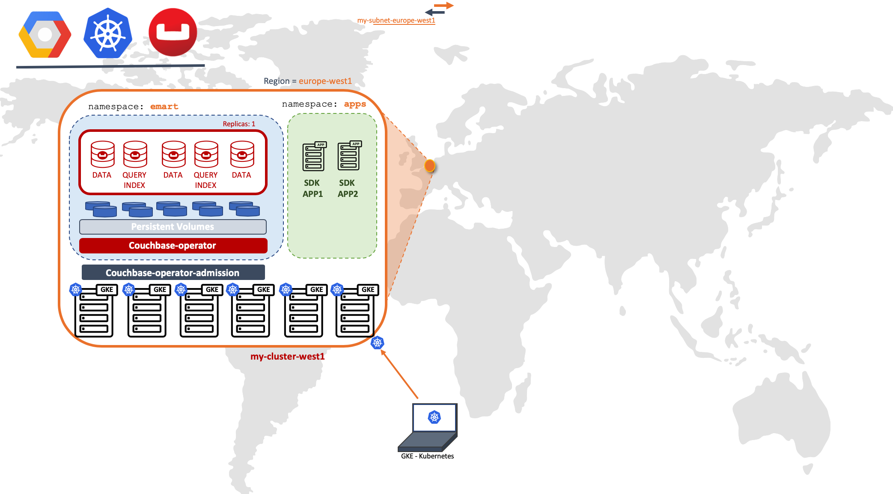
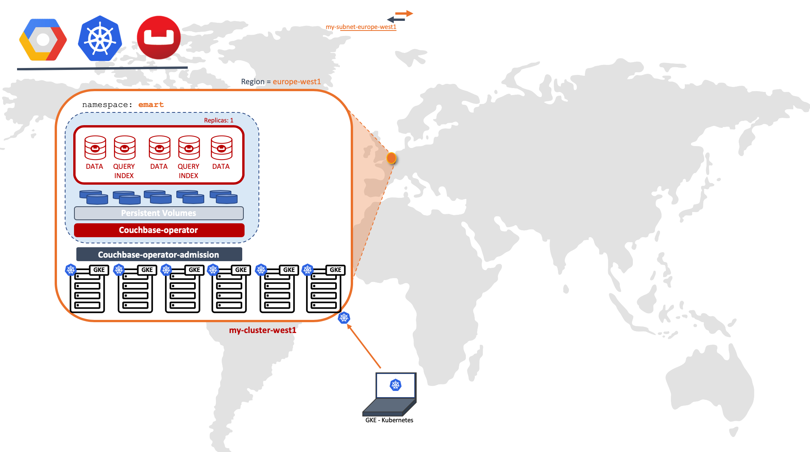
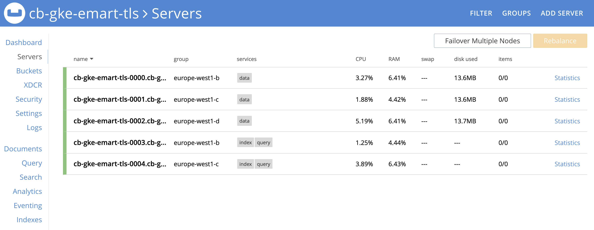
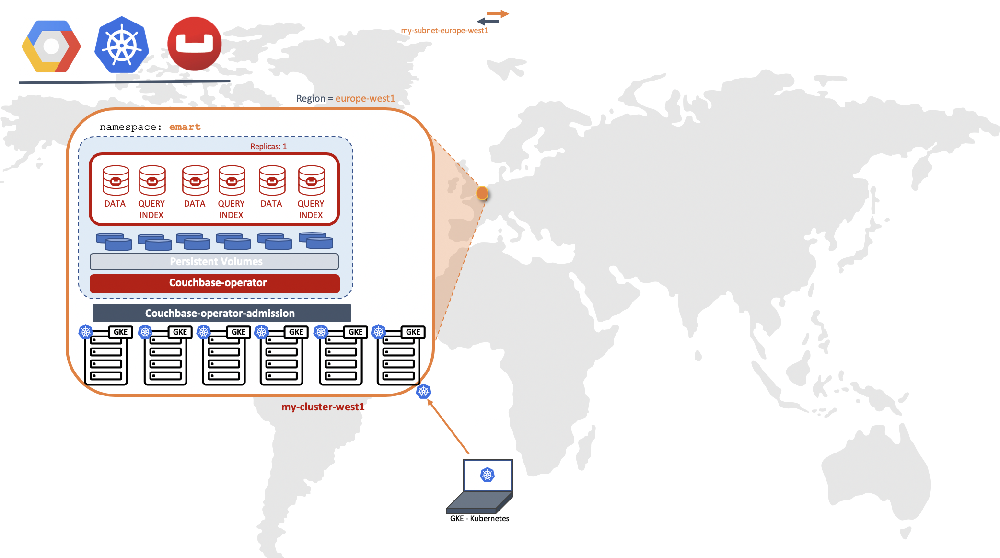
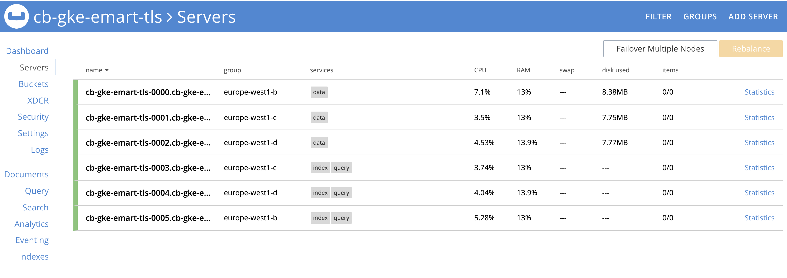
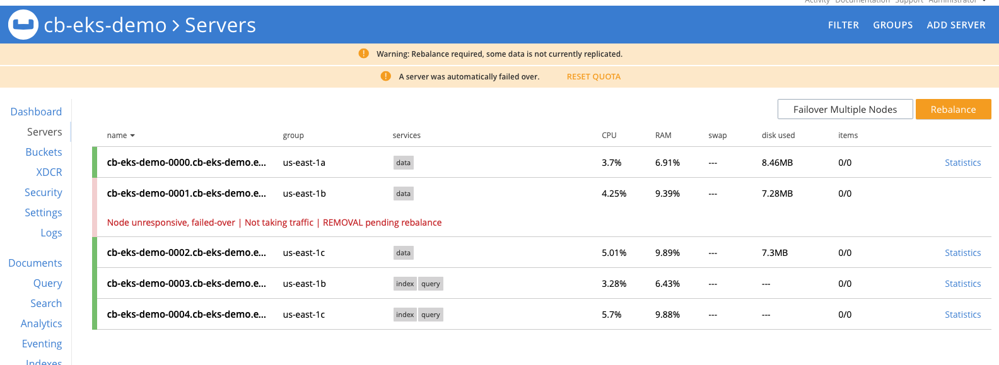
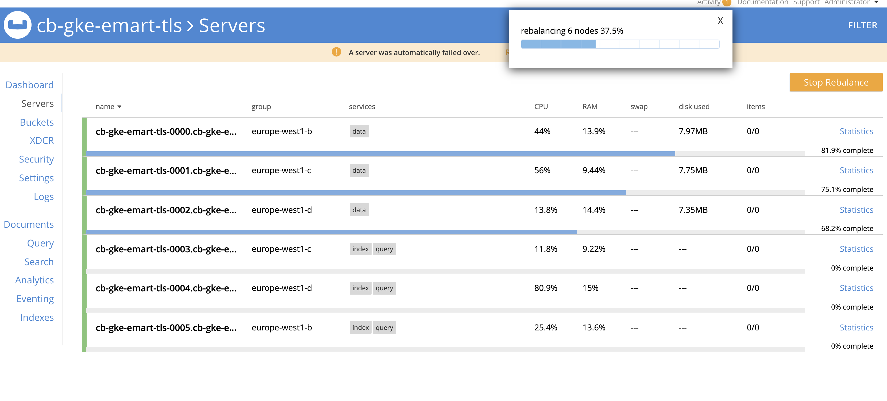
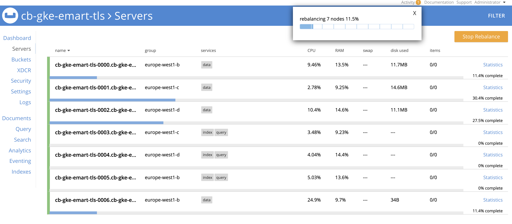

# Content

1. **Prerequisites**
2. **Deploy Couchbase Autonomous Operator** 

	2.1. **Download Operator package**
	
	2.2. **Create a namespace**
	
	2.3. **Install CRD**
	
	2.4. **Install Admission Controller**
	
	2.5. **Create a Operator Role**
	
	2.6. **Create a Service Account**
	
	2.7. **Deploy Couchbase Operator**

3. **Deploy Couchbase cluster using persistent volumes, server groups and TLS**

	3.1. **Create Secret for Couchbase Admin Console**
	
	3.2. **Create Google storage class for the GKS cluster**
	
	3.3. **Add Storage Class to Persistent Volume Claim Template**

	3.4. **Add TLS Certificate to non-default namespace 'emart'**

	3.5. **Serving Groups**

	3.6. **Deploy Couchbase Cluster**
	
4. **Operations**

	4.1. **Scaling - On demand scaling - up & down**

	4.2. **Self-recovery**

	4.3. **Couchbase automated upgrade**

	4.4. **Backing up and Restoring**
	
	
5. **Running sample application using SDK** 
		
	5.1. **Create user namespace for Couchbase Client - SDK**
	
	5.2. **Deploy Couchbase Client - SDK App**

6. **Troubleshooting**
7. **Cleanup**

8. **Conclusion**


	
# Scope



# 1. Prerequisites

There are three important prerequisites before we begin the deployment of Couchbase Autonomous Operator on GKS:
 
1. You have installed Kubernetes and [Google Cloud SDK](https://cloud.google.com/sdk/) on your local machine as described in the [guide](./guides/prerequisite-tools.md).
2. Create Google Account and Setup Google Cloud GKS cluster as per the [GKS Instruction Guide](./guides/gks-setup.md).

In the labs below we will be using europe-west1 as the region and europe-west1-b/c/d as three availability-zones but you can deploy to any region/zones by making minor changes to YAML files in the examples below.


# 2. Deploy Couchbase Autonomous Operator

Before we begin with the setup of Couchbase Operator, run ‘kubectl get nodes’ command from the local machine to confirm GKS cluster is up and running.


```
$ kubectl get nodes
NAME                                                  STATUS   ROLES    AGE    VERSION
gke-my-cluster-europe-we-default-pool-84400c30-69hb   Ready    <none>   16m    v1.13.7-gke.8
gke-my-cluster-europe-we-default-pool-84400c30-m0bg   Ready    <none>   101s   v1.13.7-gke.8
gke-my-cluster-europe-we-default-pool-a17b09e8-99kt   Ready    <none>   16m    v1.13.7-gke.8
gke-my-cluster-europe-we-default-pool-a17b09e8-x6zr   Ready    <none>   100s   v1.13.7-gke.8
gke-my-cluster-europe-we-default-pool-b1d1dea7-6shq   Ready    <none>   16m    v1.13.7-gke.8
gke-my-cluster-europe-we-default-pool-b1d1dea7-t53z   Ready    <none>   100s   v1.13.7-gke.8
```

After we have tested that we can connect to Kubernetes control plane running on Google Cloud GKS cluster from our local machine, we can now begin with the steps required to deploy Couchbase Autonomous Operator, which is the glue technology enabling Couchbase Server cluster to be managed by Kubernetes.

### 2.1. Download Operator package

Let’s first begin by downloading the latest [Couchbase Autonomous Operator](https://www.couchbase.com/downloads?family=kubernetes) and unzip onto the local machine. Change directory to the operator folder so we can find YAML files we need to deploy Couchbase operator:


```
$ cd couchbase-autonomous-operator-kubernetes_1.2.0-981_linux-x86_64

$ ls

License.txt			couchbase-cli-create-user.yaml	operator-role-binding.yaml	secret.yaml
README.txt			couchbase-cluster.yaml		operator-role.yaml
admission.yaml			crd.yaml			operator-service-account.yaml
bin				operator-deployment.yaml	pillowfight-data-loader.yaml
```

### 2.2. Create a namespace

Create a namespace that will allow cluster resources to be nicely separated between multiple users. To do that we will use a unique namespace called **emart** for our deployment and later will use this namespace to deploy Couchbase Cluster.

In your working directory create a [namespace.yaml](files/namespace.yaml) file with this content and save it in the Couchbase operator directory itself:

```
apiVersion: v1
kind: Namespace
metadata:
  name: emart
```
After saving the namespace configuration in a file, run kubectl cmd to create it:

```
$ kubectl create -f namespace.yaml
```
Run get namespace command to confirm it is created successfully:

```
$ kubectl get namespaces

NAME          STATUS   AGE
default       Active   25m
emart         Active   34s
```

From now onwards we will use emart as the namespace for all resource provisioning.

### 2.3. Install CRD

The first step in installing the Operator is to install the custom resource definition (CRD) that describes the CouchbaseCluster resource type. This can be achieved with the following command:

```
kubectl create -f crd.yaml
```

### 2.4. Install Admission Controller

The primary purpose of the admission controller is to validate Couchbase cluster configuration changes before the Operator acts on them, thus protecting your Couchbase deployment (and the Operator) from any accidental damage that might arise from an invalid configuration.

```
kubectl create -f admission.yaml 
```

### 2.5. Create a Operator Role

Next, we will create a [cluster role](https://kubernetes.io/docs/reference/access-authn-authz/rbac/#api-overview) that allows the Operator to access the resources that it needs to run. Since the Operator will manage many different [namespaces](https://kubernetes.io/docs/concepts/overview/working-with-objects/namespaces/), it is best to create a cluster role first because you can assign that role to a [service account](https://kubernetes.io/docs/reference/access-authn-authz/rbac/#service-account-permissions) in any namespace.

To create the cluster role for the Operator, run the following command:

```
$ kubectl create -f operator-role.yaml --namespace emart
```

This cluster role only needs to be created once.

### 2.6. Create a Service Account

After the cluster role is created, you need to create a service account in the namespace where you are installing the Operator. To create the service account:

```
$ kubectl create serviceaccount couchbase-operator --namespace emart
```

Now assign the operator role to the service account:

```
$ kubectl create rolebinding couchbase-operator --role couchbase-operator \
--serviceaccount emart:couchbase-operator --namespace emart

output:

clusterrolebinding.rbac.authorization.k8s.io/couchbase-operator created
```

Now before we proceed further let's make sure all the roles and service accounts are created under the namespace _emart_. To do that run these three checks and make sure each get returns something:

```
Kubectl get roles -n emart
Kubectl get rolebindings -n emart
Kubectl get sa -n emart
```

### 2.7. Deploy Couchbase Operator

We now have all the roles and privileges for our operator to be deployed. Deploying the operator is as simple as running the operator.yaml file from the Couchbase Autonomous Operator directory.

```
$ kubectl create -f operator-deployment.yaml --namespace emart

output:

deployment.apps/couchbase-operator created
```

Above command will download the Operator Docker image (specified in the operator.yaml file) and creates a deployment, which manages a single instance of the Operator. The Operator uses a deployment so that it can restart if the pod it’s running in dies.

It would take less than a minute for Kubernetes to deploy the Operator and for the Operator to be ready to run.

#### a) Verify the Status of the Deployment

You can use the following command to check on the status of the deployment:

```
  $ kubectl get deployments --namespace emart
```

If you run the this command immediately after the Operator is deployed, the output will look something like the following:

```
NAME           	    DESIRED    CURRENT     UP-TO-DATE      AVAILABLE        AGE
couchbase-operator    1          1          1               0                21s
```
Note: Above output means your Couchbase operator is deployed and you can go ahead with deploying Couchbase cluster next.

#### b) Verify the Status of the Operator

You can use the following command to verify that the Operator has started successfully:

```
$ kubectl get pods -l app=couchbase-operator --namespace emart
```

If the Operator is up and running, the command returns an output where the READY field shows 1/1, such as:

```
NAME                                    READY   STATUS   RESTARTS   AGE
couchbase-operator-f6f7b6f75-wdbtd      1/1     Running  0          57s
```

You can also check the logs to confirm that the Operator is up and running. Look for the message: CRD initialized, listening for events…​ module=controller.

```
$ kubectl logs couchbase-operator-f6f7b6f75-wdbtd --namespace emart --tail 20

output:

time="2019-08-08T19:18:50Z" level=info msg="couchbase-operator v1.2.0 (release)" module=main
time="2019-08-08T19:18:50Z" level=info msg="Obtaining resource lock" module=main
time="2019-08-08T19:18:50Z" level=info msg="Starting event recorder" module=main
time="2019-08-08T19:18:50Z" level=info msg="Attempting to be elected the couchbase-operator leader" module=main
time="2019-08-08T19:18:50Z" level=info msg="I'm the leader, attempt to start the operator" module=main
time="2019-08-08T19:18:50Z" level=info msg="Creating the couchbase-operator controller" module=main
time="2019-08-08T19:18:50Z" level=info msg="Event(v1.ObjectReference{Kind:\"Endpoints\", Namespace:\"emart\", Name:\"couchbase-operator\", UID:\"5a5fb656-ba11-11e9-98c4-42010a840059\", APIVersion:\"v1\", ResourceVersion:\"20334\", FieldPath:\"\"}): type: 'Normal' reason: 'LeaderElection' couchbase-operator-f6f7b6f75-wdbtd became leader" module=event_recorder
```

# 3. Deploy Couchbase cluster using persistent volumes, availability zones and TLS

In a production environment where performance and SLA of the system matters most, we should always plan on deploying Couchbase cluster using persistent volumes because it helps in:

* **Data Recoverability**: Persistent Volumes allow the data associated within Pods to be recovered in the case that a Pod is terminated. This helps prevent data-loss and avoid time-consuming index building when using the data or index services.

* **Pod Relocation**: Kubernetes may decide to evict pods that reach resource thresholds such as CPU and Memory Limits. Pods that are backed with Persistent Volumes can be terminated and restarted on different nodes without incurring any downtime or data-loss.
* **Dynamic Provisioning**: The Operator will create Persistent Volumes on-demand as your cluster scales, alleviating the need to pre-provision your cluster storage prior to deployment.

* **Cloud Integration**: Kubernetes integrates with native storage provisioners available on major cloud vendors such as AWS and GCE.

In this next section we will see how you can define storage classes in different availability zone and build persistent volume claim template, which will be used in [couchbase-cluster-with-pv.yaml](files/couchbase-cluster-with-pv.yaml) file.

## 3.1. Create Secret for Couchbase Admin Console

First thing we need to do is create a secret credential which will be used by the administrative web console during login. For convenience, a sample secret is provided in the Operator package. When you push it to your Kubernetes cluster, the secret sets the username to Administrator and the password to password.

To push the secret into your Kubernetes cluster, run the following command:

```
$ kubectl create -f secret.yaml --namespace emart

Output:

Secret/cb-example-auth created
```

## 3.2. Create Google storage class for the GKS cluster

Now in order to use PersistentVolume for Couchbase services (data, index, search, etc.), we need to create Storage Classes (SC) first in each of the Availability Zones (AZ). Let’s begin by checking what storage classes exist in our environment.

Let’s use kubectl command to find that out:
```
$ kubectl get storageclass
NAME                 PROVISIONER            AGE
standard (default)   kubernetes.io/gce-pd   31m
```

Above output means we just have default gce-pd storage class and we need to create separate storage-classes in all of the AZs where we are planning to deploy our Couchbase cluster.

We will run below steps to create three different storage classes of type gce-pd to store data, index and Couchbase binaries.

**1) Create an Google storage class manifest file for your storage class.** Below example defines a storage class that uses the Google gce-pd-ssd volume type. For more information about the options available for GKE storage classes, see [GKE](https://kubernetes.io/docs/concepts/storage/storage-classes/#gke) in the Kubernetes documentation.

* Create a storage definition file [sc-gce-pd-ssd.yaml](files/sc-gce-pd-ssd.yaml) that represent storage class of _pd-ssd_ type (aka general purpose SSD drive), which we will later use it in our _VolumeClaimTemplate_.

```
apiVersion: storage.k8s.io/v1
kind: StorageClass
metadata:
  name: sc-fast-storage
parameters:
  type: pd-ssd
provisioner: kubernetes.io/gce-pd
reclaimPolicy: Delete
volumeBindingMode: WaitForFirstConsumer
```

* Create a storage definition file [sc-gce-pd-slow.yaml](files/sc-gce-pd-slow.yaml) that represent storage class of pd-standard type (aka general purpose HHD drive), which we will later use it in our VolumeClaimTemplate.


```
apiVersion: storage.k8s.io/v1
kind: StorageClass
metadata:
  name: slow
parameters:
  type: pd-ssd
provisioner: kubernetes.io/gce-pd
reclaimPolicy: Delete
volumeBindingMode: WaitForFirstConsumer
```

We have used reclaimPolicy to _Delete_ which tells K8 to delete the volumes of deleted Pods but you can change it to _Retain_ depending on your needs or if for troubleshooting purpose you would like to keep the volumes of deleted pods.

2) We will now use kubectl command to physically create three storage classes from the manifest files we defined above.

```
$ kubectl create -f sc-gce-pd-ssd.yaml --namespace emart 

storageclass.storage.k8s.io/sc-fast-storage created
```


```
$ kubectl create -f sc-gce-pd-slow.yaml --namespace emart 

storageclass.storage.k8s.io/slow created
```

**3) Verify New Storage Class**
Once you’ve created all the storage classes, you can verify them through kubectl command:

```
$ kubectl get sc  --namespace emart

NAME                 PROVISIONER            AGE
sc-fast-storage      kubernetes.io/gce-pd   59s
slow                 kubernetes.io/gce-pd   59s
standard (default)   kubernetes.io/gce-pd   2d19h
```

## 3.3. Add Storage Class to Persistent Volume Claim Template:

Now that we have created SCs in each of the three AZs, we can use them to create dynamic storage volumes and mount them of each of the Couchbase services that requires persistent data. There is one last thing to do before we can use persistent volumes and that is define Persistent Volume Claim Template in our couchbase-cluster.yaml file (which can be found from the operator folder).

Since we have a Storage Class for three zones, we’ll need to create a Persistent Volume Claim Template for each Zone. The following is an example configuration required for using storage classes across 3 different zones:


```
Spec:
  volumeClaimTemplates:
    - metadata:
        name: pvc-default
      spec:
        storageClassName: slow
        resources:
          requests:
            storage: 1Gi
    - metadata:
        name: pvc-fast-data
      spec:
        storageClassName: sc-fast-storage
        resources:
          requests:
            storage: 5Gi
    - metadata:
        name: pvc-fast-index
      spec:
        storageClassName: sc-fast-storage
        resources:
          requests:
            storage: 3Gi
```

Now that the templates are added, the final step is to pair the volume claim template with server groups according in each of the zones. For instance, Pods within Server-Group named data-east-1a should use volumeClaimTemplate named _pvc-fast-data_ to store data and _pvc-default_ for Couchbase binaries and log files.

For example, the following shows the pairing of a Server Group and its associated VolumeClaimTemplate:

```
spec:
  servers:
    - name: data-europe-west1-b
      size: 1
      services:
        - data
      serverGroups:
       - europe-west1-b
      pod:
        volumeMounts:
          default: pvc-default
          data: pvc-fast-data
    - name: data-europe-west1-c
      size: 1
      services:
        - data
      serverGroups:
       - europe-west1-c
      pod:
        volumeMounts:
          default: pvc-default
          data: pvc-fast-data
    - name: data-europe-west1-d
      size: 1
      services:
        - data
      serverGroups:
       - europe-west1-d
      pod:
        volumeMounts:
          default: pvc-default
          data: pvc-fast-data
```

Notice that we have created three separate data server groups (europe-west1-b/-c/-d), each located in its own AZ, using persistent volume claim templates from that AZ. Now using the same concept we will add index, and query services and allocate them in separate server groups so they can scale independently of data nodes.


## 3.4. Add TLS Certificate to non-default namespace 'emart'

Create secret for Couchbase Operator and servers with a given certificate. See [how to create a custom](guides/tls-certificate.md) certificate section if you don't have one. 
  
```
kubectl create secret generic couchbase-server-tls --from-file chain.pem --from-file pkey.key --namespace emart
```

```
kubectl create secret generic couchbase-operator-tls --from-file pki/ca.crt --namespace emart
```


## 3.5. Serving Groups

Setting up server groups is also straightforward, which will be discussed in the following sections when we deploy the couchbase cluster yaml file.


## 3.6. Deploy Couchbase Cluster

The full spec for deploying Couchbase cluster across 3 different zones using persistent volumes can be seen in the [couchbase-cluster-with-pv-tls-serverGroups.yaml](files/couchbase-cluster-with-pv-tls-serverGroups.yaml) file. This file along with other sample yaml files used in this article can be downloaded from this git repo.

Please open the yaml file and note that we are deploying data service in three AZs but deploying index & query service in two AZs only. You can change the configuration to meet your production requirements.

Now use kubectl to deploy the cluster.

```
$ kubectl create -f couchbase-cluster-with-pv-tls-serverGroups.yaml  --namespace emart
```

This will start deploying the Couchbase cluster and if all goes fine then we will have five Couchbase cluster pods hosting the services as per the configuration file above. To check the progress run this command, which will watch (-w argument) the progress of pods creating:

```
$ kubectl get pods --namespace emart -w

output:

NAME                                 READY   STATUS    RESTARTS   AGE
cb-gke-emart-tls-0000                1/1     Running   0          8m32s
cb-gke-emart-tls-0001                1/1     Running   0          6m58s
cb-gke-emart-tls-0002                1/1     Running   0          5m30s
cb-gke-emart-tls-0003                1/1     Running   0          4m23s
cb-gke-emart-tls-0004                1/1     Running   0          3m12s
couchbase-operator-f6f7b6f75-6xzrc   1/1     Running   0          22m
```

If for any reason there is an exception, then you can find the details of exception from the couchbase-operator log file. To display the last 20 lines of the log, copy the name of your operator pod and run below command by replacing the operator name with the name in your environment.

```

$ kubectl logs couchbase-operator-f6f7b6f75-6xzrc --namespace emart --tail 20

output:

time="2019-08-18T16:20:18Z" level=info msg="│ cb-gke-emart-tls-0001 │ enterprise-5.5.5 │ data-europe-west1-c  │ managed+active │" cluster-name=cb-gke-emart-tls module=cluster
time="2019-08-18T16:20:18Z" level=info msg="│ cb-gke-emart-tls-0002 │ enterprise-5.5.5 │ data-europe-west1-d  │ managed+active │" cluster-name=cb-gke-emart-tls module=cluster
time="2019-08-18T16:20:18Z" level=info msg="│ cb-gke-emart-tls-0003 │ enterprise-5.5.5 │ query-europe-west1-a │ managed+active │" cluster-name=cb-gke-emart-tls module=cluster
time="2019-08-18T16:20:18Z" level=info msg="│ cb-gke-emart-tls-0004 │ enterprise-5.5.5 │ query-europe-west1-b │ managed+active │" cluster-name=cb-gke-emart-tls module=cluster
time="2019-08-18T16:20:18Z" level=info msg="└───────────────────────┴──────────────────┴──────────────────────┴────────────────┘" cluster-name=cb-gke-emart-tls module=cluster
time="2019-08-18T16:20:18Z" level=info cluster-name=cb-gke-emart-tls module=cluster
time="2019-08-18T16:20:24Z" level=info msg="reconcile finished" cluster-name=cb-gke-emart-tls module=cluster
time="2019-08-18T16:20:34Z" level=info msg="Cluster status: balanced" cluster-name=cb-gke-emart-tls module=cluster
time="2019-08-18T16:20:34Z" level=info msg="Node status:" cluster-name=cb-gke-emart-tls module=cluster
time="2019-08-18T16:20:34Z" level=info msg="┌───────────────────────┬──────────────────┬──────────────────────┬────────────────┐" cluster-name=cb-gke-emart-tls module=cluster
time="2019-08-18T16:20:34Z" level=info msg="│ Server                │ Version          │ Class                │ Status         │" cluster-name=cb-gke-emart-tls module=cluster
time="2019-08-18T16:20:34Z" level=info msg="├───────────────────────┼──────────────────┼──────────────────────┼────────────────┤" cluster-name=cb-gke-emart-tls module=cluster
time="2019-08-18T16:20:34Z" level=info msg="│ cb-gke-emart-tls-0000 │ enterprise-5.5.5 │ data-europe-west1-b  │ managed+active │" cluster-name=cb-gke-emart-tls module=cluster
time="2019-08-18T16:20:34Z" level=info msg="│ cb-gke-emart-tls-0001 │ enterprise-5.5.5 │ data-europe-west1-c  │ managed+active │" cluster-name=cb-gke-emart-tls module=cluster
time="2019-08-18T16:20:34Z" level=info msg="│ cb-gke-emart-tls-0002 │ enterprise-5.5.5 │ data-europe-west1-d  │ managed+active │" cluster-name=cb-gke-emart-tls module=cluster
time="2019-08-18T16:20:34Z" level=info msg="│ cb-gke-emart-tls-0003 │ enterprise-5.5.5 │ query-europe-west1-a │ managed+active │" cluster-name=cb-gke-emart-tls module=cluster
time="2019-08-18T16:20:34Z" level=info msg="│ cb-gke-emart-tls-0004 │ enterprise-5.5.5 │ query-europe-west1-b │ managed+active │" cluster-name=cb-gke-emart-tls module=cluster
time="2019-08-18T16:20:34Z" level=info msg="└───────────────────────┴──────────────────┴──────────────────────┴────────────────┘" cluster-name=cb-gke-emart-tls module=cluster
time="2019-08-18T16:20:34Z" level=info cluster-name=cb-gke-emart-tls module=cluster
time="2019-08-18T16:20:40Z" level=info msg="reconcile finished" cluster-name=cb-gke-emart-tls module=cluster
```

Quick check on persistent volumes claims can be done like below

```
$ kubectl get pvc --namespace emart
```

When all the pods are ready then you can port forward one of Couchbase cluster pod so that we can view the cluster status from the web-console. Run this command to port forward it.


```
$ kubectl port-forward cb-gke-emart-tls-0002 8091:8091 --namespace emart
```

At this point you can open up a browser and type http://locahost:8091 which will bring Couchbase web-console from where you can monitor server stats, create buckets, run queries all from one single place.



Figure 1: Five node Couchbase cluster using persistent volumes.



Figure 2: Couchbase cluster UI with 5 nodes using MDS and server groups.


# 4. Operations
	
	4.1. Scaling - On demand scaling - up & down

	4.2. High Availability (HA) & Self-recovery

	4.3. Couchbase automated upgrade

	4.4. Create backup
	

## 4.1. Scaling - On demand scaling - up & down
 
If you have ever scaled-out or scaled-in a database cluster you would know that it is a non-trivial process as it entails lot of manually triggered steps which are not only time consuming but also error prone.

With Couchbase Autonomous Operator scaling-out or scaling-in is as simple as changing the desired number servers for a specific service in the [couchbase-cluster-with-pv-tls-serverGroups.yaml](./files/couchbase-cluster-with-pv-tls-serverGroups.yaml) file. Let's open this YAML file again and add one server node in us-east-1a server-group running Index and Query service.

Notice we don't have any Index and Query service in the **europe-west1-b** serverGroups:

  ```
  - name: query-west1-b
    size: 1
    services:
      - query
      - index
    serverGroups:
     - europe-west1-b
    pod:
      volumeMounts:
        default: pvc-default
        index: pvc-fast-index
  - name: query-west1-c
    size: 1
    services:
      - index
      - query
    serverGroups:
     - europe-west1-c
    pod:
      volumeMounts:
        default: pvc-default
        index: pvc-fast-index
  ```  
  
So we are going to add one more server in **europe-west1-b** server group hosting both index and query service like this:

  ```
  - name: query-west1-d
    size: 1
    services:
      - query
      - index
    serverGroups:
     - europe-west1-d
    pod:
      volumeMounts:
        default: pvc-default
        index: pvc-fast-index
  - name: query-west1-b
    ....
  - name: query-west1-c
    ....
  ```
  
A separate [couchbase-cluster-with-pv-tls-serverGroups_addNode.yaml](./files/couchbase-cluster-with-pv-tls-serverGroups_addNode.yaml) file is provided just for convenience but if you want you can also make changes yourself in the [couchbase-cluster-with-pv-tls-serverGroups.yaml](./files/couchbase-cluster-with-pv-tls-serverGroups.yaml)

```
  $ kubectl apply -f couchbase-cluster-with-pv-tls-serverGroups_addNode.yaml  --namespace emart

  couchbasecluster.couchbase.com/cb-gke-demo configured
```

Notice a new pod will be getting ready to be added to the cluster:

```
  $ kubectl get pods --namespace emart -w
NAME                                 READY     STATUS     RESTARTS   AGE
cb-gke-emart-tls-0000                     1/1       Running    0          44m
cb-gke-emart-tls-0001                     1/1       Running    0          34m
cb-gke-emart-tls-0002                     1/1       Running    0          42m
cb-gke-emart-tls-0003                     1/1       Running    0          41m
cb-gke-emart-tls-0004                     1/1       Running    0          40m
cb-gke-emart-tls-0005                     0/1       Init:0/1   0          11s
```

  After pod is ready you can view it from the Web Console as well.

  
  
  
  
  Figure 5: Cluster now has three Couchbase server pods hosting Index and Query services spread across three server-groups.


## 4.2. High Availability (HA) & Self-recovery

One of the best feature of Kubernetes in general is that it provides Auto-Healing capability to the services that are managed by it. With Couchbase Autonomous Operator we leverage the same Auto-Healing capability of K8 for Couchbase Cluster.

We are going to test this capability by manually deleting the pod, which would be detected by K8 as an exception, which will inform the operator to bring back the current state of the cluster to the desired state as specified in the [couchbase-cluster-with-pv-tls-serverGroups.yaml](./files/couchbase-cluster-with-pv-tls-serverGroups.yaml) file.

Let's induce the fault now using kubectl delete command:

```
$ kubectl get pod --namespace emart
NAME                                 READY     STATUS    RESTARTS   AGE
cb-gke-emart-tls-0000                     1/1       Running   0          8m17s
cb-gke-emart-tls-0001                     1/1       Running   0          7m23s
cb-gke-emart-tls-0002                     1/1       Running   0          6m32s
cb-gke-emart-tls-0003                     1/1       Running   0          5m42s
cb-gke-emart-tls-0004                     1/1       Running   0          4m52s
couchbase-operator-f6f7b6f75-tbxdj   1/1       Running   0          45m
```
```
$ kubectl delete pod cb-gke-emart-tls-0001 --namespace emart
pod "cb-gke-emart-tls-0001" deleted

```

Figure 3: One of the Data pod is dropped.

After Couchbase Autonomous Operator detects the failure it triggers the healing process.


Figure 4: Data node with same name and persistent volume will be restored automatically.


## 4.3. Couchbase automated upgrade 

Any software in service goes through continuous improvement and there is definitely going to be the moments when you would like to upgrade Couchbase Autonomous Operator too because of some new feature or the patch which is critical for your business.

Upgrading a distributed cluster like Couchbase requires careful orchestration of steps if you manually run the online upgrade operation. With Couchbase Autonomous Operator the whole symphony of these operations are completely automated, so the management becomes very easy.

Let's take a look at how you can upgrade the system in an online fashion.

### 4.3.1. Preparing for Upgrade
Before beginning an upgrade to your Kubernetes cluster, review the following considerations and prerequisites:

- As an eviction deletes a pod, ensure that the Couchbase cluster is scaled correctly so that it can handle the increased load of having a pod down while a new pod is balanced into the cluster.

- To minimize disruption, ensure that a short failover period is configured with the autoFailoverTimeout parameter to reduce down time before another node takes over the load.

- Ensure that there is capacity in your Kubernetes cluster to handle the scheduling of replacement Couchbase pods. For example, if a Couchbase cluster were running on Kubernetes nodes marked exclusively for use by Couchbase, and anti-affinity were enabled as per the deployment [best practices](https://docs.couchbase.com/operator/current/best-practices.html), the Kubernetes cluster would require at least one other node capable of scheduling and running your Couchbase workload.

### 4.3.2. Perform Automatic Upgrade
To prevent downtime or a data loss scenario, the Operator provides controls for how automated Kubernetes upgrades proceed.

A PodDisruptionBudget is created for each CouchbaseCluster resource created. The PodDisruptionBudget specifies that at least the cluster size minus one node (N-1) be ready at any time. This constraint allows, at most, one node to be evicted at a time. As a result, it’s recommended that to support an automatic Kubernetes upgrade, the cluster be deployed with anti-affinity enabled to guarantee only a single eviction at a time.

Now let's open [couchbase-cluster-with-pv-tls-serverGroups.yaml](./files/couchbase-cluster-with-pv-tls-serverGroups.yaml) file and change:

```
spec:
  baseImage: couchbase/server
  version: enterprise-5.5.5
```

  to
  
  ```
  spec:
    baseImage: couchbase/server
    version: enterprise-6.0.2
  ```
  
  Now using kubectl to deploy the cluster.

  ```
  $ kubectl apply -f couchbase-cluster-with-pv-tls-serverGroups.yaml  --namespace emart
  ```
  
At this point you would notice the pods will be evicted one by one and new pod will be joined to the existing cluster but with an upgraded Couchbase version (6.0.2).


Figure 6: Couchbase Cluster getting upgraded one pod at a time in and online fashion.

**Note:** At some point during upgrade when your cb-gke-demo-0000 pod is upgraded to a newer pod (cb-gke-demo-0005), you might need to reset the forwarding to newly upgraded pod like this:

```
  $ kubectl port-forward cb-gke-emart-tls-0005 8091:8091 --namespace emart 
```

Just wait for some time and cluster will upgraded one pod at a time in a rolling fashion.


## 4.4. Backing up and Restoring a Couchbase Deployment

The Couchbase Autonomous Operator automatically repairs and rebalances Couchbase clusters to maintain high availability. It is considered best practice to regularly backup your data, and also test restoring it works as expected before disaster recovery is required.

This functionality is not provided by the Operator and left to the cluster administrator to define backup policies and test data restoration. This section describes some common patterns that may be employed to perform the required functions.


### 4.4.1. Backing Up

The Kubernetes resource definitions below illustrate a typical arrangement for backup that saves the state of the entire cluster.

```
# Define backup storage volume
kind: PersistentVolumeClaim
apiVersion: v1
metadata:
  name: couchbase-cluster-backup
spec:
  resources:
    requests:
      storage: 100Gi
  storageClassName: standard
  accessModes:
    - ReadWriteOnce
```
    
A persistent volume is claimed in order to keep data safe in the event of an outage. You will need to plan the claim size based on your expected data set size, the number of days data retention and whether incremental backups are used at all.

```
# Create a backup repository
kind: Job
apiVersion: batch/v1
metadata:
  name: couchbase-cluster-backup-create
spec:
  template:
    spec:
      containers:
        - name: couchbase-cluster-backup-create
          image: couchbase/server:enterprise-6.0.2
          command: ["cbbackupmgr", "config", "--archive", "/backups", "--repo", "demo"]
          volumeMounts:
            - name: "couchbase-cluster-backup-volume"
              mountPath: "/backups"
      volumes:
        - name: couchbase-cluster-backup-volume
          persistentVolumeClaim:
            claimName: couchbase-cluster-backup
      restartPolicy: Never
```      
      
A job is created to mount the persistent volume and initialize a backup repository. The repository is named `demo` which will map to the cluster name in later specifications.

```
kind: CronJob
apiVersion: batch/v1beta1
metadata:
  name: couchbase-cluster-backup
spec:
  schedule: "0 3 * * *"
  jobTemplate:
    spec:
      template:
        spec:
          containers:
            - name: couchbase-cluster-backup-full
              image: couchbase/server:enterprise-6.0.2
              command: ["cbbackupmgr", "backup", "--archive", "/backups", "--repo", "demo", "--cluster", "couchbase://cb-gke-emart.emart.svc", "--username", "Administrator", "--password", "password"]
              volumeMounts:
                - name: "couchbase-cluster-backup-volume"
                  mountPath: "/backups"
          volumes:
            - name: couchbase-cluster-backup-volume
              persistentVolumeClaim:
                claimName: couchbase-cluster-backup
          restartPolicy: Never
```

A backup cron job runs daily at a time that had low cluster utilization. The first time it runs a full backup is taken, for other runs an incremental backup is run to save disk space.

```
kind: Job
apiVersion: batch/v1
metadata:
  name: couchbase-cluster-backup-merge
spec:
  spec:
    template:
      spec:
        containers:
          - name: couchbase-cluster-backup-prune
            image: couchbase/server:enterprise-6.0.2
            command: ["cbbackupmgr", "merge", "--archive", "/backups", "--repo", "demo", "--start", "2018-07-25T13_02_45.92773833Z", "--end", "2020-07-25T14_57_57.83339572Z"]
            volumeMounts:
              - name: "couchbase-cluster-backup-volume"
                mountPath: "/backups"
        volumes:
         - name: couchbase-cluster-backup-volume
            persistentVolumeClaim:
              claimName: couchbase-cluster-backup
        restartPolicy: Never
```

A merge job should be run periodically to compact full and incremental backups into a single full backup. This step will reduce disk utilization.


### 4.4.2. Restoring

Much like a backup we can restore data to a new Couchbase cluster with a Kubernetes Job.

```
kind: Job
apiVersion: batch/v1
metadata:
  name: couchbase-cluster-restore
spec:
  template:
    spec:
      containers:
        - name: couchbase-cluster-restore
          image: couchbase/server:enterprise-6.0.2
          command: ["cbbackupmgr", "restore", "--archive", "/backups", "--repo", "demo", "--cluster", "couchbase://couchbase.emart.svc", "--username", "Administrator", "--password", "password"]
          volumeMounts:
            - name: "couchbase-cluster-backup-volume"
              mountPath: "/backups"
      volumes:
        - name: couchbase-cluster-backup-volume
          persistentVolumeClaim:
            claimName: couchbase-cluster-backup
      restartPolicy: Never
```      


# 5. **Running sample application using SDK** 


		
## 5.1. **Create user namespace for Couchbase Client - SDK**

```
$ kubectl create namespace apps
namespace/apps created
```


## 5.2. **Deploy Couchbase Client - SDK App**

Create the application file [app_pod.yaml](files/app_pod.yaml)

```
$ kubectl create -f app_pod.yaml --namespace apps
pod/app01 created
```

**Run the sample python program to upsert a document into couchbase cluster**

Login to the pods shell/exec into app pod

```
$ kubectl exec -ti app01 bash --namespace apps
```

**Prep the pod for installing python SDK**

[prep-app-pod for python SDK](https://docs.google.com/document/d/14lGw0KYOAzByHeO1yzNLEbfxe6MWQTNK/edit#heading=h.6ctclr4lgnu3)

**Edit the program with FQDN of the pod**

Run below command after exec'ing into the couchbase pod

```
$ kubectl exec -ti cb-opensource-k8s-0000 bash --namespace emart
```

```
# hostname -f
cb-opensource-k8s-0000.cb-opensource-k8s.cbdb.svc.cluster.local
```

Edit the program with correct connection string

Connection string for me looks like below:

```
cluster = Cluster('couchbase://cb-opensource-k8s-0000.cb-opensource-k8s.cbdb.svc.cluster.local')
```

Since both the namespaces in minikube share same kube-dns

Run the program

```
root@app01:/# python python_sdk_example.py
CB Server connection PASSED
Open the bucket...
Done...
Upserting a document...
Done...
Getting non-existent key. Should fail..
Got exception for missing doc
Inserting a doc...
Done...
Getting an existent key. Should pass...
Value for key 'babyliz_liz'

Value for key 'babyliz_liz'
{u'interests': [u'Holy Grail', u'Kingdoms and Dungeons'], u'type': u'Royales', u'name': u'Baby Liz', u'email': u'babyliz@cb.com'}
Delete a doc with key 'u:baby_arthur'...
Done...
Value for key [u:baby_arthur]
Got exception for missing doc for key [u:baby_arthur] with error <Key=u'u:baby_arthur', RC=0xD[The key does not exist on the server], Operational Error, Results=1, C Source=(src/multiresult.c,316), Tracing Output={"u:baby_arthur": {"c": "0000000036fb5729/523b08473029eae3", "b": "default", "i": 1754553113405298788, "l": "172.17.0.9:36304", "s": "kv:Unknown", "r": "cb-opensource-k8s-0001.cb-opensource-k8s.cbdb.svc:11210", "t": 2500000}}>
Closing connection to the bucket...
root@app01:/#
```

Upserted document should looks like this


# 6. Troubleshooting


## 6.1. Certificate cannot be verified

Issue:

```
$ kubectl create -f couchbase-cluster-with-pv-tls-serverGroups_1.2.yaml --namespace emart
Error from server: error when creating "couchbase-cluster-with-pv-tls-serverGroups_1.2.yaml": admission webhook "couchbase-operator-admission.default.svc" denied 

...

certificate cannot be verified: x509: certificate is valid for cb-gke-emart-tls, not verify.cb-gke-emart-tls.emart.svc
```

Review the steps on [how to create a custom](guides/tls-certificate.md). Repeat the steps of the cerficiation and ensure the cluster name regular expression matches with your cluster name. Regular expression has to be enquoted with `"`

```
$ ./easyrsa --subject-alt-name="DNS:*.yourClusterName.yourNamespace.svc" build-server-full couchbase-server nopass
```
example with cluster `cb-gke-emart` in namespace `emart`: 
```
$ ./easyrsa --subject-alt-name="DNS:*.cb-gke-emart-tls.emart.svc" build-server-full couchbase-server nopass
```

## 6.2. Persistent Volume 


```
kubectl create -f couchbase-cluster-with-pv-tls-serverGroups_1.2.yaml --namespace emart
Error from server: error when creating "couchbase-cluster-with-pv-tls-serverGroups_1.2.yaml": admission webhook "couchbase-operator-admission.default.svc" denied the request: validation failure list:
spec.servers[0].default should be one of []
spec.servers[0].data should be one of []
spec.servers[1].default should be one of []
spec.servers[1].data should be one of []
spec.servers[2].default should be one of []
spec.servers[2].data should be one of []
spec.servers[3].default should be one of []
spec.servers[3].index should be one of []
spec.servers[4].default should be one of []
spec.servers[4].index should be one of []
```

If you are deploying in multiple Availability Zones, all your persistent volumes need to include: 

```
volumeBindingMode: WaitForFirstConsumer
```

**Note:**  remove/alter the `default` persitent volume to include `volumeBindingMode: WaitForFirstConsumer`


# 7. Cleanup

Perform these steps below to un-config all the k8s assets created.

```
kubectl delete -f secret.yaml --namespace emart
kubectl delete -f couchbase-cluster-with-pv-tls-serverGroups.yaml --namespace emart
kubectl delete rolebinding couchbase-operator --namespace emart
kubectl delete serviceaccount couchbase-operator --namespace emart
kubectl delete -f operator-deployment.yaml --namespace emart
kubectl get deployments --namespace emart
kubectl delete -f sc-gce-pd-ssd.yaml --namespace emart
kubectl delete -f sc-gce-pd-slow.yaml --namespace emart 
kubectl delete pod app01 --namespace apps
kubectl delete -f namespace.yaml
kubectl delete -f admission.yaml
kubectl delete -f crd.yaml
```


# 8. Conclusion

Couchbase Autonomous Operator makes management and orchestration of Couchbase Cluster seamless on the Kubernetes platform. What makes this operator unique is its ability to easily use storage classes offered by different cloud vendors (AWS, Azure, GCP, RedHat OpenShift, etc) to create persistent volumes, which is then used by the Couchbase database cluster to persistently store the data. In the event of pod or container failure, Kubernetes re-instantiate a new pod/container automatically and simply remounts the persistent volumes back, making the recovery fast. It also helps maintain the SLA of the system during infrastructure failure recovery because only delta recovery is needed as opposed to full-recovery, if persistent volumes are not being used.

We walked through step-by-step on how you will setup persistent volumes on Google Cloud GKS in this article but the same steps would also be applicable if you are using any other open-source Kubernetes environment (AKS, GKE, etc). We hope you will give Couchbase Autonomous Operator a spin and let us know of your experience.

