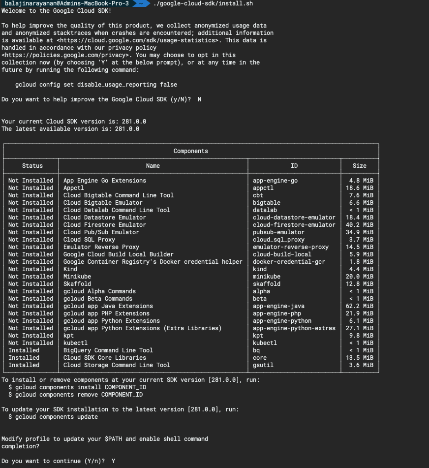
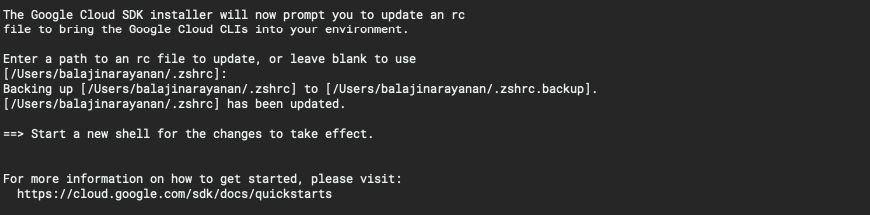
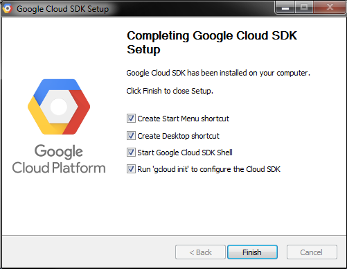

# Pre-requisites

In this section, you will perform the necessary steps to install and configure the prerequisite tools required to interact with kubernetes cluster deployed on GKE. Follow the steps below and reach out for help if you get stuck. You can skip any step if you already have the corresponding tool(s) installed on your computer.

> **Note:** It is important to have the right minimum versions of the tools. This guide focuses on installing the right versions, so you get the functionality needed to complete all steps successfully.

For Mac OS, it is recommended you install Homebrew package manager; it will make things much easier. If you don't have homebrew available on your system, [install homebrew](https://docs.brew.sh/Installation.html) before continuing.

There are separate sections for Mac and Windows setup steps where needed. If there are no such separate sections, the steps are similar or identical for both operating systems, however terminal commands shown are based on Mac OS and some may need to be modified before being run on Windows, e.g. change / to \\, remove trailing & character to run commands in the background.

This guide does not cover installation steps on Linux due to a variety of popular Linux distributions. Please ask for help if you are using Linux and get stuck.

## Step 1: Install kubectl

Kubectl is a command line interface for running commands against Kubernetes clusters. We will use kubectl to deploy and manage applications on Kubernetes. There are multiple options to download and install kubectl for your operating system, you can find them on the following page: [Install and setup kubectl](https://kubernetes.io/docs/tasks/tools/install-kubectl/). Below are the recommended methods for Mac and Windows.

### Mac - Homebrew

Please follow the below steps to install `kubectl` uisng [Homebrew](https://brew.sh/) package manager.

1. Run the installation command:

    ```bash
    brew install kubernetes-cli
    ```

2. Test to ensure the version you installed is up-to-date:

    ```bash
    kubectl version
    ```

    If `kubectl` is installed successfully, then you should see the below output.

    ```bash
    Client Version: version.Info{Major:"1", Minor:"16", GitVersion:"v1.16.3", GitCommit:"b3cbbae08ec52a7fc73d334838e18d17e8512749", GitTreeState:"clean", BuildDate:"2019-11-14T04:24:34Z", GoVersion:"go1.12.13", Compiler:"gc", Platform:"darwin/amd64"}
    ```
  
### Windows - Download kubectl.exe (Option 1)

1. Download the kubectl.exe binary from here: [kubectl 1.13.0 binary for Windows](https://storage.googleapis.com/kubernetes-release/release/v1.13.0/bin/windows/amd64/kubectl.exe). Put the kubectl.exe file in any directory of your choice on your computer, e.g. `C:\kubectl`.

2. Modify/edit your PATH environment variable to include the path where you put kubectl.exe, e.g., C:\kubectl. Use the Environment Variables dialog box (Control Panel → System → Advanced system settings → Environment Variables) to change the PATH variable permanently or use the terminal as shown below to change the PATH variable for the duration of the session:

    ```bash
    > set PATH=%PATH%;C:\kubectl
    ```

### Windows - PowerShell Gallery (Option 2)

Use [PowerShell Gallery](https://www.powershellgallery.com/) package manager. This works best on Windows 10, since Install-PackageProvider cmdlet has not been part of the OS prior to Windows 10.

Run Windows PowerShell as Administrator and execute the following commands:

```bash
> Set-ExecutionPolicy -ExecutionPolicy Unrestricted -Scope CurrentUser -Force
> Install-PackageProvider -Name NuGet -MinimumVersion 2.8.5.201 -Force
Name                           Version          Source           Summary
----                           -------          ------           -------
nuget                          2.8.5.208        https://onege... NuGet provider for the OneGet meta-package manager
> Install-Script -Name install-kubectl -Scope CurrentUser -Force
> install-kubectl.ps1 -DownloadLocation C:\YOUR_PATH
==>Getting download link from  https://kubernetes.io/docs/tasks/tools/install-kubectl/
==>analyzing Downloadlink
==>starting Download from https://storage.googleapis.com/kubernetes-release/release/v1.13.0/bin/windows/amd64/kubectl.exe using Bitstransfer
==>starting 'C:\kubectl\kubectl.exe version'
Client Version: version.Info{Major:"1", Minor:"13", GitVersion:"v1.13.0", GitCommit:"ddf47ac13c1a9483ea035a79cd7c10005ff21a6d", GitTreeState:"clean", BuildDate:"2018-12-03T21:04:45Z", GoVersion:"go1.11.2", Compiler:"gc", Platform:"windows/amd64"}
Unable to connect to the server: dial tcp [::1]:8080: connectex: No connection could be made because the target machine actively refused it.

You can now start kubectl from C:\kubectl\kubectl.exe
```

> **Note**:  If you do not specify -DownloadLocation parameter, kubectl.exe will be installed in your temp directory.

### Windows - Chocolatey (Option 3)

Using [Chocolatey](https://chocolatey.org/) package manager. This works well on Windows 7 and later versions.

Once you install Chocolatey, run Windows PowerShell as Administrator and execute the following commands:

```bash
> choco install kubernetes-cli
Chocolatey v0.10.11
Installing the following packages:
kubernetes-cli
By installing you accept licenses for the packages.
Progress: Downloading kubernetes-cli 1.13.3... 100%

kubernetes-cli v1.13.3 [Approved]
kubernetes-cli package files install completed. Performing other installation steps.
The package kubernetes-cli wants to run 'chocolateyInstall.ps1'.
Note: If you dont run this script, the installation will fail.
Note: To confirm automatically next time, use '-y' or consider:
choco feature enable -n allowGlobalConfirmation
Do you want to run the script?([Y]es/[N]o/[P]rint): Y

.....
 ShimGen has successfully created a shim for kubectl.exe
 The install of kubernetes-cli was successful.
  Software installed to 'C:\ProgramData\chocolatey\lib\kubernetes-cli\tools'

Chocolatey installed 1/1 packages.
 See the log for details (C:\ProgramData\chocolatey\logs\chocolatey.log).

> cd $HOME
> mkdir .kube
Mode                LastWriteTime     Length Name
----                -------------     ------ ----
d----        02/04/2019   4:42 PM            .kube
> cd .kube
> New-Item config -type file
Mode                LastWriteTime     Length Name
----                -------------     ------ ----
-a---        02/04/2019   4:43 PM          0 config
```

Check kubectl version in a terminal to make sure it successfully installed:

```bash
> kubectl version

Client Version: version.Info{Major:"1", Minor:"13", GitVersion:"v1.13.0", GitCommit:"ddf47ac13c1a9483ea035a79cd7c10005ff21a6d", GitTreeState:"clean", BuildDate:"2018-12-03T21:04:45Z", GoVersion:"go1.11.2", Compiler:"gc", Platform:"windows/amd64"}
Unable to connect to the server: dial tcp [::1]:8080: connectex: No connection could be made because the target machine actively refused it.
```

## Step 2: Installing Google Cloud SDK

### The gcloud CLI and Cloud SDK

The gcloud CLI is a part of the Google Cloud SDK. You must download and install the SDK on your system and initialize it before you can use the gcloud command-line tool.

### System requirements

Cloud SDK runs on Linux, macOS, and Windows. Cloud SDK requires Python. Supported versions are 3.5 or higher, and 2.7.9 or higher. Some tools bundled with Cloud SDK have additional requirements. For example, Java tools for Google App Engine development require Java 1.7 or later.

### Before you begin - Mac OS

1. [Create a Google Cloud Platform project](https://console.cloud.google.com/cloud-resource-manager?_ga=2.183684132.342733646.1582237615-284162590.1577339951&_gac=1.125730168.1582316924.Cj0KCQiAnL7yBRD3ARIsAJp_oLZbpCvPRux0-eRPR9pt4exUPMYLwlViFilpj5gtLokDVYihXYN8uA4aAqISEALw_wcB), if you don't have one already.

2. Cloud SDK requires Python. Supported versions are 3.5 or higher, and 2.7.9 or higher. To check the Python version installed on your system:

    ```bash
    python -V
    ```

    > **Note:** Cloud SDK uses Python 2 by default, but will soon move to Python 3 (run `gcloud topic startup` for exclusions and more information on configuring your Python interpreter to use a different version). Consider upgrading to Python 3 to avoid disruption in the future.

3. Download the archive file best suited to your operating system. Most machines will run the 64-bit package.

    | Platform | Package| Size | SHA256 Checksum |
    | :--- | :--- | :--- | :--- |
    | macOS 64-bit (x86_64) | [google-cloud-sdk-281.0.0-darwin-x86_64.tar.gz](https://dl.google.com/dl/cloudsdk/channels/rapid/downloads/google-cloud-sdk-281.0.0-darwin-x86_64.tar.gz) | 49.2 MB |d9c4a987e64ab4f1ac2ce641be6ab2bd3113352f20b7043154c959da8640e441 |
    | macOS 32-bit(x86) | [google-cloud-sdk-281.0.0-darwin-x86.tar.gz](https://dl.google.com/dl/cloudsdk/channels/rapid/downloads/google-cloud-sdk-281.0.0-darwin-x86.tar.gz) | 49.2 MB |1ee756ffeedabc4f6caa8959f2f38a53650fc2cfb03f09f8aa872e157f2b4cfc |

4. Extract the archive to any location on your file system; preferably, your home directory. On macOS, this can be achieved by opening the downloaded `.tar.gz` archive file in the preferred location.

5. _Optional_: If you're having trouble getting the `gcloud` command to work, ensure your `$PATH` is defined appropriately. Use the install script to add Cloud SDK tools to your path. You will also be able to opt-in to command-completion for your bash shell and [usage statistics collection](https://cloud.google.com/sdk/usage-statistics) during the installation process. Run the script using this command:

    ```bash
    ./google-cloud-sdk/install.sh
    ```

    
    

    Restart your terminal for the changes to take effect.

    Alternatively, you can call Cloud SDK after extracting the downloaded archive by invoking its executables via the full path.

### Before you begin - Windows

1. [Create a Google Cloud Platform project](https://console.cloud.google.com/cloud-resource-manager?_ga=2.243854471.342733646.1582237615-284162590.1577339951&_gac=1.229601774.1582316924.Cj0KCQiAnL7yBRD3ARIsAJp_oLZbpCvPRux0-eRPR9pt4exUPMYLwlViFilpj5gtLokDVYihXYN8uA4aAqISEALw_wcB), if you don't have one already.

2. Download the [Google Cloud SDK installer](https://dl.google.com/dl/cloudsdk/channels/rapid/GoogleCloudSDKInstaller.exe).

3. Launch the installer and follow the prompts.

4. After installation has completed, the installer presents several options:
   

   Make sure that the following are selected:
    - **Start Google Cloud SDK Shell**
    - **Run 'gcloud init'**

   The installer then starts a terminal window and runs the [gcloud init](https://cloud.google.com/sdk/gcloud/reference/init) command.

**Troubleshooting tips:**

- If the Cloud SDK fails to run after installing version 274.0.0, please refer to this [tracking bug](https://issuetracker.google.com/issues/146458519) for the latest workarounds.
- If your installation is unsuccessful due to the find command not being recognized, ensure your PATH environment variable is set to include the folder containing find. Usually, this is `C:\WINDOWS\system32;`
- If you have just uninstalled Cloud SDK, you will need to reboot your system before installing Cloud SDK again.
