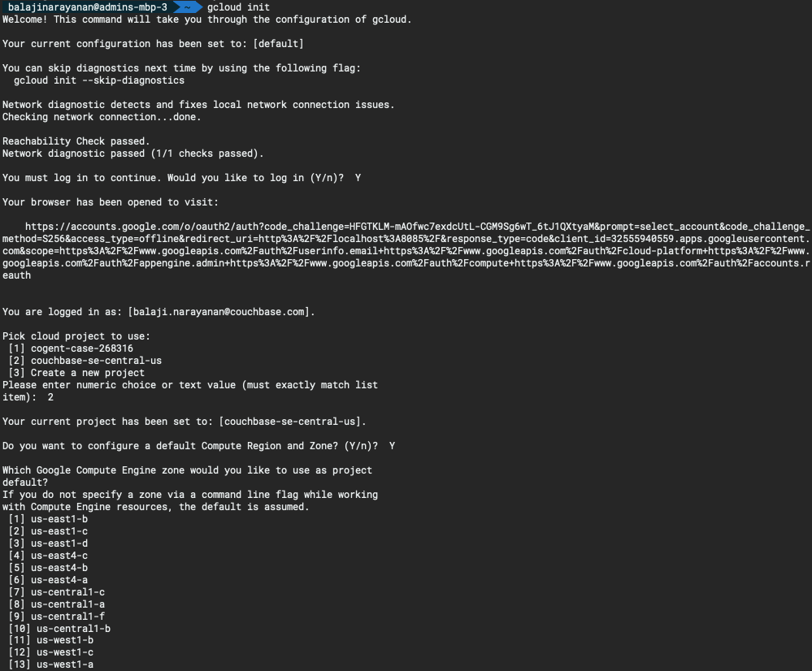
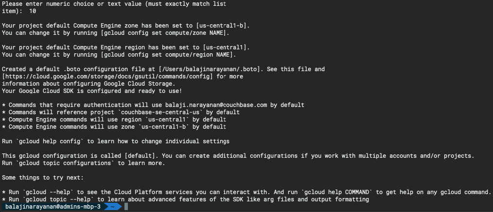
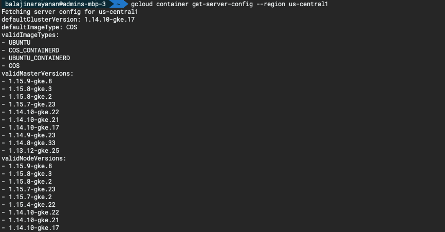
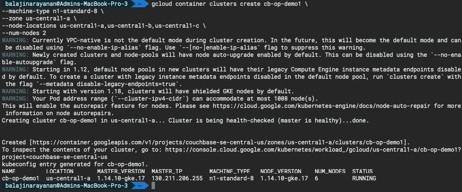
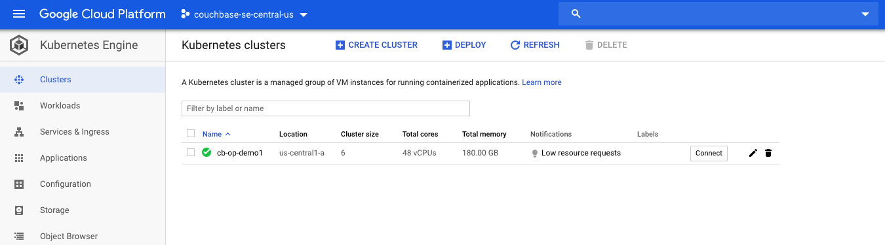
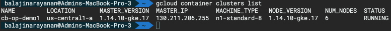
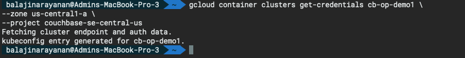

# Setup GKE Cluster

The following section will walk through the steps to create the GKE cluster. This GKE cluster will be used to deploy Couchbase Autonomous Operator later in the lab.

## Before you begin

Before you start, make sure you have performed the following tasks:

- Ensure that you have enabled the Google Kubernetes Engine API.

    [Enable Google Kubernetes Engine API](https://console.cloud.google.com/apis/library/container.googleapis.com?q=kubernetes%20engine&_ga=2.184676139.342733646.1582237615-284162590.1577339951&_gac=1.115717236.1582316924.Cj0KCQiAnL7yBRD3ARIsAJp_oLZbpCvPRux0-eRPR9pt4exUPMYLwlViFilpj5gtLokDVYihXYN8uA4aAqISEALw_wcB)

- Ensure that you have installed the `Cloud SDK`.

### Step 1: Set up default gcloud settings

1. Run gcloud init and follow the directions:

    ```bash
    gcloud init
    ```

    If you are using SSH on a remote server, use the --console-only flag to prevent the command from launching a browser:

    ```bash
    gcloud init --console-only
    ```

2. Follow the instructions to authorize gcloud to use your Google Cloud account.

3. Create a new configuration or select an existing one.

4. Choose a Google Cloud project.

5. Choose a default Compute Engine zone.

    Output:

    
    

### Step 2: **Provisioning the nodes for the Kubernetes GKE Cluster**

1. Check your region cluster version.

    ```bash
    gcloud container get-server-config --region us-central1
    ```

    

2. Create a multi-zonal cluster.

    To create a multi-zonal cluster, set `--zone` to the zone for the cluster control plane, and set `--node-locations` to a comma-separated list of compute zones where the control plane and nodes are created. Use one of the following commands.

    To specify an exact version, use the `--cluster-version` flag.

    ```bash
    gcloud container clusters create cb-op-demo1 \
    --machine-type n1-standard-8 \
    --zone us-central1-a \
    --node-locations us-central1-a,us-central1-b,us-central1-c \
    --num-nodes 2
    ```

    > **Note:**  In `--node-locations`, do not put spaces between the zones.

    When the --num-nodes flag is omitted, the default number of per-zone nodes created by the cluster is `three`. Because three zones were specified, this command creates a nine-node cluster with three nodes each in us-central1-a, us-central1-b, and us-central1-c.

    

    

3. List the GKE clusters

    ```bash
    gcloud container clusters list
    ```

    

### Step 3: Get the GKE cluster credentials and setup kubernetes environment

- Run the below command to fetch the cluster endpoint details and configure the kubeconfig.

    ```bash
    gcloud container clusters get-credentials cb-op-demo1 \
    --zone us-central1-a \
    --project couchbase-se-central-us
    ```

    

- Create a cluster role binding to assign cluster-admin role to your user account.

    ```bash
    kubectl create clusterrolebinding cluster-admin-binding \
    --clusterrole cluster-admin --user $(gcloud config get-value account)
    ```

    

### Step 4: Verify the number of nodes created in the GKE cluster

- Make sure the number of nodes requested is what has been deployed.

    ```bash
    kubectl get nodes
    ```

    

    
