# Deploy Couchbase Autonomous Operator

The Couchbase Autonomous Operator for Kubernetes enables cloud portability and automates operational best practices for deploying and managing Couchbase.

- Before we begin with the setup of Couchbase Operator, run ‘kubectl get nodes’ command from the local machine to confirm GKE cluster is up and running.

  ```bash
  kubectl get nodes
  ```

  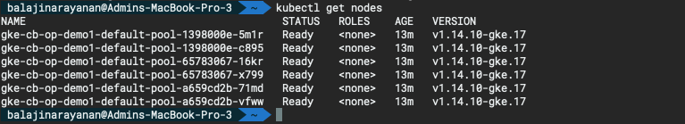

  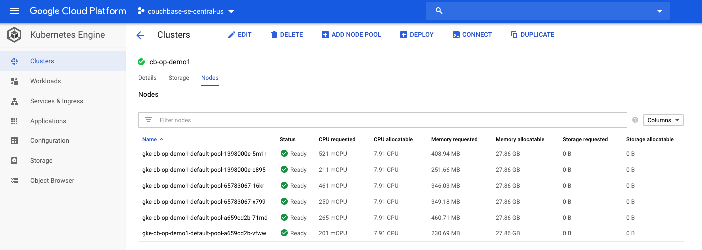

  After we have tested that we can connect to Kubernetes control plane running on Google Cloud GKE cluster from our local machine, we can now begin with the steps required to deploy Couchbase Autonomous Operator, which is the glue technology enabling Couchbase Server cluster to be managed by Kubernetes.

Below are the steps to deploy Couchbase Autonomous Operator.

- [Download the Couchbase Autonomous Operator package](#step-1-download-the-couchbase-autonomous-operator-package)

- [Install CRD](#step-3-install-the-custom-resource-definition-crd)

- [Install Admission Controller](#step-3-deploy-admission-controller)

- [Create a Namespace](#step-2-create-a-namespace)

- [Create Couchbase Operator Role](#step-5-create-couchbase-operator-role)

- [Create the Service Account](#step-6-create-the-service-account)

- [Deploy Couchbase Operator](#step-7-deploy-couchbase-operator)

## Step 1: Download the Couchbase Autonomous Operator package

Let’s first begin by downloading the latest [Couchbase Autonomous Operator](https://www.couchbase.com/downloads?family=kubernetes) and unzip to the local machine. Change directory to the operator folder so we can find YAML files we need to deploy Couchbase operator:

  ```bash
  cd couchbase-autonomous-operator-kubernetes_1.2.2-macos-x86_64
  ```

  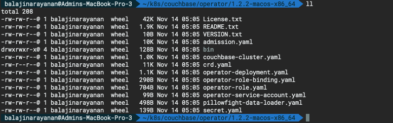

## Step 2: Install the Custom Resource Definition (CRD)

The first step in installing the Operator is to install the custom resource definition (CRD) that describes the `CouchbaseCluster` resource type. This can be achieved by running the below command from the Operator package directory:

  ```bash
  kubectl create -f crd.yaml
  ```

  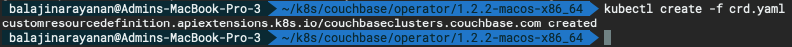

## Step 3: Deploy Admission Controller

The admission controller is a required component of the Couchbase Autonomous Operator and needs to be installed separately. The primary purpose of the admission controller is to validate Couchbase cluster configuration changes before the Operator acts on them, thus protecting your Couchbase deployment (and the Operator) from any accidental damage that might arise from an invalid configuration.

- Open a Terminal window and go to the directory where you unpacked the Operator package. Run the following command to create the admission controller.

  ```bash
  kubectl create -f admission.yaml
  ```

  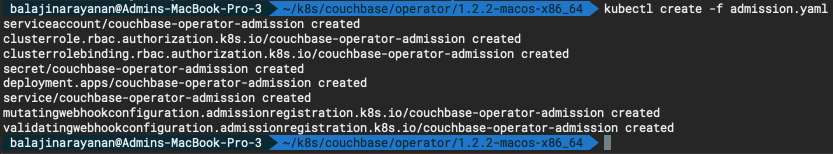

- Confirm the admission controller has deployed successfully.

  ```bash
  kubectl get deployments
  ```

  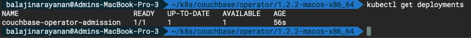

## Step 4: Create a Namespace

Create a namespace that will allow cluster resources to be nicely separated between multiple users. To do that we will use a unique namespace called **emart** for our deployment and later will use this namespace to deploy Couchbase Cluster.

- Run the following command to create a `Namespace`.

  ```bash
  kubectl create namespace workshop
  ```

  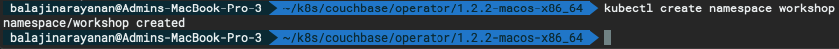

- Confirm the Namespace is created successfully.

  ```bash
  kubectl get namespaces
  ```
  
  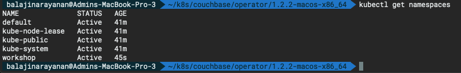

From now onwards we will use `workshop` as the namespace for all the resource provisioning.

## Step 5: Create Couchbase Operator Role

In this step, we will create a [cluster role](https://kubernetes.io/docs/reference/access-authn-authz/rbac/#api-overview) that allows the Operator to access the resources that it needs to run.

> **Note:**
If you plan to run the Operator in more than one [namespace](https://kubernetes.io/docs/concepts/overview/working-with-objects/namespaces/), it may be preferable to create a cluster role because you can assign that role to a [service account](https://kubernetes.io/docs/reference/access-authn-authz/rbac/#service-account-permissions) in any namespace. Note that if you chose to to use a cluster role, making modifications to it will affect all instances of the Operator that use it.

- To create the role for the Operator, run the below command from the Operator package directory:

  ```bash
  kubectl create -f operator-role.yaml --namespace workshop
  ```

  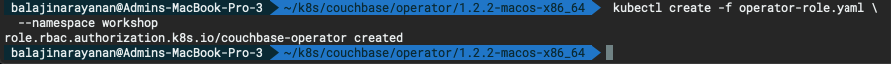

## Step 6: Create the Service Account

After the cluster role is created, you need to create a service account in the namespace where you are installing the Operator, and then assign the cluster role to that service account using a [cluster role binding](https://kubernetes.io/docs/reference/access-authn-authz/rbac/#api-overview). (In this example, the service account is created in the namespace called `workshop`).

- Run the following command to create the service account.

  ```bash
  kubectl create serviceaccount couchbase-operator --namespace workshop
  ```

  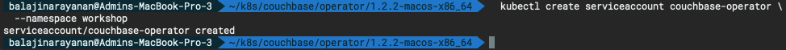

- Now run the following command to assign the operator role to the service account.

  ```bash
  kubectl create rolebinding couchbase-operator \
  --role couchbase-operator \
  --serviceaccount workshop:couchbase-operator \
  --namespace workshop
  ```

  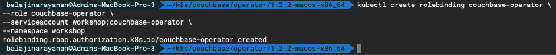

 Now before we proceed further let's make sure all the roles and service accounts are created under the namespace _workshop_. To do that run these three checks and make sure each _get_ returns the output as shown below:

 ```bash
 kubectl get roles -n workshop
 kubectl get sa -n workshop
 kubectl get rolebindings -n workshop
 ```

 **Output :**

 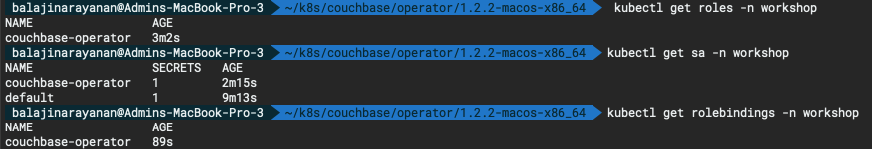

## Step 7: Deploy Couchbase Operator

Now that the service account is set up with the appropriate permissions, you can create and start the Operator by running the following command from the Operator package directory:

```bash
kubectl create -f operator-deployment.yaml \
--namespace workshop
```


Running the above command downloads the Operator Docker image (specified in the operator-deployment.yaml file) and creates a [deployment](https://kubernetes.io/docs/concepts/workloads/controllers/deployment/), which manages a single instance of the Operator. The Operator uses a deployment so that it can restart if the pod it’s running in dies.

After you run the `kubectl create` command, it generally takes less than a minute for Kubernetes to deploy the Operator and for the Operator to be ready to run.

### Check the status of the Deployment

You can use the following command to check on the status of the deployment:

```bash
kubectl get deployments -n workshop
```

If you run the this command immediately after the Operator is deployed, the output will have the `AVAILABLE` column as 0.

However, the **AVAILABLE** field indicates that the pod is not ready yet since its value is 0 and not 1. That means that the Operator is still establishing a connection to the Kubernetes master node to allow it to get updates on CouchbaseCluster objects. Once the Operator has completed this task, it will be able to start managing Couchbase Server clusters and the status will be shown as AVAILABLE.

You should continue to poll the status of the Operator until the output looks similar to the following:

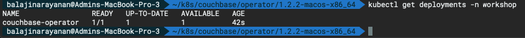

### Check the status of the Operator

Run the following command to verify that the Operator has started successfully:

```bash
kubectl get pods -l app=couchbase-operator -n workshop
```

If the Operator is up and running, the command returns an output where the **READY** field shows **1/1**, such as:

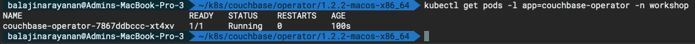

You can also check the logs to confirm that the Operator is up and running. 

```bash
kubectl logs -f couchbase-operator-7867ddbccc-xt4xv \
-n workshop
```

**Output :**

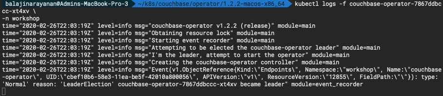
