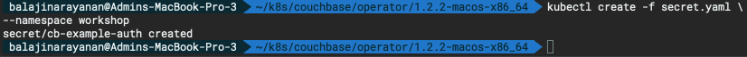
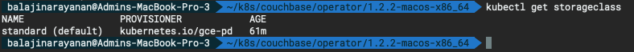
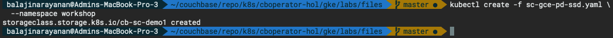
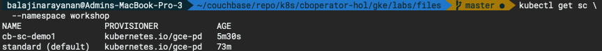
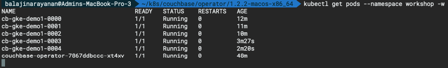
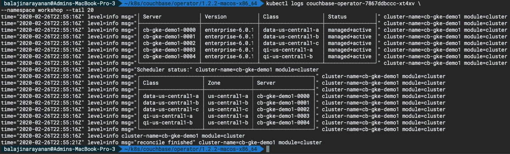
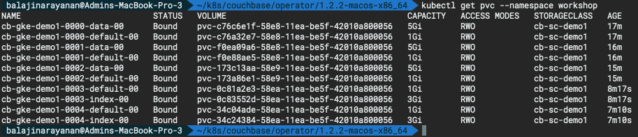
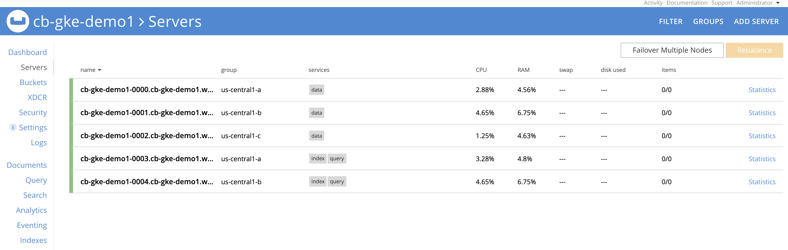

# Deploy Couchbase cluster using persistent volumes and availability zones

Now that we have deployed the Couchbase Autonomous Operator in GKE, now lets deploy the Couchbase Cluster.

## Step 1: Create Secret for Couchbase Admin Console

Let's create a secret credential which will be used by the administrative web console during login. For convenience, a sample secret is provided in the Operator package. When you push it to your Kubernetes cluster, the secret sets the username to `Administrator` and the password to `password`.

To push the secret into your Kubernetes cluster, run the following command:

```bash
kubectl create -f secret.yaml --namespace workshop
```

**Output :**



## Step 2: Create Google storage class for the GKE cluster

Now in order to use `PersistentVolume` for Couchbase services (data, index, search, etc.), we need to first create Storage Class (SC). Let’s begin by checking what storage class exist in our environment.

Let’s use kubectl command to find that out:

```bash
kubectl get storageclass
```



Above output means we just have default `pd-standard` storage class, and we will run the below steps to create storage class of type `pd-ssd` to store data, index and Couchbase binaries.

- Create a `StorageClass` definition file [sc-gce-pd-ssd.yaml](./files/sc-gce-pd-ssd.yaml) that represent storage class of _pd-ssd_ type (aka general purpose SSD drive), which we will later use it in our _VolumeClaimTemplate_.

  ```bash
  apiVersion: storage.k8s.io/v1
  kind: StorageClass
  metadata:
    name: cb-sc-demo1
  parameters:
    type: pd-ssd
  provisioner: kubernetes.io/gce-pd
  reclaimPolicy: Delete
  volumeBindingMode: WaitForFirstConsumer
  ```

- Run the below command to create storage class from the definition file we defined above.

  ```bash
  kubectl create -f sc-gce-pd-ssd.yaml --namespace workshop
  ```

  

- Verify the new storage class by running the below command.

  ```bash
  kubectl get sc --namespace workshop
  ```

  

## Step 3: Add Storage Class to Persistent Volume Claim Template

Now that we have created the `StorageClass`, we can use them to create dynamic storage volumes and mount them of each of the Couchbase services that requires persistent data. There is one last thing to do before we can use persistent volumes and that is to define Persistent Volume Claim Template in our couchbase-cluster.yaml file (which can be found from the operator package directory).

```bash
spec:
  volumeClaimTemplates:
    - metadata:
        name: pvc-default
      spec:
        storageClassName: cb-sc-demo1
        resources:
          requests:
            storage: 1Gi
    - metadata:
        name: pvc-data
      spec:
        storageClassName: cb-sc-demo1
        resources:
          requests:
            storage: 5Gi
    - metadata:
        name: pvc-index
      spec:
        storageClassName: cb-sc-demo1
        resources:
          requests:
            storage: 3Gi
```

Now that the templates are added, the final step is to pair the volume claim template with server groups in each of the zones. For instance, Pods within _Server Group_ named data-us-central1-a should use volumeClaimTemplate named _pvc-data_ to store data and _pvc-default_ for Couchbase binaries and log files.

```bash
servers:
    - name: data-us-central1-a
      size: 1
      services:
        - data
      serverGroups:
       - us-central1-a
      pod:
        volumeMounts:
          default: pvc-default  # /opt/couchbase/var/lib/couchbase
          data: pvc-data       # /mnt/data
    - name: data-us-central1-b
      size: 1
      services:
        - data
      serverGroups:
       - us-central1-b
      pod:
        volumeMounts:
          default: pvc-default
          data: pvc-data
    - name: data-us-central1-c
      size: 1
      services:
        - data
      serverGroups:
       - us-central1-c
      pod:
        volumeMounts:
          default: pvc-default
          data: pvc-data
    - name: qi-us-central1-a
      size: 1
      services:
        - query
        - index
      serverGroups:
       - us-central1-b
      pod:
        volumeMounts:
          default: pvc-default
          index: pvc-index
    - name: qi-us-central1-b
      size: 1
      services:
        - index
        - query
      serverGroups:
       - us-central1-c
      pod:
        volumeMounts:
          default: pvc-default
          index: pvc-index
```

## Step 4: Deploy Couchbase Cluster

The full spec for deploying Couchbase cluster across 3 different zones using persistent volumes can be seen in the [couchbase-cluster-with-pv-server-groups.yaml](./files/couchbase-cluster-with-pv-server-groups.yaml) file. This file along with other sample yaml files used in this article can be downloaded from this git repo.

Please open the yaml file and note that we are deploying data service in three AZs but deploying index & query service in two AZs only. You can change the configuration to meet your production requirements.

Now use kubectl to deploy the cluster.

```bash
kubectl create -f couchbase-cluster-with-pv-server-groups.yaml --namespace workshop
```

This will start deploying the Couchbase cluster and if all goes fine then we will have five Couchbase cluster pods hosting the services as per the configuration file above. To check the progress run the below command, which will watch (-w argument) the progress of pods creating:

```bash
kubectl get pods --namespace workshop -w
```

Output:



If for any reason there is an exception, then you can find the details of exception from the couchbase-operator log file. To display the last 20 lines of the log, copy the name of your operator pod and run the below command by replacing the operator pod name with the name in your environment.

```bash
kubectl logs couchbase-operator-7867ddbccc-xt4xv --namespace workshop --tail 20
```

Output:



Quick check on persistent volumes claims can be done like below.

```bash
kubectl get pvc --namespace workshop
```



When all the pods are ready then you can port forward one of Couchbase cluster pod so that we can view the cluster status from the web-console. Run this command to port forward it.

```bash
kubectl port-forward cb-gke-demo1-0000 8091:8091 --namespace workshop
```

At this point you can open up a browser and type http://locahost:8091 which will bring Couchbase web-console from where you can monitor server stats, create buckets, run queries all from one single place.

