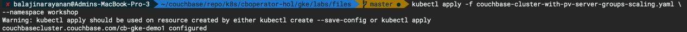
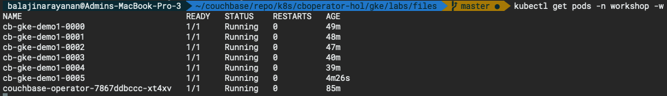
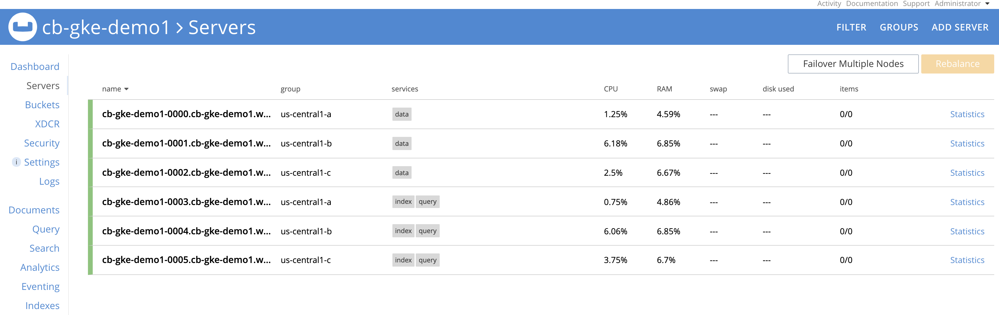

# Scaling a Couchbase Cluster

## On demand scaling - up & down

Using the Couchbase Operator, you can easily scale clusters and services up and down. The handling of individual nodes is defined in the servers section of the Couchbase cluster specification in [couchbase-cluster-with-pv-server-groups.yaml](./files/couchbase-cluster-with-pv-server-groups.yaml)

This configuration specifies that the cluster should contain 5 nodes running the data, index, query services and that the data and index path are each set to /opt/couchbase/var/lib/couchbase/data.

To scale these servers, you only need to change the size parameter and then push the new configuration into Kubernetes to increase or decrease the number of nodes in the cluster. Let's say we want to increase index and query nodes capacity from 2 to 3, so change servers:size to 3.

Notice we don't have any Index and Query service in the **us-central1-c** serverGroups:

```bash
  - name: qi-us-central1-a
    size: 1
    services:
      - query
      - index
    serverGroups:
      - us-central1-a
    pod:
      volumeMounts:
        default: pvc-default
        index: pvc-index
  - name: qi-us-central1-b
    size: 1
    services:
      - index
      - query
    serverGroups:
      - us-central1-b
    pod:
      volumeMounts:
        default: pvc-default
        index: pvc-index
```
  
So we are going to add one more server in **us-central1-c** server group hosting both index and query service like this:

```bash
  - name: qi-us-central1-c
    size: 1
    services:
      - index
      - query
    serverGroups:
      - us-central1-c
    pod:
      volumeMounts:
        default: pvc-default
        index: pvc-index
```
  
A separate [couchbase-cluster-with-pv-server-groups-scaling.yaml](./files/couchbase-cluster-with-pv-server-groups-scaling.yaml) file is provided just for convenience but if you want you can also make changes yourself in the [couchbase-cluster-with-pv-server-groups.yaml](./files/couchbase-cluster-with-pv-server-groups.yaml)

```bash
kubectl apply -f couchbase-cluster-with-pv-server-groups-scaling.yaml \
--namespace workshop
```



We will see the new pods are getting created and couchbase nodes are getting added to cluster, rebalance is performed, simply amazing!

```bash
kubectl get pods --namespace workshop -w
```



You can check the Couchbase web console to see how the new data service pod is added to the cluster and rebalance is performed.


