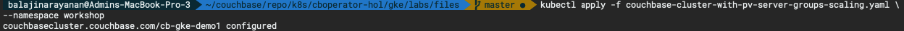
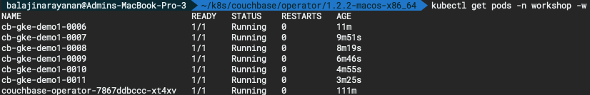
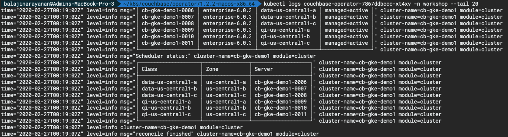
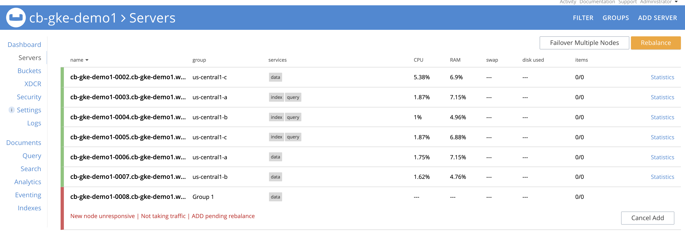
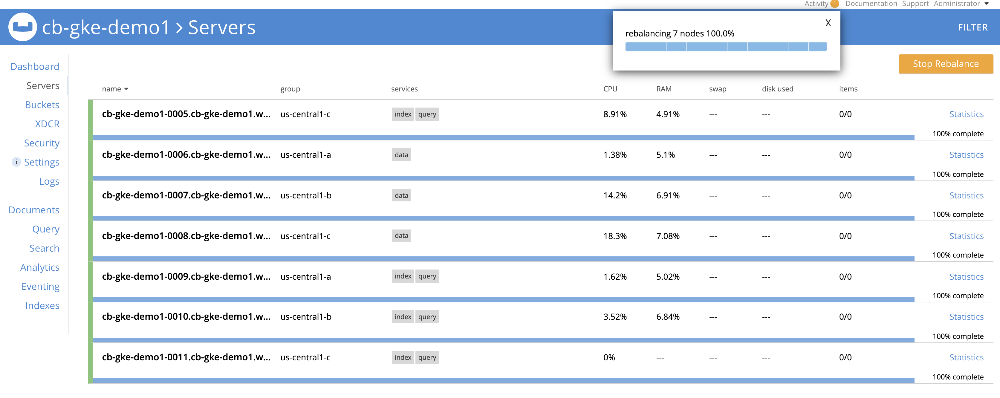

# Couchbase automated upgrade

Any software in service goes through continuous improvement and there is definitely going to be the moments when you would like to upgrade Couchbase Autonomous Operator too because of some new feature or the patch which is critical for your business.

Upgrading a distributed cluster like Couchbase requires careful orchestration of steps if you manually run the online upgrade operation. With Couchbase Autonomous Operator the whole symphony of these operations are completely automated, so the management becomes very easy.

Let's take a look at how you can upgrade the system in an online fashion.

## Step 1: Preparing for Upgrade

Before beginning an upgrade to your Kubernetes cluster, review the following considerations and prerequisites:

- As an eviction deletes a pod, ensure that the Couchbase cluster is scaled correctly so that it can handle the increased load of having a pod down while a new pod is balanced into the cluster.

- To minimize disruption, ensure that a short failover period is configured with the autoFailoverTimeout parameter to reduce down time before another node takes over the load.

- Ensure that there is capacity in your Kubernetes cluster to handle the scheduling of replacement Couchbase pods. For example, if a Couchbase cluster were running on Kubernetes nodes marked exclusively for use by Couchbase, and anti-affinity were enabled as per the deployment [best practices](https://docs.couchbase.com/operator/current/best-practices.html), the Kubernetes cluster would require at least one other node capable of scheduling and running your Couchbase workload.

## Step 2: Perform Automatic Upgrade

To prevent downtime or a data loss scenario, the Operator provides controls for how automated Kubernetes upgrades proceed.

A PodDisruptionBudget is created for each CouchbaseCluster resource created. The PodDisruptionBudget specifies that at least the cluster size minus one node (N-1) be ready at any time. This constraint allows, at most, one node to be evicted at a time. As a result, it’s recommended that to support an automatic Kubernetes upgrade, the cluster be deployed with anti-affinity enabled to guarantee only a single eviction at a time.

- Now let's open [couchbase-cluster-with-pv-server-groups.yaml](./files/couchbase-cluster-with-pv-server-groups.yaml) file and change:

  ```bash
  spec:
    baseImage: couchbase/server
    version: enterprise-6.0.1
  ```

  to
  
  ```bash
  spec:
    baseImage: couchbase/server
    version: enterprise-6.0.3
  ```

- Now using kubectl to deploy the cluster.

  ```bash
  kubectl apply -f couchbase-cluster-with-pv-server-groups-scaling.yaml \
  --namespace workshop
  ```

  
  
- To check the progress run the below command, which will watch (-w argument) the progress of pods getting created:

  ```bash
  kubectl get pods -n workshop -w
  ```

  

- Run the below command to check the logs.

  ```bash
  kubectl logs couchbase-operator-7867ddbccc-xt4xv -n workshop --tail 20
  ```
  
  

- At this point you would notice the pods will be evicted one by one and new pod will be joined to the existing cluster but with an upgraded Couchbase version (6.0.3).

  > **Note:** At some point during upgrade when your cb-gke-demo-0000 pod is upgraded to a newer pod (cb-gke-demo-0006), you might need to reset the forwarding to newly upgraded pod like this:

  ```bash
  kubectl port-forward cb-gke-demo1-0006 8091:8091 --namespace workshop
  ```

  Just wait for some time and cluster will upgrade one pod at a time in a rolling fashion.

  

  
