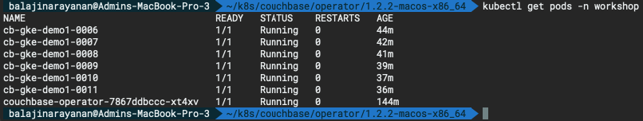
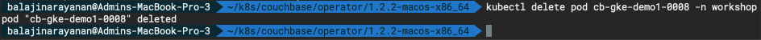
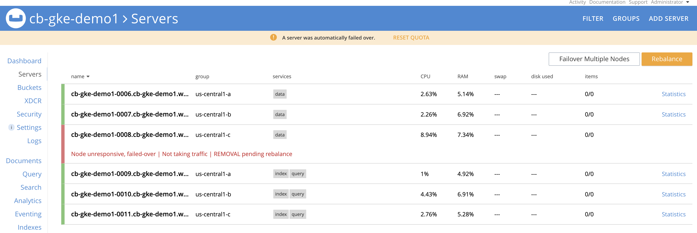
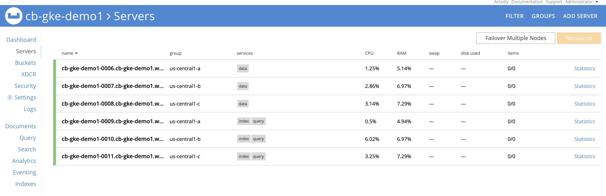

# High Availability (HA) & Self-recovery

The Couchbase Operator can detect node failures, rebalance out bad nodes, and bring the cluster back up to the desired capacity.

Lets delete a pod simulating a node failure by following the below steps.

**Step 1:** Run the below command to get the list pods running in the `workshop` namespace.

```bash
kubectl get pods -n workshop
```



**Step 2:** Delete one of the pod from the list above by running the below command.

```bash
kubectl delete pod cb-gke-demo1-0008 -n workshop
```





Couchbase Server waits for the node to be down for a specified amount of time before failing over the node, and this failover timeout can be set using the `autoFailoverTimeout` in the cluster configuration file. You can check this in the logs.

```bash
kubectl logs couchbase-operator-7867ddbccc-xt4xv -n workshop -f
```

**Output :**

```bash
time="2020-02-27T00:30:48Z" level=info cluster-name=cb-gke-demo1 module=cluster
time="2020-02-27T00:30:53Z" level=info msg="reconcile finished" cluster-name=cb-gke-demo1 module=cluster
time="2020-02-27T00:30:56Z" level=error msg="failed to reconcile: remote command on cb-gke-demo1-0008 failed: unable to upgrade connection: container not found (\"couchbase-server\")" cluster-name=cb-gke-demo1 module=cluster
time="2020-02-27T00:31:07Z" level=info msg="server config data-us-central1-c: " cluster-name=cb-gke-demo1 module=cluster
time="2020-02-27T00:31:07Z" level=info msg="Cluster status: balanced" cluster-name=cb-gke-demo1 module=cluster
time="2020-02-27T00:31:07Z" level=info msg="Node status:" cluster-name=cb-gke-demo1 module=cluster
time="2020-02-27T00:31:07Z" level=info msg="┌───────────────────┬──────────────────┬────────────────────┬────────────────┐" cluster-name=cb-gke-demo1 module=cluster
time="2020-02-27T00:31:07Z" level=info msg="│ Server            │ Version          │ Class              │ Status         │" cluster-name=cb-gke-demo1 module=cluster
time="2020-02-27T00:31:07Z" level=info msg="├───────────────────┼──────────────────┼────────────────────┼────────────────┤" cluster-name=cb-gke-demo1 module=cluster
time="2020-02-27T00:31:07Z" level=info msg="│ cb-gke-demo1-0006 │ enterprise-6.0.3 │ data-us-central1-a │ managed+active │" cluster-name=cb-gke-demo1 module=cluster
time="2020-02-27T00:31:07Z" level=info msg="│ cb-gke-demo1-0007 │ enterprise-6.0.3 │ data-us-central1-b │ managed+active │" cluster-name=cb-gke-demo1 module=cluster
time="2020-02-27T00:31:07Z" level=info msg="│ cb-gke-demo1-0008 │ enterprise-6.0.3 │ data-us-central1-c │ managed+down   │" cluster-name=cb-gke-demo1 module=cluster
time="2020-02-27T00:31:07Z" level=info msg="│ cb-gke-demo1-0009 │ enterprise-6.0.3 │ qi-us-central1-a   │ managed+active │" cluster-name=cb-gke-demo1 module=cluster
time="2020-02-27T00:31:07Z" level=info msg="│ cb-gke-demo1-0010 │ enterprise-6.0.3 │ qi-us-central1-b   │ managed+active │" cluster-name=cb-gke-demo1 module=cluster
time="2020-02-27T00:31:07Z" level=info msg="│ cb-gke-demo1-0011 │ enterprise-6.0.3 │ qi-us-central1-c   │ managed+active │" cluster-name=cb-gke-demo1 module=cluster
time="2020-02-27T00:31:07Z" level=info msg="└───────────────────┴──────────────────┴────────────────────┴────────────────┘" cluster-name=cb-gke-demo1 module=cluster
time="2020-02-27T00:31:07Z" level=info msg="Scheduler status:" cluster-name=cb-gke-demo1 module=cluster
time="2020-02-27T00:31:07Z" level=info msg="┌────────────────────┬───────────────┬───────────────────┐" cluster-name=cb-gke-demo1 module=cluster
time="2020-02-27T00:31:07Z" level=info msg="│ Class              │ Zone          │ Server            │" cluster-name=cb-gke-demo1 module=cluster
time="2020-02-27T00:31:07Z" level=info msg="├────────────────────┼───────────────┼───────────────────┤" cluster-name=cb-gke-demo1 module=cluster
time="2020-02-27T00:31:07Z" level=info msg="│ data-us-central1-a │ us-central1-a │ cb-gke-demo1-0006 │" cluster-name=cb-gke-demo1 module=cluster
time="2020-02-27T00:31:07Z" level=info msg="│ data-us-central1-b │ us-central1-b │ cb-gke-demo1-0007 │" cluster-name=cb-gke-demo1 module=cluster
time="2020-02-27T00:31:07Z" level=info msg="│ qi-us-central1-a   │ us-central1-a │ cb-gke-demo1-0009 │" cluster-name=cb-gke-demo1 module=cluster
time="2020-02-27T00:31:07Z" level=info msg="│ qi-us-central1-b   │ us-central1-b │ cb-gke-demo1-0010 │" cluster-name=cb-gke-demo1 module=cluster
time="2020-02-27T00:31:07Z" level=info msg="│ qi-us-central1-c   │ us-central1-c │ cb-gke-demo1-0011 │" cluster-name=cb-gke-demo1 module=cluster
time="2020-02-27T00:31:07Z" level=info msg="└────────────────────┴───────────────┴───────────────────┘" cluster-name=cb-gke-demo1 module=cluster
time="2020-02-27T00:31:07Z" level=info cluster-name=cb-gke-demo1 module=cluster
time="2020-02-27T00:31:08Z" level=error msg="Waiting for auto-failover of down node `cb-gke-demo1-0008`.  Automated recovery will begin after (38s) if auto-failover cannot be performed" cluster-name=cb-gke-demo1 module=cluster
time="2020-02-27T00:31:08Z" level=error msg="failed to reconcile: unable to reconcile cluster because some nodes are down" cluster-name=cb-gke-demo1 module=cluster
time="2020-02-27T00:31:16Z" level=info msg="server config data-us-central1-c: " cluster-name=cb-gke-demo1 module=cluster
time="2020-02-27T00:31:16Z" level=warning msg="unable to poll external addresses for pod cb-gke-demo1-0008" cluster-name=cb-gke-demo1 module=cluster
time="2020-02-27T00:31:17Z" level=info msg="Cluster status: unbalanced" cluster-name=cb-gke-demo1 module=cluster
time="2020-02-27T00:31:17Z" level=info msg="Node status:" cluster-name=cb-gke-demo1 module=cluster
time="2020-02-27T00:31:17Z" level=info msg="┌───────────────────┬──────────────────┬────────────────────┬────────────────┐" cluster-name=cb-gke-demo1 module=cluster
time="2020-02-27T00:31:17Z" level=info msg="│ Server            │ Version          │ Class              │ Status         │" cluster-name=cb-gke-demo1 module=cluster
time="2020-02-27T00:31:17Z" level=info msg="├───────────────────┼──────────────────┼────────────────────┼────────────────┤" cluster-name=cb-gke-demo1 module=cluster
time="2020-02-27T00:31:17Z" level=info msg="│ cb-gke-demo1-0006 │ enterprise-6.0.3 │ data-us-central1-a │ managed+active │" cluster-name=cb-gke-demo1 module=cluster
time="2020-02-27T00:31:17Z" level=info msg="│ cb-gke-demo1-0007 │ enterprise-6.0.3 │ data-us-central1-b │ managed+active │" cluster-name=cb-gke-demo1 module=cluster
time="2020-02-27T00:31:17Z" level=info msg="│ cb-gke-demo1-0008 │ enterprise-6.0.3 │ data-us-central1-c │ managed+failed │" cluster-name=cb-gke-demo1 module=cluster
time="2020-02-27T00:31:17Z" level=info msg="│ cb-gke-demo1-0009 │ enterprise-6.0.3 │ qi-us-central1-a   │ managed+active │" cluster-name=cb-gke-demo1 module=cluster
time="2020-02-27T00:31:17Z" level=info msg="│ cb-gke-demo1-0010 │ enterprise-6.0.3 │ qi-us-central1-b   │ managed+active │" cluster-name=cb-gke-demo1 module=cluster
time="2020-02-27T00:31:17Z" level=info msg="│ cb-gke-demo1-0011 │ enterprise-6.0.3 │ qi-us-central1-c   │ managed+active │" cluster-name=cb-gke-demo1 module=cluster
time="2020-02-27T00:31:17Z" level=info msg="└───────────────────┴──────────────────┴────────────────────┴────────────────┘" cluster-name=cb-gke-demo1 module=cluster
time="2020-02-27T00:31:17Z" level=info msg="Scheduler status:" cluster-name=cb-gke-demo1 module=cluster
time="2020-02-27T00:31:17Z" level=info msg="┌────────────────────┬───────────────┬───────────────────┐" cluster-name=cb-gke-demo1 module=cluster
time="2020-02-27T00:31:17Z" level=info msg="│ Class              │ Zone          │ Server            │" cluster-name=cb-gke-demo1 module=cluster
time="2020-02-27T00:31:17Z" level=info msg="├────────────────────┼───────────────┼───────────────────┤" cluster-name=cb-gke-demo1 module=cluster
time="2020-02-27T00:31:17Z" level=info msg="│ data-us-central1-a │ us-central1-a │ cb-gke-demo1-0006 │" cluster-name=cb-gke-demo1 module=cluster
time="2020-02-27T00:31:17Z" level=info msg="│ data-us-central1-b │ us-central1-b │ cb-gke-demo1-0007 │" cluster-name=cb-gke-demo1 module=cluster
time="2020-02-27T00:31:17Z" level=info msg="│ qi-us-central1-a   │ us-central1-a │ cb-gke-demo1-0009 │" cluster-name=cb-gke-demo1 module=cluster
time="2020-02-27T00:31:17Z" level=info msg="│ qi-us-central1-b   │ us-central1-b │ cb-gke-demo1-0010 │" cluster-name=cb-gke-demo1 module=cluster
time="2020-02-27T00:31:17Z" level=info msg="│ qi-us-central1-c   │ us-central1-c │ cb-gke-demo1-0011 │" cluster-name=cb-gke-demo1 module=cluster
time="2020-02-27T00:31:17Z" level=info msg="└────────────────────┴───────────────┴───────────────────┘" cluster-name=cb-gke-demo1 module=cluster
time="2020-02-27T00:31:17Z" level=info cluster-name=cb-gke-demo1 module=cluster
time="2020-02-27T00:31:19Z" level=info msg="An auto-failover has taken place" cluster-name=cb-gke-demo1 module=cluster
time="2020-02-27T00:31:19Z" level=info msg="Creating a pod (cb-gke-demo1-0008) running Couchbase enterprise-6.0.3" cluster-name=cb-gke-demo1 module=cluster
time="2020-02-27T00:31:50Z" level=error msg="failed to reconcile: recovering node http://cb-gke-demo1-0008.cb-gke-demo1.workshop.svc:8091" cluster-name=cb-gke-demo1 module=cluster
time="2020-02-27T00:31:58Z" level=info msg="server config data-us-central1-c: " cluster-name=cb-gke-demo1 module=cluster
time="2020-02-27T00:31:59Z" level=info msg="Cluster status: unbalanced" cluster-name=cb-gke-demo1 module=cluster
time="2020-02-27T00:31:59Z" level=info msg="Node status:" cluster-name=cb-gke-demo1 module=cluster
time="2020-02-27T00:31:59Z" level=info msg="┌───────────────────┬──────────────────┬────────────────────┬──────────────────┐" cluster-name=cb-gke-demo1 module=cluster
time="2020-02-27T00:31:59Z" level=info msg="│ Server            │ Version          │ Class              │ Status           │" cluster-name=cb-gke-demo1 module=cluster
time="2020-02-27T00:31:59Z" level=info msg="├───────────────────┼──────────────────┼────────────────────┼──────────────────┤" cluster-name=cb-gke-demo1 module=cluster
time="2020-02-27T00:31:59Z" level=info msg="│ cb-gke-demo1-0006 │ enterprise-6.0.3 │ data-us-central1-a │ managed+active   │" cluster-name=cb-gke-demo1 module=cluster
time="2020-02-27T00:31:59Z" level=info msg="│ cb-gke-demo1-0007 │ enterprise-6.0.3 │ data-us-central1-b │ managed+active   │" cluster-name=cb-gke-demo1 module=cluster
time="2020-02-27T00:31:59Z" level=info msg="│ cb-gke-demo1-0008 │ enterprise-6.0.3 │ data-us-central1-c │ managed+add_back │" cluster-name=cb-gke-demo1 module=cluster
time="2020-02-27T00:31:59Z" level=info msg="│ cb-gke-demo1-0009 │ enterprise-6.0.3 │ qi-us-central1-a   │ managed+active   │" cluster-name=cb-gke-demo1 module=cluster
time="2020-02-27T00:31:59Z" level=info msg="│ cb-gke-demo1-0010 │ enterprise-6.0.3 │ qi-us-central1-b   │ managed+active   │" cluster-name=cb-gke-demo1 module=cluster
time="2020-02-27T00:31:59Z" level=info msg="│ cb-gke-demo1-0011 │ enterprise-6.0.3 │ qi-us-central1-c   │ managed+active   │" cluster-name=cb-gke-demo1 module=cluster
time="2020-02-27T00:31:59Z" level=info msg="└───────────────────┴──────────────────┴────────────────────┴──────────────────┘" cluster-name=cb-gke-demo1 module=cluster
time="2020-02-27T00:31:59Z" level=info msg="Scheduler status:" cluster-name=cb-gke-demo1 module=cluster
time="2020-02-27T00:31:59Z" level=info msg="┌────────────────────┬───────────────┬───────────────────┐" cluster-name=cb-gke-demo1 module=cluster
time="2020-02-27T00:31:59Z" level=info msg="│ Class              │ Zone          │ Server            │" cluster-name=cb-gke-demo1 module=cluster
time="2020-02-27T00:31:59Z" level=info msg="├────────────────────┼───────────────┼───────────────────┤" cluster-name=cb-gke-demo1 module=cluster
time="2020-02-27T00:31:59Z" level=info msg="│ data-us-central1-a │ us-central1-a │ cb-gke-demo1-0006 │" cluster-name=cb-gke-demo1 module=cluster
time="2020-02-27T00:31:59Z" level=info msg="│ data-us-central1-b │ us-central1-b │ cb-gke-demo1-0007 │" cluster-name=cb-gke-demo1 module=cluster
time="2020-02-27T00:31:59Z" level=info msg="│ data-us-central1-c │ us-central1-c │ cb-gke-demo1-0008 │" cluster-name=cb-gke-demo1 module=cluster
time="2020-02-27T00:31:59Z" level=info msg="│ qi-us-central1-a   │ us-central1-a │ cb-gke-demo1-0009 │" cluster-name=cb-gke-demo1 module=cluster
time="2020-02-27T00:31:59Z" level=info msg="│ qi-us-central1-b   │ us-central1-b │ cb-gke-demo1-0010 │" cluster-name=cb-gke-demo1 module=cluster
time="2020-02-27T00:31:59Z" level=info msg="│ qi-us-central1-c   │ us-central1-c │ cb-gke-demo1-0011 │" cluster-name=cb-gke-demo1 module=cluster
time="2020-02-27T00:31:59Z" level=info msg="└────────────────────┴───────────────┴───────────────────┘" cluster-name=cb-gke-demo1 module=cluster
time="2020-02-27T00:31:59Z" level=info cluster-name=cb-gke-demo1 module=cluster
time="2020-02-27T00:32:00Z" level=info msg="Add back node `cb-gke-demo1-0008` is being marked for delta recovery" cluster-name=cb-gke-demo1 module=cluster
time="2020-02-27T00:32:04Z" level=info msg="Rebalance progress: 0.000000" cluster-name=cb-gke-demo1 module=cluster
time="2020-02-27T00:32:08Z" level=info msg="reconcile finished" cluster-name=cb-gke-demo1 module=cluster
time="2020-02-27T00:32:19Z" level=info msg="Cluster status: balanced" cluster-name=cb-gke-demo1 module=cluster
time="2020-02-27T00:32:19Z" level=info msg="Node status:" cluster-name=cb-gke-demo1 module=cluster
time="2020-02-27T00:32:19Z" level=info msg="┌───────────────────┬──────────────────┬────────────────────┬────────────────┐" cluster-name=cb-gke-demo1 module=cluster
time="2020-02-27T00:32:19Z" level=info msg="│ Server            │ Version          │ Class              │ Status         │" cluster-name=cb-gke-demo1 module=cluster
time="2020-02-27T00:32:19Z" level=info msg="├───────────────────┼──────────────────┼────────────────────┼────────────────┤" cluster-name=cb-gke-demo1 module=cluster
time="2020-02-27T00:32:19Z" level=info msg="│ cb-gke-demo1-0006 │ enterprise-6.0.3 │ data-us-central1-a │ managed+active │" cluster-name=cb-gke-demo1 module=cluster
time="2020-02-27T00:32:19Z" level=info msg="│ cb-gke-demo1-0007 │ enterprise-6.0.3 │ data-us-central1-b │ managed+active │" cluster-name=cb-gke-demo1 module=cluster
time="2020-02-27T00:32:19Z" level=info msg="│ cb-gke-demo1-0008 │ enterprise-6.0.3 │ data-us-central1-c │ managed+active │" cluster-name=cb-gke-demo1 module=cluster
time="2020-02-27T00:32:19Z" level=info msg="│ cb-gke-demo1-0009 │ enterprise-6.0.3 │ qi-us-central1-a   │ managed+active │" cluster-name=cb-gke-demo1 module=cluster
time="2020-02-27T00:32:19Z" level=info msg="│ cb-gke-demo1-0010 │ enterprise-6.0.3 │ qi-us-central1-b   │ managed+active │" cluster-name=cb-gke-demo1 module=cluster
time="2020-02-27T00:32:19Z" level=info msg="│ cb-gke-demo1-0011 │ enterprise-6.0.3 │ qi-us-central1-c   │ managed+active │" cluster-name=cb-gke-demo1 module=cluster
time="2020-02-27T00:32:19Z" level=info msg="└───────────────────┴──────────────────┴────────────────────┴────────────────┘" cluster-name=cb-gke-demo1 module=cluster
time="2020-02-27T00:32:19Z" level=info msg="Scheduler status:" cluster-name=cb-gke-demo1 module=cluster
time="2020-02-27T00:32:19Z" level=info msg="┌────────────────────┬───────────────┬───────────────────┐" cluster-name=cb-gke-demo1 module=cluster
time="2020-02-27T00:32:19Z" level=info msg="│ Class              │ Zone          │ Server            │" cluster-name=cb-gke-demo1 module=cluster
time="2020-02-27T00:32:19Z" level=info msg="├────────────────────┼───────────────┼───────────────────┤" cluster-name=cb-gke-demo1 module=cluster
time="2020-02-27T00:32:19Z" level=info msg="│ data-us-central1-a │ us-central1-a │ cb-gke-demo1-0006 │" cluster-name=cb-gke-demo1 module=cluster
time="2020-02-27T00:32:19Z" level=info msg="│ data-us-central1-b │ us-central1-b │ cb-gke-demo1-0007 │" cluster-name=cb-gke-demo1 module=cluster
time="2020-02-27T00:32:19Z" level=info msg="│ data-us-central1-c │ us-central1-c │ cb-gke-demo1-0008 │" cluster-name=cb-gke-demo1 module=cluster
time="2020-02-27T00:32:19Z" level=info msg="│ qi-us-central1-a   │ us-central1-a │ cb-gke-demo1-0009 │" cluster-name=cb-gke-demo1 module=cluster
time="2020-02-27T00:32:19Z" level=info msg="│ qi-us-central1-b   │ us-central1-b │ cb-gke-demo1-0010 │" cluster-name=cb-gke-demo1 module=cluster
time="2020-02-27T00:32:19Z" level=info msg="│ qi-us-central1-c   │ us-central1-c │ cb-gke-demo1-0011 │" cluster-name=cb-gke-demo1 module=cluster
time="2020-02-27T00:32:19Z" level=info msg="└────────────────────┴───────────────┴───────────────────┘" cluster-name=cb-gke-demo1 module=cluster
time="2020-02-27T00:32:19Z" level=info cluster-name=cb-gke-demo1 module=cluster
time="2020-02-27T00:32:24Z" level=info msg="reconcile finished" cluster-name=cb-gke-demo1 module=cluster
```

After the node gets auto-failed over, the Couchbase Operator removes the faulty pod from the cluster, adds a new pod to the cluster and peforms rebalance, ensuring that the cluster is back up to the desired configuration without any loss of data.


