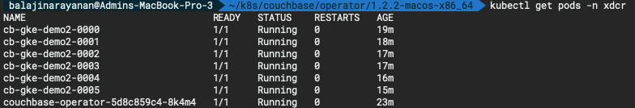
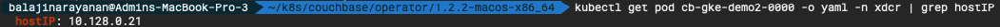
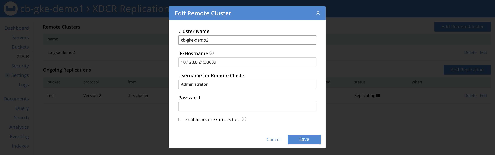
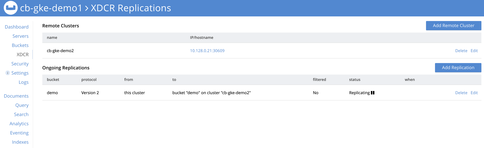

# XDCR

> **Note** The full spec for deploying the second Couchbase cluster across 3 different zones using persistent volumes can be seen in the [couchbase-cluster-with-pv-server-groups-xdcr-cluster.yaml](./files/couchbase-cluster-with-pv-server-groups-xdcr-cluster.yaml) file. The storage class definition file used by the second cluster is [sc-gce-pd-ssd-xdcr.yaml](./files/sc-gce-pd-ssd-xdcr.yaml), and the namespace used is `xdcr`. These definition files used in this section can be downloaded from the git repo.

## Determine the correct connection string on the XDCR target cluster

- List the Couchbase pods deployed in the second cluster `cb-gke-demo2` under namespace `xdcr`.

```bash
kubectl get pods -n xdcr
```



- Choose one of the Couchbase pods and get its underlying GKE node’s IP address:

```bash
kubectl get pod cb-gke-demo2-0000 -o yaml -n xdcr | grep hostIP
```



- Get the port number that maps to the admin port (8091).

```bash
kubectl get service cb-gke-demo2-0000-exposed-ports -n xdcr
```


If you were logged into the Couchbase Server Web Console on the first cluster `cb-gke-demo1`, and establishing the XDCR connection to the second cluster `cb-gke-demo2`, you’d use the connection string **10.128.0.21:30609** based on the example above.

## Accessing the Couchbase Web UI

You can port forward one of Couchbase cluster pod so that we can view the cluster status from the web-console. Run this command to port forward it.

> **Note:** You might have done a port forward for the first cluster `cb-gke-demo1` using port `8091`. Let's do a port forward for the second cluster using a different port `8092`.

```bash
kubectl port-forward cb-gke-demo2-0000 8092:8091
```

We need to make sure to leave the command running in the terminal. Now we can open up a browser at [http://localhost:8092](http://localhost:8092)

## Create XDCR replication between clusters

Let's configure a uni-directional replication from cluster `cb-gke-demo1` to `cb-gke-demo2`. You can find more details in the [XDCR documentation](https://docs.couchbase.com/server/6.0/manage/manage-xdcr/xdcr-management-overview.html).

In **cb-gke-demo1** cluster [http://localhost:8091](http://localhost:8091):

- Add cluster reference to **cb-gke-demo2** cluster.



- Add bucket replication from **cb-gke-demo1.demo** bucket to **cb-gke-demo2.demo** bucket.


- Your bucket is now replicating from `cb-gke-demo1` to `cb-gke-demo2` cluster.


