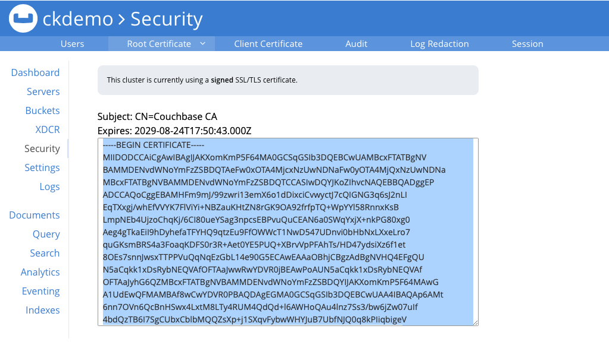

# Setting Keystore

Couchbase Server EE 3.0 and later supports full encryption of client-side traffic. That includes key-value type operations, queries, and configuration communication. Make sure to have a proper Couchbase Server version installed before proceeding with configuring encryption on the client side.

To configure encryption for the Java SDK:
* Load and import the certificate from the cluster into your JVM keystore
* Enable encryption on the client side and point it to the keystore

The JVM keystore is independent of the Java SDK, so your own setup might look different. It is important to make sure you are transferring the certificate in an encrypted manner from the server to the client side, so either copy it through SSH or through a similar secure mechanism.
If you are running on localhost and just want to enable it for a development machine, just copying and pasting it suffices. Navigate in the admin UI to ```Security > Root Certificate``` and copy the input box of the SSL certificate into a file on your machine (here named cluster.cert). It looks similar to this:


Fig 1: Couchbase web-console displaying TLS certificate

Now, use the keytool command to import it into your JVM keystore. Use the ```-keystore``` option to specify where to create the keystore. If you don’t use this option, the default location is the .keystore file in user’s home directory.

```
$ keytool -importcert -file cluster.cert -keystore ~/.keystore
Enter keystore password:
Owner: CN=*
Issuer: CN=*
Serial number: 1381528ec7379f22
Valid from: Tue Jan 01 01:00:00 CET 2013 until: Sat Jan 01 00:59:59 CET 2050
Certificate fingerprints:
	 MD5:  4A:5E:DB:4F:F6:7E:FD:C3:0E:0C:56:C4:05:34:C1:4A
	 SHA1: 3A:BC:48:3C:0F:36:99:EB:35:76:7C:E5:14:DE:89:DE:AE:79:9B:ED
	 SHA256: 24:46:59:55:F2:65:23:85:E2:80:9F:CC:D1:EF:41:E9:4E:D8:ED:11:C8:CF:60:C7:C5:AD:63:56:D0:E6:7F:4D
	 Signature algorithm name: SHA1withRSA
	 Version: 3
Trust this certificate? [no]:  yes
Certificate was added to keystore
```
You can verify with keytool -list:
```
$ keytool -keystore ~/.keystore -list
Enter keystore password:

Keystore type: JKS
Keystore provider: SUN

Your keystore contains 1 entry

mykey, Aug 18, 2014, trustedCertEntry,
Certificate fingerprint (SHA1): 3A:BC:48:3C:0F:36:99:EB:35:76:7C:E5:14:DE:89:DE:AE:79:9B:ED
```
The next step is to enable encryption in the client code by passing the path and password of the keystore file.
