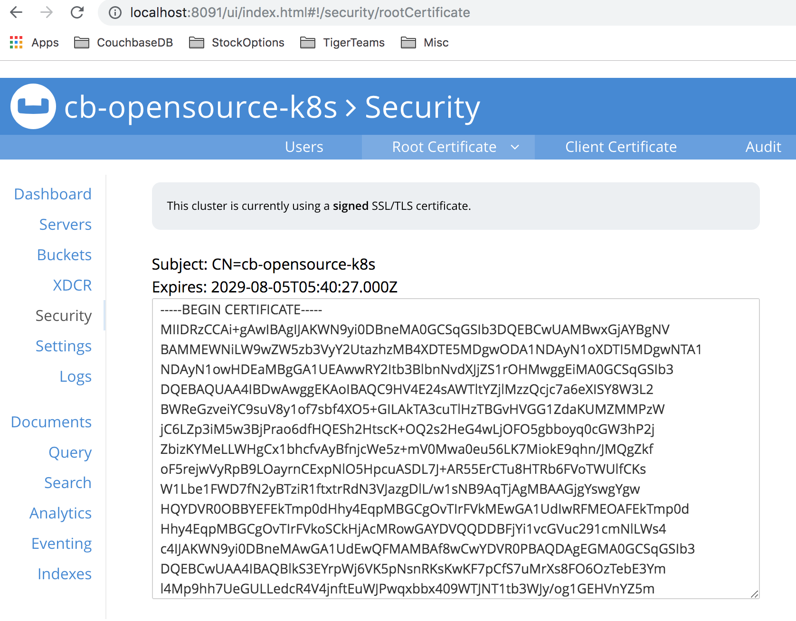
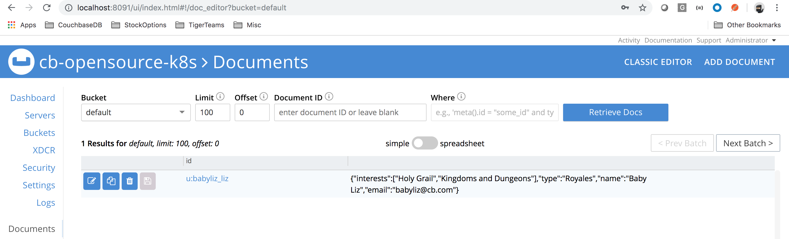

# Couchbase Operator deployment for Open Source Kubernetes with minikube

## Scope
	Setup couchbase operator 1.2 on open source kubernetes using minikube
	The deployment would be using command line tools to deploy 
	
## Overview of the hand on labs
	Pre-requisities
	Env details
	Deploy adminission controller
	Deploy Couchbase Autonomous Operator
	Deploymnent Couchbase Cluster with following details
		* PV 
		* TLS certificates
	Delete a pod
	Check that cluster self-heals
	Cluster is healthy
	

## Pre-requisites
* CLI / UI

	`$ brew update`
	 
* Install hypervisor from link below

	<https://download.virtualbox.org/virtualbox/6.0.10/VirtualBox-6.0.10-132072-OSX.dmg>

* Install minikube

	`$ brew cask install minikube`

* Install kubectl

	<https://kubernetes.io/docs/tasks/tools/install-kubectl/#install-kubectl-on-macos>

* Kubernetes cluster with supported version

* Start minikube

	`$ sudo minikube start`

	`$ sudo kubectl cluster-info`

	
## Environment details
* minikue on macos : v1.2.0

* Set the vCPUs and Memory to 4 and 4GiB so that Couchbase operator would work on laptop


```
sudo minikube config set memory 4096
sudo minikube config set cpus 4
```

`$ sudo minikube config view`
	
	- cpus: 4
	- memory: 4096
	
## minikube cluster details

	$ sudo kubectl get nodes
	
	NAME       STATUS   ROLES    AGE     VERSION
	minikube   Ready    master   3d11h   v1.15.0
	

### Deploy adminission controller
*	cd into the files dir to access the required yaml files
First we will create a namespace to localize our deployment
	
`$ sudo kubectl create namespace cbdb`

*	Deployment adminission controller

`	$ sudo kubectl create -f admission.yaml --namespace cbdb`	

*	Query the deployment

	```
	$ sudo kubectl get deployments --namespace cbdb
	NAME                           READY   UP-TO-DATE   AVAILABLE   AGE
	couchbase-operator-admission   1/1     1            1           11m
	```
		
## Deploy Couchbase Autonomous Operator
*	Deploy Operator Role

	`sudo kubectl create -f operator-role.yaml --namespace cbdb`
	
*	Create service account

	`sudo kubectl create serviceaccount couchbase-operator --namespace cbdb`
	
*	Bind the service account 'couchbase-operator' with operator-role

	`sudo kubectl create rolebinding couchbase-operator --role couchbase-operator --serviceaccount cbdb:couchbase-operator --namespace cbdb`
	
*	Deploy Custom Resource Definition

	`sudo kubectl create -f operator-deployment.yaml --namespace cbdb`
	
* Query deployment

	```
	
	$ sudo kubectl get deployment --namespace cbdb
	NAME                           READY   UP-TO-DATE   AVAILABLE   AGE
	couchbase-operator             1/1     1            1           20m
	couchbase-operator-admission   1/1     1            1           20m
	
	
	```	

## Deploymnent Couchbase Cluster

### Deploy TLS certs in namespace cbdb
Using help file below, make sure use appropriate namespace, here I have used 'cbdb'

Link is ![here] (https://raw.githubusercontent.com/ramdhakne/blogs/master/external-connectivity/x509-help.txt)

### Query the TLS secrets
	
```
$ sudo kubectl get secrets --namespace cbdb
NAME                                       TYPE                                  DATA   AGE
couchbase-operator-tls                     Opaque                                1      14h
couchbase-server-tls                       Opaque                                2      14h
```

### Deploy secret to access Couchbase UI


`sudo kubectl create -f secret.yaml --namespace cbdb`

### Get storageClass details for minikube k8s cluster

```
$ sudo kubectl get storageclass
NAME                 PROVISIONER                AGE
standard (default)   k8s.io/minikube-hostpath   3d14h
```

### Deploy the Couchbase cluster

`sudo kubectl create -f couchbase-persistent-cluster-tls-k8s-minikube.yaml --namespace cbdb`
	
### If everything goes well then we should see the Couchbase cluster deployed with PVs, TLS certs

```
$ sudo kubectl get pods --namespace cbdb
NAME                                            READY   STATUS    RESTARTS   AGE
cb-opensource-k8s-0000                          1/1     Running   0          5h58m
cb-opensource-k8s-0001                          1/1     Running   0          5h58m
cb-opensource-k8s-0002                          1/1     Running   0          5h57m
couchbase-operator-864685d8b9-j72jd             1/1     Running   0          20h
couchbase-operator-admission-7d7d594748-btnm9   1/1     Running   0          20h
```

### Access the Couchbase UI

*	Get the service details for Couchbase cluster

```
$ sudo kubectl get svc --namespace cbdb
NAME              		TYPE        CLUSTER-IP       EXTERNAL-IP   PORT(S)                                                 AGE                                             6h11m
cb-opensource-k8s-ui   NodePort    10.100.90.161    <none>        8091:30477/TCP,18091:30184/TCP
```

```
$ sudo kubectl port-forward service/cb-opensource-k8s-ui 8091:8091 --namespace cbdb
Forwarding from 127.0.0.1:8091 -> 8091
Forwarding from [::1]:8091 -> 8091
```

#### Couchbase UI


Verify the root ca to check custom x509 cert is being used

Click Security->Root Certificate




Delete a pod at random, lets delete pod 001

```
$ sudo kubectl delete pod cb-opensource-k8s-0001 --namespace cbdb
pod "cb-opensource-k8s-0001" deleted
```

Server would automatically failover, depending on the autoFailovertimeout


A lost couchbase is auto-recovered by Couchbase Operator as its contantly watching cluster definition


## Scaling up

Change size to 4 from 3

```
--- a/opensrc-k8s/cmd-line/files/couchbase-persistent-cluster-tls-k8s-minikube.yaml
       enableIndexReplica: false
       compressionMode: passive
   servers:
-    - size: 3
+    - size: 4 
       name: data
       services:
         - data
```

Run

```
sudo kubectl apply -f couchbase-persistent-cluster-tls-k8s-minikube.yaml --namespace cbdb
```

## Scaling down 

Its exact opposite of scaling up, reduce the cluster to any number. But not less than 3. Couchbase MVP is 3 nodes.

## Run sample Python application

### Create namespace for app tier

```

$ sudo kubectl create namespace apps
namespace/apps created

```

Deploy the app pod

```
$ sudo kubectl create -f app_pod.yaml --namespace apps
pod/app01 created
```


*  Run the sample python program to upsert a document into couchbase cluster

Login to the pods shell/exec into app pod


```

$ sudo kubectl exec -ti app01 bash --namespace apps

```

Prep the pod for installing python SDK

[prep-app-pod for python SDK](https://docs.google.com/document/d/14lGw0KYOAzByHeO1yzNLEbfxe6MWQTNK/edit#)

Edit the program with FQDN of the pod

Run below command after exec'ing into the couchbase pod

`$ sudo kubectl exec -ti cb-opensource-k8s-0000 bash --namespace cbdb`


```
root@cb-opensource-k8s-0000:/# hostname -f
cb-opensource-k8s-0000.cb-opensource-k8s.cbdb.svc.cluster.local
```

Edit the program with correct connection string

Connection string for me looks like below:

`cluster = Cluster('couchbase://cb-opensource-k8s-0000.cb-opensource-k8s.cbdb.svc.cluster.local')`

Since both the namespaces in minikube share same kube-dns 

Run the program

```
root@app01:/# python python_sdk_example.py
CB Server connection PASSED
Open the bucket...
Done...
Upserting a document...
Done...
Getting non-existent key. Should fail..
Got exception for missing doc
Inserting a doc...
Done...
Getting an existent key. Should pass...
Value for key 'babyliz_liz'

Value for key 'babyliz_liz'
{u'interests': [u'Holy Grail', u'Kingdoms and Dungeons'], u'type': u'Royales', u'name': u'Baby Liz', u'email': u'babyliz@cb.com'}
Delete a doc with key 'u:baby_arthur'...
Done...
Value for key [u:baby_arthur]
Got exception for missing doc for key [u:baby_arthur] with error <Key=u'u:baby_arthur', RC=0xD[The key does not exist on the server], Operational Error, Results=1, C Source=(src/multiresult.c,316), Tracing Output={"u:baby_arthur": {"c": "0000000036fb5729/523b08473029eae3", "b": "default", "i": 1754553113405298788, "l": "172.17.0.9:36304", "s": "kv:Unknown", "r": "cb-opensource-k8s-0001.cb-opensource-k8s.cbdb.svc:11210", "t": 2500000}}>
Closing connection to the bucket...
root@app01:/#
```

Upserted document should looks like this



## Conclusion
We deployed Couchbase Autonomous Operator with version 1.2 on minikue version: v1.2.0. Couchbase cluster requires admission controller, RBACs with role limited to the namespace (more secure). CRD deployed has cluster wide scope, but that is by design. Couchbase cluster deployed had PV support and customer x509 certs. 
We saw how how Couchbase cluster self-heals, and brings cluster up and healthy back without any user intervention.

We also saw how to install Couchbase python sdk in a Applicaiton pod deployed in its namespace and we can have that application talk to Couchbase server and perform CRUD operations.


## Cleanup

Perform these steps below to un-config all the k8s assets created.

```
sudo kubectl delete -f secret.yaml --namespace cbdb
sudo kubectl delete -f couchbase-persistent-cluster-tls-k8s-minikube.yaml --namespace cbdb
sudo kubectl delete rolebinding couchbase-operator --namespace cbdb
sudo kubectl delete serviceaccount couchbase-operator --namespace cbdb
sudo kubectl delete -f operator-deployment.yaml --namespace cbdb
sudo kubectl get deployments --namespace cbdb
sudo kubectl delete -f admission.yaml --namespace cbdb
sudo kubectl delete pod app01 --namespace apps
```
