# Couchbase Operator deployment for Open Source Kubernetes with Minikube using Helm


The Couchbase Autonomous Operator enables you to automate the management of common Couchbase tasks such as the configuration, creation, scaling, and recovery of Couchbase clusters. By reducing the complexity of running a Couchbase cluster, it lets you focus on the desired configuration and not worry about the details of manual deployment and lifecycle management.

This guide walks through the recommended procedure for installing and running the Couchbase Autonomous Operator on Open Source Kubernetes with Minikube using Helm. This guide focuses on simplicity and is for demonstration purposes.  This document should not be used for production deployments as-is.  The details on how a user should manage their Kubernetes environment is beyond the scope of this document.


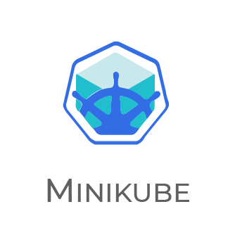


## Table of Contents

 - [Prerequisites](#prerequisites)
 	- [Install kubectl](#install-kubectl)
 	- [Install Hypervisor](#install-hypervisor)
 	- [Install Minikube](#install-minikube)
 - [Setup Minikube Cluster](#setup-minikube-cluster)
 - [Installing and Configuring Helm/Tiller](#installing-and-configuring-helm-and-tiller)
 - [Deploy Couchbase Autonomous Operator](#deploy-the-couchbase-autonomous-operator)
 - [Deploy the Couchbase Cluster](#deploy-the-couchbase-cluster)
 	- [Using TLS](#using-tls)
 - [Operations](#operations)
   	- [Self Recovery from a Node Failure](#self-recovery-from-a-node-failure)
   	- [Scaling the Couchbase Cluster](#scaling-the-couchbase-cluster)
 	- [Upgrade Couchbase Server](#upgrade-couchbase-server)
 - [Cleanup](#cleanup)
 - [Conclusion](#conclusion)
	   

## Prerequisite

In this section, you will perform the necessary steps to install and configure the prerequisite tools required to interact with kubernetes cluster deployed on Minikube. You can skip any step if you already have the corresponding tool(s) installed on your computer.

> **Note:** It is important to have the right minimum versions of the tools. This guide focuses on installing the right versions, so you get the functionality needed to complete all steps successfully.

For Mac OS, it is recommended you install Homebrew package manager; it will make things much easier. If you don't have homebrew available on your system, [install homebrew](https://docs.brew.sh/Installation.html) before continuing.

There are separate sections for Mac and Windows setup steps where needed. If there are no such separate sections, the steps are similar or identical for both operating systems, however terminal commands shown are based on Mac OS and some may need to be modified before being run on Windows, e.g. change / to \\, remove trailing & character to run commands in the background.

This guide does not cover installation steps on Linux due to a variety of popular Linux distributions.

### Install kubectl

Kubectl is a command line interface for running commands against Kubernetes clusters. We will use kubectl to deploy and manage applications on Kubernetes. There are multiple options to download and install kubectl for your operating system, you can find them on the following page: [Install and setup kubectl](https://kubernetes.io/docs/tasks/tools/install-kubectl/). Below are the recommended methods for Mac and Windows.

#### Mac - Homebrew

Please follow the below steps to install `kubectl` uisng [Homebrew](https://brew.sh/) package manager.

1. Run the installation command:

	```
	brew install kubernetes-cli
	```

2. Test to ensure the version you installed is up-to-date:

	```
	kubectl version
	```
	
	If `kubectl` is installed successfully, then you should see the below output.
	
	```
	Client Version: version.Info{Major:"1", Minor:"15", GitVersion:"v1.15.2",   
	GitCommit:"f6278300bebbb750328ac16ee6dd3aa7d3549568", GitTreeState:"clean",
	BuildDate:"2019-08-05T16:54:35Z", GoVersion:"go1.12.7", Compiler:"gc", Platform:"darwin/
	amd64"}
	```

#### Windows - Download kubectl.exe

1. Download the kubectl.exe binary from here: [kubectl 1.13.0 binary for Windows](https://storage.googleapis.com/kubernetes-release/release/v1.13.0/bin/windows/amd64/kubectl.exe). Put the kubectl.exe file in any directory of your choice on your computer, e.g. ```C:\kubectl```.

2. Modify/edit your PATH environment variable to include the path where you put kubectl.exe, e.g., C:\kubectl. Use the Environment Variables dialog box (Control Panel → System → Advanced system settings → Environment Variables) to change the PATH variable permanently or use the terminal as shown below to change the PATH variable for the duration of the session:

	```
	> set PATH=%PATH%;C:\kubectl
	```
	
### Install Hypervisor

Oracle VM VirtualBox is a free and open-source hosted hypervisor for x86 virtualization. 

#### Mac

- Please download and install VirtualBox on your Mac system using this [link](https://download.virtualbox.org/virtualbox/6.0.10/VirtualBox-6.0.10-132072-OSX.dmg).

#### Windows

1. **Disable Hyper V** - Click on Search -> Type in ‘Turn Windows features on or off’ -> Uncheck Hyper V (and its children).

	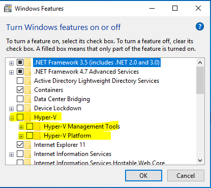

2. Please download and install VirtualBox on your Windows system using this [link](https://download.virtualbox.org/virtualbox/6.0.12/VirtualBox-6.0.12-133076-Win.exe).


### Install Minikube

#### Mac - Homebrew

- Run the following command to install `Minikube` using Homebrew.

	```
	brew cask install minikube
	```
	
	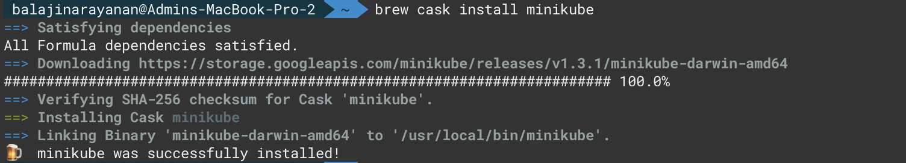
	

#### Windows - Download minikube.exe

1. Download minikube from this [link](https://github.com/kubernetes/minikube/releases/download/v0.27.0/minikube-windows-amd64). 

	>Note: Don’t install using curl/ chocolatey as the latest version might have some issues.

2. Rename the downloaded minikube-windows-amd64.exe file as minikube.exe and place it to the same folder where you have kubectl.exe, in that way you avoid adding another location in Path.

---

## Setup Minikube Cluster

In this section, you will setup kubernetes cluster using minikube.

- Run the below command to start `Minikube` on your system.

	```
	minikube start
	```
	
	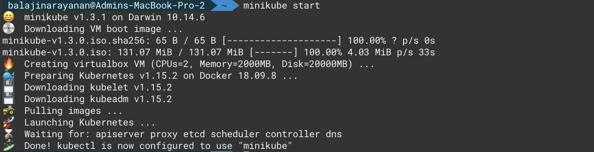

	
- Run the below command to get the kubernetes cluster details.

	```
	kubectl cluster-info 
	```
	
	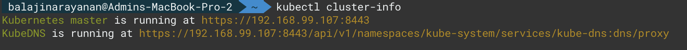
	
- Set the minikube vCPUs to 4 and Memory to 4GiB so that Couchbase operator would work on your system.

	```
	minikube config set memory 4096
	minikube config set cpus 4
	```
	
- Verify the minikube config by running the following command.

	```
	minikube config view
	```
	
	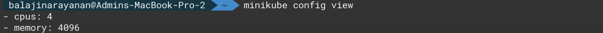
	
- To verify the connection to your cluster, use the `kubectl get` command to return a list of the cluster nodes.

	```
	kubectl get nodes
	```
	
	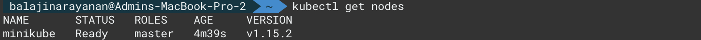

---

## Installing and Configuring Helm/Tiller

As mentioned earlier Helm is a package manager for k8s applications. Setting up Helm consists of installing the Helm client (helm) on your computer, and installing the Helm server (Tiller) on your Kubernetes cluster. Once you’ve set up Helm, you can then use official Couchbase Helm charts to deploy the Operator and the Couchbase Server cluster. Helm simplifies k8s application installation and management using [three big concepts](https://helm.sh/docs/using_helm/#three-big-concepts) of charts, repositories and releases.  

- Install the Helm Client
	- **Mac:** Run the below command to install Helm Client on Mac OS.
	
		```
		brew install kubernetes-helm
		```
	- **Windows:** Download the latest tar file with the Windows binary from this [link](https://	github.com/kubernetes/helm/releases) and extract its contents. Copy `helm.exe` to the bin 	directory.

- With the helm client installed setup [RBAC](https://helm.sh/docs/using_helm/#tiller-namespaces-and-rbac) for Tiller to the Kubernetes cluster, by running the below command using the provided file [rbac-tiller.yaml](files/rbac-tiller.yaml):

	```
	kubectl create -f rbac-tiller.yaml
	```
	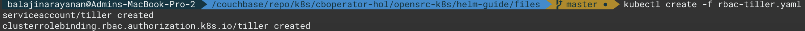

- The RBAC for the Tiller Service Account is now configured, so install Tiller into the environment by running:

	```
	helm init --service-account tiller
	```
	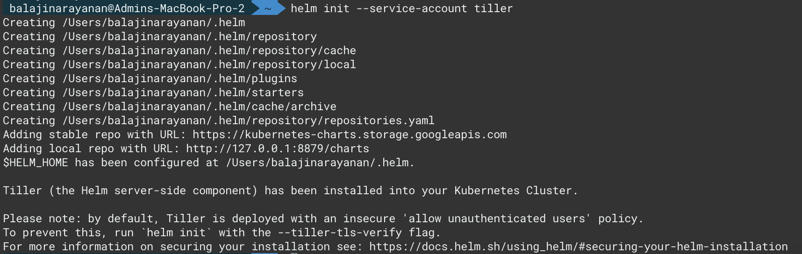

	> Note: For simplicity Tiller is granted cluster-wide access.  This is appropriate for development and test environments only. For a production environment refer to [the Couchbase documentation](http://labs.couchbase.com/docs-preview/operator/1.2/helm-setup-guide.html#installing-tiller-for-production).

- Add the Couchbase chart repository that contains the needed Couchbase charts **couchbase/couchbase-operator and couchbase/couchbase-cluster**:

	```
	helm repo add couchbase https://couchbase-partners.github.io/helm-charts/
	```
	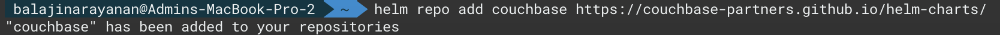

---

## Deploy Couchbase Autonomous Operator

The Couchbase Autonomous Operator for Kubernetes enables cloud portability and automates operational best practices for deploying and managing Couchbase.

- With the necessary tools installed and configured, the core component of this guide, the Couchbase Autonomous Operator can be deployed using the  **couchbase/couchbase-operator** chart, with a single command:

	```
	helm install couchbase/couchbase-operator
	```
	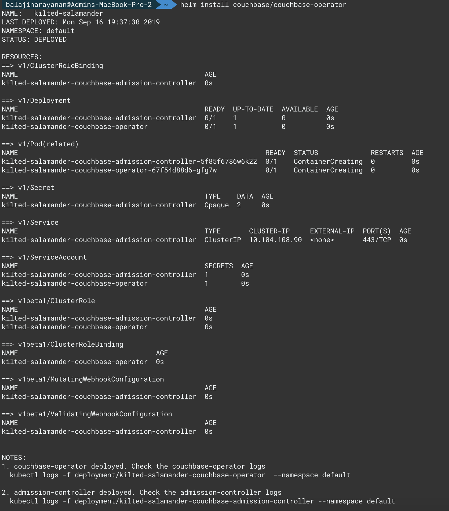

- Wait for the operator to become ready by running the below command (use Ctrl+C to break out of the wait):

	```
	kubectl get deployments -w
	```
	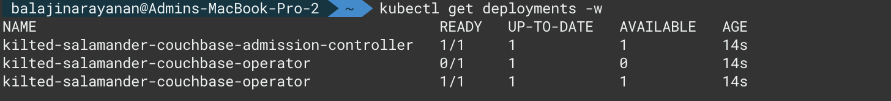

----

## Deploy the Couchbase Cluster

The **couchbase/couchbase-cluster** chart defines a simple cluster configuration. The helm chart supports creating and managing a single couchbase cluster by exposing the default values available in the [default-cluster-configuration.yaml](files/default-cluster-configuration.yaml)


### Using TLS

The default behavior of Couchbase Clusters and the Couchbase Autonomous Operator do not use TLS. TLS is supported using one of the following methods: 

1. With automatically generated certificates
2. With user provided certificates

> Note: Couchbase certificates are represented as plain Kubernetes secrets, so the secret itself can be overridden if desired.

This guide will use automatically generated TLS certificates for simplicity.  See the documentation to [use custom certificates](http://labs.couchbase.com/docs-preview/operator/1.2/helm-cluster-config.html#custom-tls).

Override the chart cluster settings and deploy the cluster, by using the --set switch for the single TLS flag, and using the --values switch with the provided [couchbase-cluster-minikube-helm.yaml](files/couchbase-cluster-minikube-helm.yaml) by running:

```
helm install couchbase/couchbase-cluster --set couchbaseTLS.create=true --values couchbase-cluster-minikube-helm.yaml
```
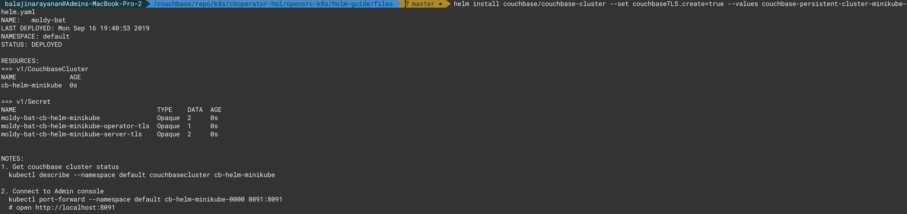

Record the information from the **NOTES:** section that is displayed at the end of the installation, then wait for all the nodes to deploy by running the below command (Ctrl+C to resume):

```
kubectl get pods -l app=couchbase
```
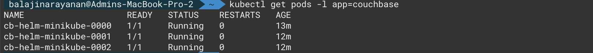

### View the Couchbase Web Console

To view the Couchbase Web Console locally the ports must be forwarded (refer to the **NOTES:** section mentioned previously). 

To forward the ports run the below command:

```
kubectl port-forward --namespace default cb-helm-minikube-0000 8091:8091
```

Open a browser to [localhost:8091](http://localhost:8091) and login to the console.  The defaults are username: `Administrator`, and password: `password`. View the "Servers" tab and observe that the server topology matches the desired configuration.

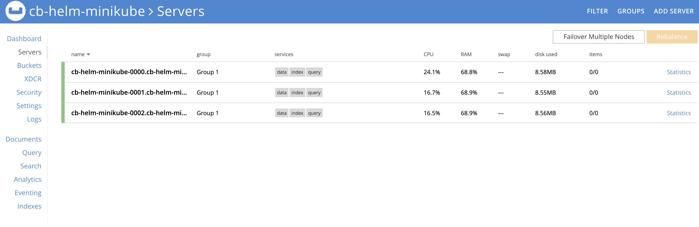

---

## Operations

### Self Recovery from a Node Failure

The Couchbase Operator can detect node failures, rebalance out bad nodes, and bring the cluster back up to the desired capacity.

Lets delete a pod simulating a node failure by following the below steps.

- Run the below command to get the list pods running in the `default` namespace.

	```
	kubectl get pods -l app=couchbase
	```

	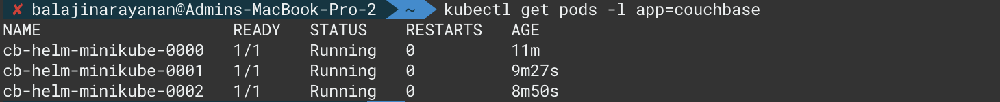

- Delete one of the pod from the list above by running the below command.

	```
	kubectl delete pod cb-op-aks-workshop-0002 -n default
	```

	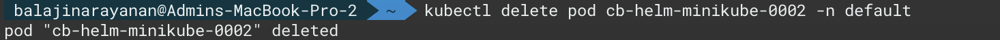

- Couchbase Server waits for the node to be down for a specified amount of time before failing over the node, and this failover timeout can be set using the `autoFailoverTimeout` in the cluster configuration file. You can check this in the logs [here](files/cb-cluster-self-recovery-logs.txt).

	```
	kubectl logs deployment/kilted-salamander-couchbase-operator -f
	```

- After the node gets auto-failed over, the Couchbase Operator removes the faulty pod from the cluster, adds a new pod to the cluster and peforms rebalance, ensuring that the cluster is back up to the desired configuration without any loss of data.

	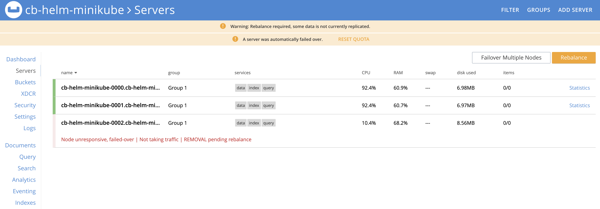
	
	


### Scaling the Couchbase Cluster

Previously a values file [couchbase-cluster-minikube-helm.yaml](files/couchbase-cluster-minikube-helm.yaml) was used, however since only one value is being changed, using --set is appropriate.

>Note: this is an example of a scale in, however a scale out can be performed by increasing the value as opposed to decreasing the value is being demonstrated.

- Retrieve the release name for `couchbase-cluster` by running the below command:

	```
	helm list
	```
	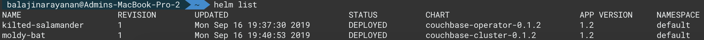

- Use the couchbase-cluster release name to initiate the scaling process by running the below command:

	```
	helm upgrade moldy-bat couchbase/couchbase-cluster --set couchbaseCluster.servers.all_services.size=2 --reuse-values
	```
	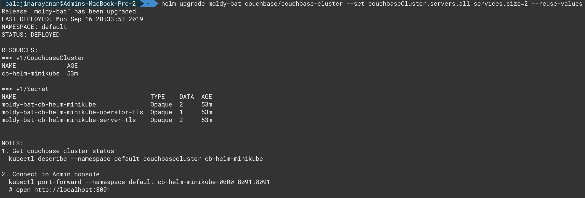

- Locate the operator deployment name by running the below command:

	```
	kubectl get deployments
	```
	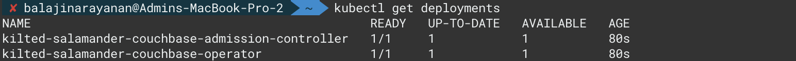

- Use the deployment name of the operator to view the operator logs (Ctrl+C to resume):

	```
	kubectl logs deployment/kilted-salamander-couchbase-operator -f
	```
	
	**Output:**
	
	```
	time="2019-09-17T01:37:15Z" level=info msg="Cluster status: balanced" cluster-name=cb-helm-minikube module=cluster
time="2019-09-17T01:37:15Z" level=info msg="Node status:" cluster-name=cb-helm-minikube module=cluster
time="2019-09-17T01:37:15Z" level=info msg="┌───────────────────────┬──────────────────┬──────────────┬────────────────┐" cluster-name=cb-helm-minikube module=cluster
time="2019-09-17T01:37:15Z" level=info msg="│ Server                │ Version          │ Class        │ Status         │" cluster-name=cb-helm-minikube module=cluster
time="2019-09-17T01:37:15Z" level=info msg="├───────────────────────┼──────────────────┼──────────────┼────────────────┤" cluster-name=cb-helm-minikube module=cluster
time="2019-09-17T01:37:15Z" level=info msg="│ cb-helm-minikube-0000 │ enterprise-6.0.1 │ all_services │ managed+active │" cluster-name=cb-helm-minikube module=cluster
time="2019-09-17T01:37:15Z" level=info msg="│ cb-helm-minikube-0001 │ enterprise-6.0.1 │ all_services │ managed+active │" cluster-name=cb-helm-minikube module=cluster
time="2019-09-17T01:37:15Z" level=info msg="└───────────────────────┴──────────────────┴──────────────┴────────────────┘" cluster-name=cb-helm-minikube module=cluster
time="2019-09-17T01:37:15Z" level=info cluster-name=cb-helm-minikube module=cluster
time="2019-09-17T01:37:20Z" level=info msg="reconcile finished" cluster-name=cb-helm-minikube module=cluster
```

- Check the Couchbase Web Console to get more details on the server list, by forwarding the ports as before:

	```
	kubectl port-forward --namespace default cb-helm-minikube-0000 8091:8091
	```

	Navigate to [localhost:8091](http://localhost:8091), and login. Note that the number of servers 	in the Couchbase cluster is now scaled in to 2. 

	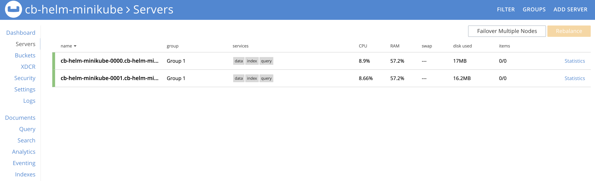

	
### Upgrade Couchbase Server

The current deployment installed Couchbase Server 6.0.1

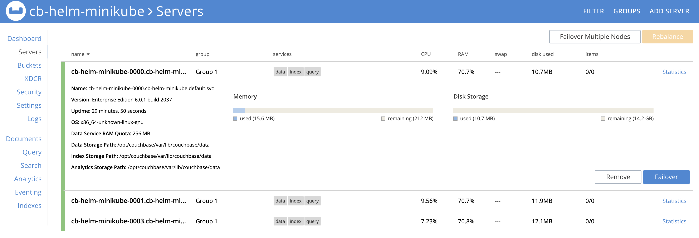

- To upgrade to Couchbase Server 6.0.2, retrieve the release name for Couchbase-cluster by running the below command:

	```
	helm list
	```
	

- Use the release name to initiate the upgrade by running the below command:

	```
	helm upgrade moldy-bat couchbase/couchbase-cluster --set couchbaseCluster.version=enterprise-6.0.2 --reuse-values
	```
	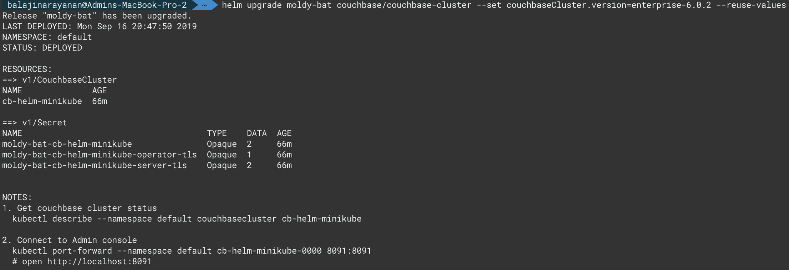

- Run the below command to locate the operator deployment name.

	```
	kubectl get deployments
	```
	

- Use the deployment name of the operator, to view the operator logs (Ctrl-c to resume). You can refer the log output [here](files/cb-cluster-upgrade-logs.txt).

	```
	kubectl logs deployment/kilted-salamander-couchbase-operator -f
	```
	
- Run the below command to get the list of pods running in the `default` namespace.

	```
	kubectl get pods -l app=couchbase -n default
	```
	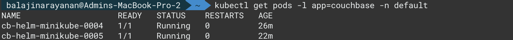

- Check the Couchbase Web Console to get more details on the Couchbase server version, by forwarding the ports as before.

	```
	kubectl port-forward --namespace default cb-helm-minikube-0004 8091:8091
	```

	Navigate to [localhost:8091](http://localhost:8091), and login. Note that the Couchbase server version is now upgraded to 6.0.2
	
	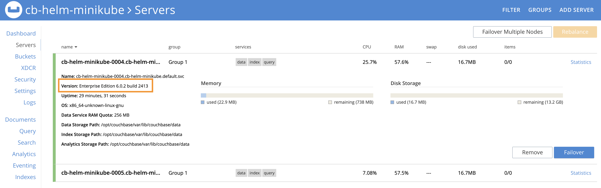

---

## Cleanup

Perform the below steps to un-config all the k8s assets created.

```
minikube stop
minikube delete
```

---

## Conclusion

In summary, the most important point is the Couchbase Autonomous Operator simplifies Couchbase deployments, while being nonintrusive. However, with the help of Helm managing Couchbase versioning, clusters, applications and releases is quick and easy. Changes are often completed with basic configuration and distilled into command line one-liners. Another great feature is the flexibility when choosing your tools, as Helm can be used with kubectl, or kubectl can be used alone, at any time without any change to an k8s environment. In all cases the Couchbase Autonomous Operator is a stellar tool for managing Couchbase clusters in a k8s environment.


 

